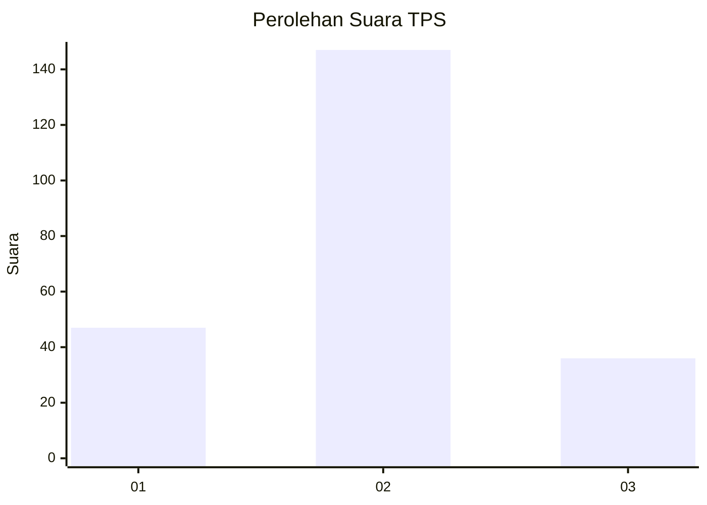
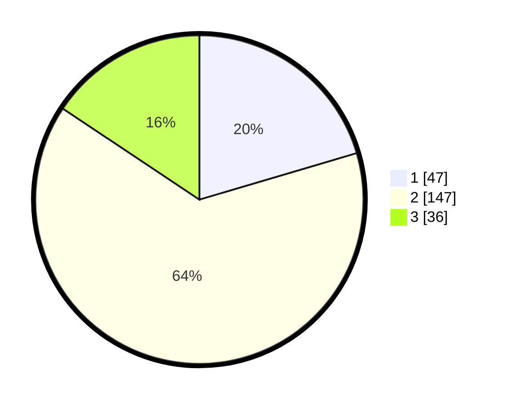

# Hasil

## Grafik

## Tabel

| No. | Nama Paslon    | Suara | Suara (raw) | Persentase |
|:--- |:-------------- | -----:| -----------:| ----------:|
| 1   | ANIES MUHAIMIN | 47    | [47][p-1]   | 20,43      |
| 2   | PRABOWO GIBRAN | 147   | [147][p-2]  | 63,91      |
| 3   | GANJAR MAHFUD  | 36    | [36][p-3]   | 15,65      |

[p-1]: https://github.com/gigit-pemilu/pemilu-2024-34-di-yogyakarta/blob/main/pilpres/hitung-suara/sub/34-di-yogyakarta/sub/01-kulon-progo/sub/12-kalibawang/sub/2001-banjararum/sub/026-tps/sub/paslon-1.txt
[p-2]: https://github.com/gigit-pemilu/pemilu-2024-34-di-yogyakarta/blob/main/pilpres/hitung-suara/sub/34-di-yogyakarta/sub/01-kulon-progo/sub/12-kalibawang/sub/2001-banjararum/sub/026-tps/sub/paslon-2.txt
[p-3]: https://github.com/gigit-pemilu/pemilu-2024-34-di-yogyakarta/blob/main/pilpres/hitung-suara/sub/34-di-yogyakarta/sub/01-kulon-progo/sub/12-kalibawang/sub/2001-banjararum/sub/026-tps/sub/paslon-3.txt

## Foto C Plano

https://sirekap-obj-formc.kpu.go.id/5fbd/pemilu/ppwp/34/01/12/20/01/3401122001026-20240215-004153--d5ead481-f2dc-4bd8-9c8c-d1fb715ead7c.jpg

https://sirekap-obj-formc.kpu.go.id/5fbd/pemilu/ppwp/34/01/12/20/01/3401122001026-20240214-200102--9cc9593e-dcb0-48c2-a52e-8fab1aa03224.jpg

https://sirekap-obj-formc.kpu.go.id/5fbd/pemilu/ppwp/34/01/12/20/01/3401122001026-20240215-004519--6d60b61b-48c6-4b92-901f-67337993bea8.jpg

## Metadata

| Key        | Value               |
| ---------- | ------------------- |
| Time Stamp | 2024-02-16 03:00:26 |

## DATA PEMILIH TETAP

Jumlah pemilih dalam DPT: **266**.
 * L: **126**.
 * P: **140**.

## DATA PENGGUNA HAK PILIH

Jumlah pengguna hak pilih dalam DPT: **234**.
 * L: **111**.
 * P: **123**.

Jumlah pengguna hak pilih dalam DPTb: **5**.
 * L: **2**.
 * P: **3**.

Jumlah pengguna hak pilih dalam DPK: **0**.
 * L: **0**.
 * P: **0**.

Jumlah pengguna hak pilih: **239**.
 * L: **113**.
 * P: **126**.

## JUMLAH SUARA SAH DAN TIDAK SAH

JUMLAH SELURUH SUARA SAH: **230**.

JUMLAH SUARA TIDAK SAH: **9**.

JUMLAH SELURUH SUARA SAH DAN SUARA TIDAK SAH: **239**.

