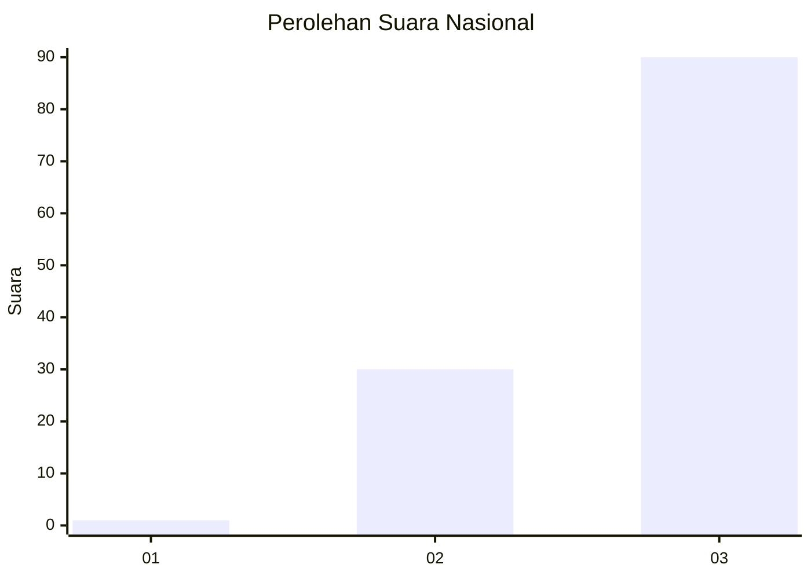
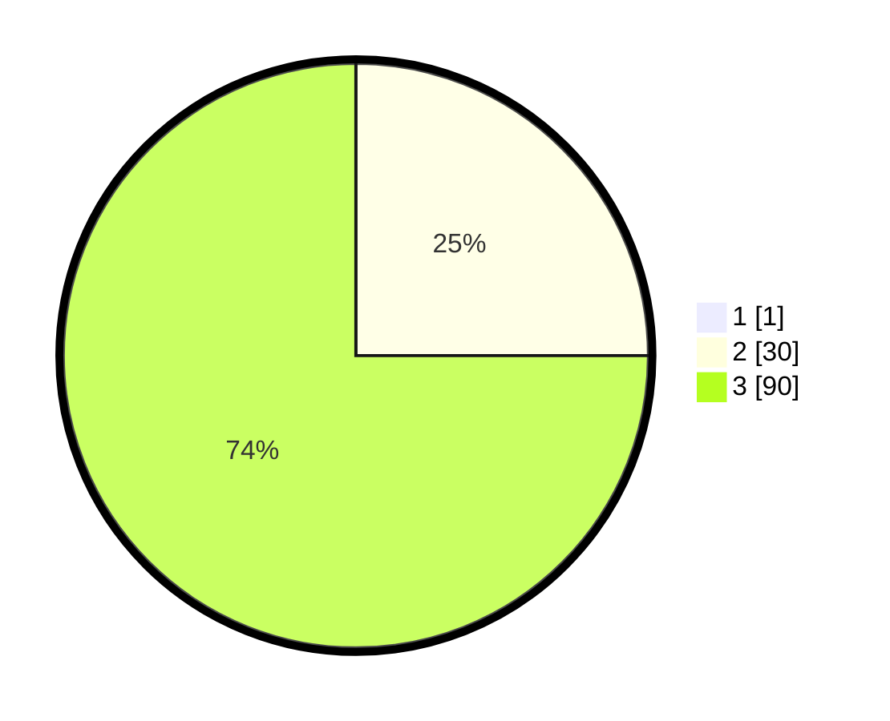

# Hasil

## Grafik

## Tabel

| No. | Nama Paslon    | Suara | Suara (raw) | Persentase |
|:--- |:-------------- | -----:| -----------:| ----------:|
| 1   | ANIES MUHAIMIN | 1     | [1][p-1]    | 0,83       |
| 2   | PRABOWO GIBRAN | 30    | [30][p-2]   | 24,79      |
| 3   | GANJAR MAHFUD  | 90    | [90][p-3]   | 74,38      |

[p-1]: https://github.com/gigit-pemilu/pemilu-2024/blob/main/pilpres/hitung-suara/sub/34-di-yogyakarta/sub/01-kulon-progo/sub/12-kalibawang/sub/2002-banjarasri/sub/001-tps/sub/paslon-1.txt
[p-2]: https://github.com/gigit-pemilu/pemilu-2024/blob/main/pilpres/hitung-suara/sub/34-di-yogyakarta/sub/01-kulon-progo/sub/12-kalibawang/sub/2002-banjarasri/sub/001-tps/sub/paslon-2.txt
[p-3]: https://github.com/gigit-pemilu/pemilu-2024/blob/main/pilpres/hitung-suara/sub/34-di-yogyakarta/sub/01-kulon-progo/sub/12-kalibawang/sub/2002-banjarasri/sub/001-tps/sub/paslon-3.txt

## Foto C Plano

https://sirekap-obj-formc.kpu.go.id/7282/pemilu/ppwp/34/01/12/20/02/3401122002001-20240216-144531--4d4dd574-c16b-4681-9138-5e66c21dc2ee.jpg

https://sirekap-obj-formc.kpu.go.id/7282/pemilu/ppwp/34/01/12/20/02/3401122002001-20240216-144532--4e284213-332d-4b5e-97b5-812cfcf3b253.jpg

https://sirekap-obj-formc.kpu.go.id/7282/pemilu/ppwp/34/01/12/20/02/3401122002001-20240216-144532--4afc6920-0719-4671-a953-954da039db3f.jpg

## Metadata

| Key        | Value               |
| ---------- | ------------------- |
| Time Stamp | 2024-02-19 14:00:00 |

## DATA PEMILIH TETAP

Jumlah pemilih dalam DPT: **183**.
 * L: **62**.
 * P: **121**.

## DATA PENGGUNA HAK PILIH

Jumlah pengguna hak pilih dalam DPT: **117**.
 * L: **48**.
 * P: **69**.

Jumlah pengguna hak pilih dalam DPTb: **5**.
 * L: **0**.
 * P: **5**.

Jumlah pengguna hak pilih dalam DPK: **1**.
 * L: **0**.
 * P: **1**.

Jumlah pengguna hak pilih: **123**.
 * L: **48**.
 * P: **75**.

## JUMLAH SUARA SAH DAN TIDAK SAH

JUMLAH SELURUH SUARA SAH: **121**.

JUMLAH SUARA TIDAK SAH: **2**.

JUMLAH SELURUH SUARA SAH DAN SUARA TIDAK SAH: **123**.

