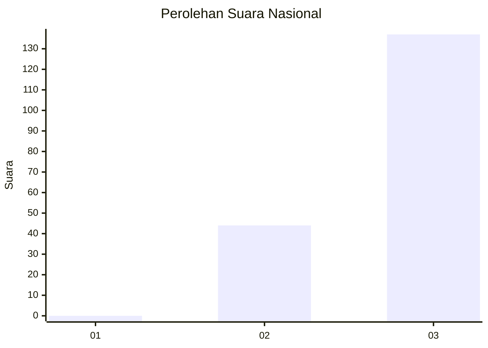
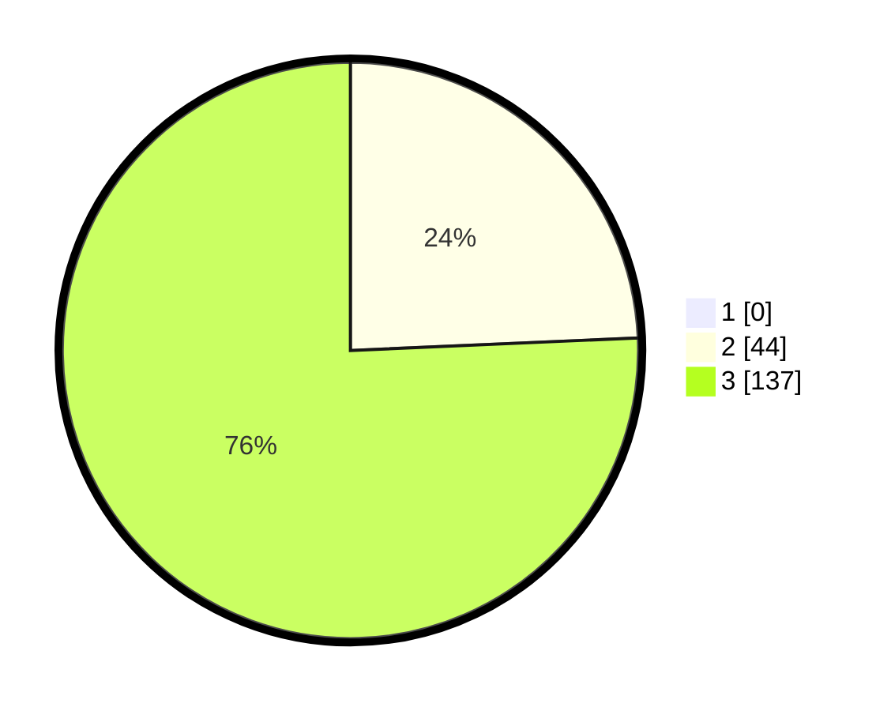

# Hasil

## Grafik

## Tabel

| No. | Nama Paslon    | Suara | Suara (raw) | Persentase |
|:--- |:-------------- | -----:| -----------:| ----------:|
| 1   | ANIES MUHAIMIN | 0     | [0][p-1]    | 0,00       |
| 2   | PRABOWO GIBRAN | 44    | [44][p-2]   | 24,31      |
| 3   | GANJAR MAHFUD  | 137   | [137][p-3]  | 75,69      |

[p-1]: https://github.com/gigit-pemilu/pemilu-2024/blob/main/pilpres/hitung-suara/sub/34-di-yogyakarta/sub/01-kulon-progo/sub/12-kalibawang/sub/2002-banjarasri/sub/003-tps/sub/paslon-1.txt
[p-2]: https://github.com/gigit-pemilu/pemilu-2024/blob/main/pilpres/hitung-suara/sub/34-di-yogyakarta/sub/01-kulon-progo/sub/12-kalibawang/sub/2002-banjarasri/sub/003-tps/sub/paslon-2.txt
[p-3]: https://github.com/gigit-pemilu/pemilu-2024/blob/main/pilpres/hitung-suara/sub/34-di-yogyakarta/sub/01-kulon-progo/sub/12-kalibawang/sub/2002-banjarasri/sub/003-tps/sub/paslon-3.txt

## Foto C Plano

https://sirekap-obj-formc.kpu.go.id/1098/pemilu/ppwp/34/01/12/20/02/3401122002003-20240214-223942--8f7b024f-0dc9-4cff-b1a3-38c48f857d37.jpg

https://sirekap-obj-formc.kpu.go.id/1098/pemilu/ppwp/34/01/12/20/02/3401122002003-20240214-225022--c4867c2b-77df-4638-82df-db350ba844ce.jpg

https://sirekap-obj-formc.kpu.go.id/1098/pemilu/ppwp/34/01/12/20/02/3401122002003-20240214-224604--7738ed0f-f28d-424c-b23a-54e0807812ba.jpg

## Metadata

| Key        | Value               |
| ---------- | ------------------- |
| Time Stamp | 2024-02-16 03:30:26 |

## DATA PEMILIH TETAP

Jumlah pemilih dalam DPT: **201**.
 * L: **100**.
 * P: **101**.

## DATA PENGGUNA HAK PILIH

Jumlah pengguna hak pilih dalam DPT: **175**.
 * L: **85**.
 * P: **90**.

Jumlah pengguna hak pilih dalam DPTb: **11**.
 * L: **7**.
 * P: **4**.

Jumlah pengguna hak pilih dalam DPK: **0**.
 * L: **0**.
 * P: **0**.

Jumlah pengguna hak pilih: **186**.
 * L: **92**.
 * P: **94**.

## JUMLAH SUARA SAH DAN TIDAK SAH

JUMLAH SELURUH SUARA SAH: **181**.

JUMLAH SUARA TIDAK SAH: **5**.

JUMLAH SELURUH SUARA SAH DAN SUARA TIDAK SAH: **186**.

