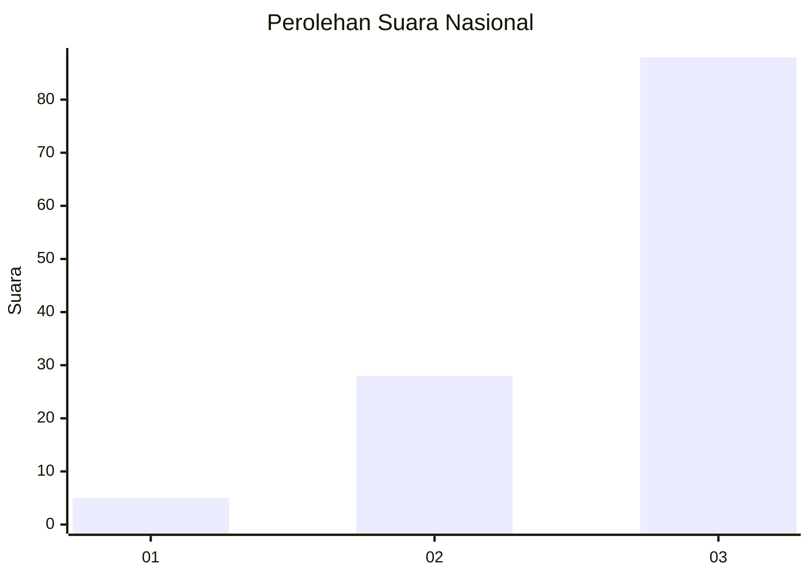
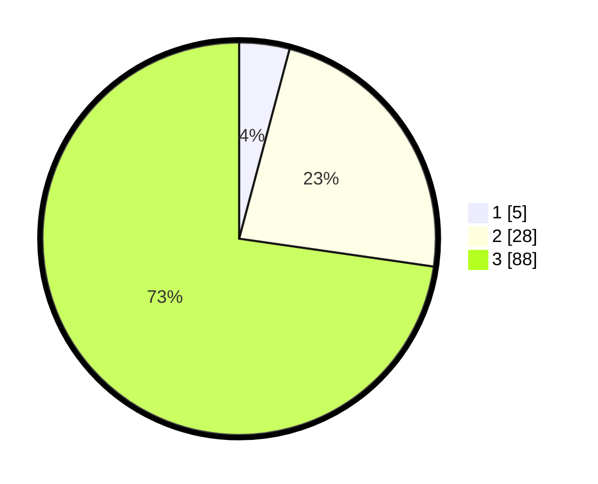

# Hasil

## Grafik

## Tabel

| No. | Nama Paslon    | Suara | Suara (raw) | Persentase |
|:--- |:-------------- | -----:| -----------:| ----------:|
| 1   | ANIES MUHAIMIN | 5     | [5][p-1]    | 4,13       |
| 2   | PRABOWO GIBRAN | 28    | [28][p-2]   | 23,14      |
| 3   | GANJAR MAHFUD  | 88    | [88][p-3]   | 72,73      |

[p-1]: https://github.com/gigit-pemilu/pemilu-2024/blob/main/pilpres/hitung-suara/sub/34-di-yogyakarta/sub/01-kulon-progo/sub/12-kalibawang/sub/2003-banjarharjo/sub/001-tps/sub/paslon-1.txt
[p-2]: https://github.com/gigit-pemilu/pemilu-2024/blob/main/pilpres/hitung-suara/sub/34-di-yogyakarta/sub/01-kulon-progo/sub/12-kalibawang/sub/2003-banjarharjo/sub/001-tps/sub/paslon-2.txt
[p-3]: https://github.com/gigit-pemilu/pemilu-2024/blob/main/pilpres/hitung-suara/sub/34-di-yogyakarta/sub/01-kulon-progo/sub/12-kalibawang/sub/2003-banjarharjo/sub/001-tps/sub/paslon-3.txt

## Foto C Plano

https://sirekap-obj-formc.kpu.go.id/ce2e/pemilu/ppwp/34/01/12/20/03/3401122003001-20240214-232636--576913d9-5ede-4412-b34f-b3f43b59545e.jpg

https://sirekap-obj-formc.kpu.go.id/ce2e/pemilu/ppwp/34/01/12/20/03/3401122003001-20240214-155658--68abcc79-57c2-43f4-988a-711b940e9ca5.jpg

https://sirekap-obj-formc.kpu.go.id/ce2e/pemilu/ppwp/34/01/12/20/03/3401122003001-20240216-105306--e080edf2-65f1-4662-aef0-4829c8426e9a.jpg

## Metadata

| Key        | Value               |
| ---------- | ------------------- |
| Time Stamp | 2024-02-16 11:00:29 |

## DATA PEMILIH TETAP

Jumlah pemilih dalam DPT: **149**.
 * L: **75**.
 * P: **74**.

## DATA PENGGUNA HAK PILIH

Jumlah pengguna hak pilih dalam DPT: **123**.
 * L: **61**.
 * P: **62**.

Jumlah pengguna hak pilih dalam DPTb: **1**.
 * L: **1**.
 * P: **0**.

Jumlah pengguna hak pilih dalam DPK: **0**.
 * L: **0**.
 * P: **0**.

Jumlah pengguna hak pilih: **124**.
 * L: **62**.
 * P: **62**.

## JUMLAH SUARA SAH DAN TIDAK SAH

JUMLAH SELURUH SUARA SAH: **121**.

JUMLAH SUARA TIDAK SAH: **3**.

JUMLAH SELURUH SUARA SAH DAN SUARA TIDAK SAH: **124**.

