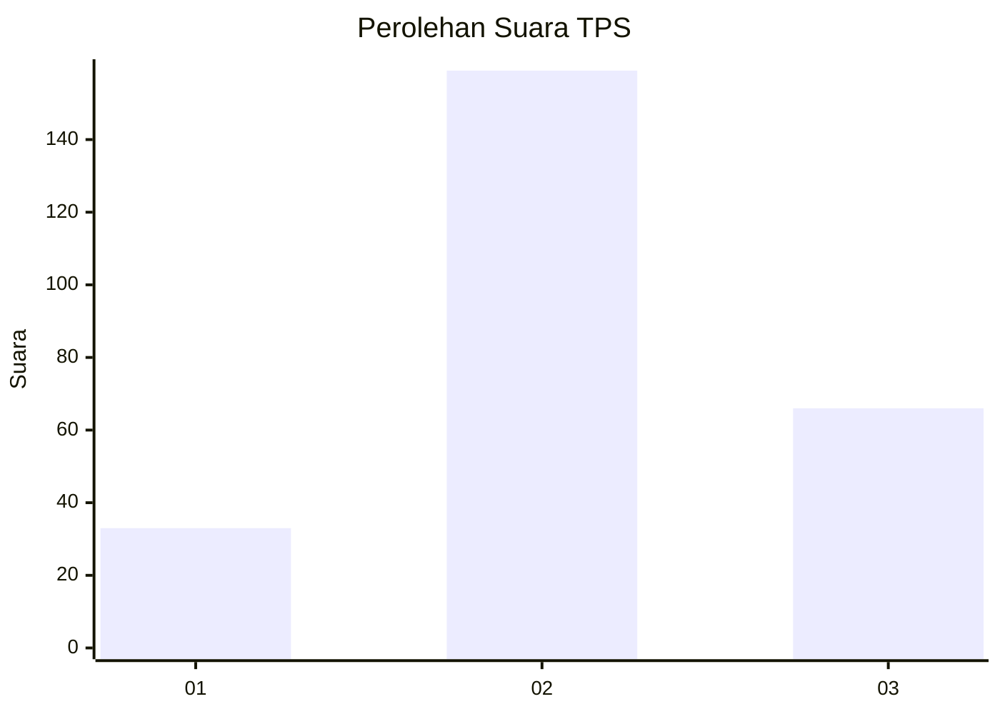
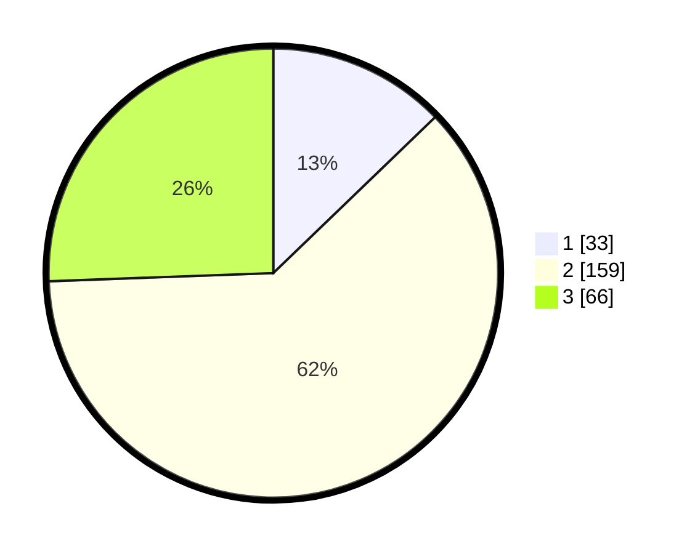

# Hasil

## Grafik

## Tabel

| No. | Nama Paslon    | Suara | Suara (raw) | Persentase |
|:--- |:-------------- | -----:| -----------:| ----------:|
| 1   | ANIES MUHAIMIN | 33    | [33][p-1]   | 12,79      |
| 2   | PRABOWO GIBRAN | 159   | [159][p-2]  | 61,63      |
| 3   | GANJAR MAHFUD  | 66    | [66][p-3]   | 25,58      |

[p-1]: https://github.com/gigit-pemilu/pemilu-2024-34-di-yogyakarta/blob/main/pilpres/hitung-suara/sub/34-di-yogyakarta/sub/01-kulon-progo/sub/12-kalibawang/sub/2003-banjarharjo/sub/006-tps/sub/paslon-1.txt
[p-2]: https://github.com/gigit-pemilu/pemilu-2024-34-di-yogyakarta/blob/main/pilpres/hitung-suara/sub/34-di-yogyakarta/sub/01-kulon-progo/sub/12-kalibawang/sub/2003-banjarharjo/sub/006-tps/sub/paslon-2.txt
[p-3]: https://github.com/gigit-pemilu/pemilu-2024-34-di-yogyakarta/blob/main/pilpres/hitung-suara/sub/34-di-yogyakarta/sub/01-kulon-progo/sub/12-kalibawang/sub/2003-banjarharjo/sub/006-tps/sub/paslon-3.txt

## Foto C Plano

https://sirekap-obj-formc.kpu.go.id/0149/pemilu/ppwp/34/01/12/20/03/3401122003006-20240216-143632--b655e81f-03d6-46b0-ad79-15715ca1958d.jpg

https://sirekap-obj-formc.kpu.go.id/0149/pemilu/ppwp/34/01/12/20/03/3401122003006-20240216-143633--f32c392f-b255-4945-95c6-b6cac4b4eb29.jpg

https://sirekap-obj-formc.kpu.go.id/0149/pemilu/ppwp/34/01/12/20/03/3401122003006-20240216-143633--ee451169-d225-49bc-82eb-f5393f9c477b.jpg

## Metadata

| Key        | Value               |
| ---------- | ------------------- |
| Time Stamp | 2024-02-21 13:00:00 |

## DATA PEMILIH TETAP

Jumlah pemilih dalam DPT: **284**.
 * L: **138**.
 * P: **146**.

## DATA PENGGUNA HAK PILIH

Jumlah pengguna hak pilih dalam DPT: **254**.
 * L: **120**.
 * P: **134**.

Jumlah pengguna hak pilih dalam DPTb: **9**.
 * L: **6**.
 * P: **3**.

Jumlah pengguna hak pilih dalam DPK: **2**.
 * L: **2**.
 * P: **0**.

Jumlah pengguna hak pilih: **265**.
 * L: **128**.
 * P: **137**.

## JUMLAH SUARA SAH DAN TIDAK SAH

JUMLAH SELURUH SUARA SAH: **258**.

JUMLAH SUARA TIDAK SAH: **7**.

JUMLAH SELURUH SUARA SAH DAN SUARA TIDAK SAH: **265**.

