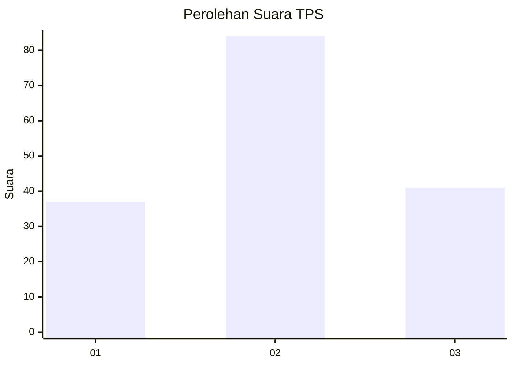
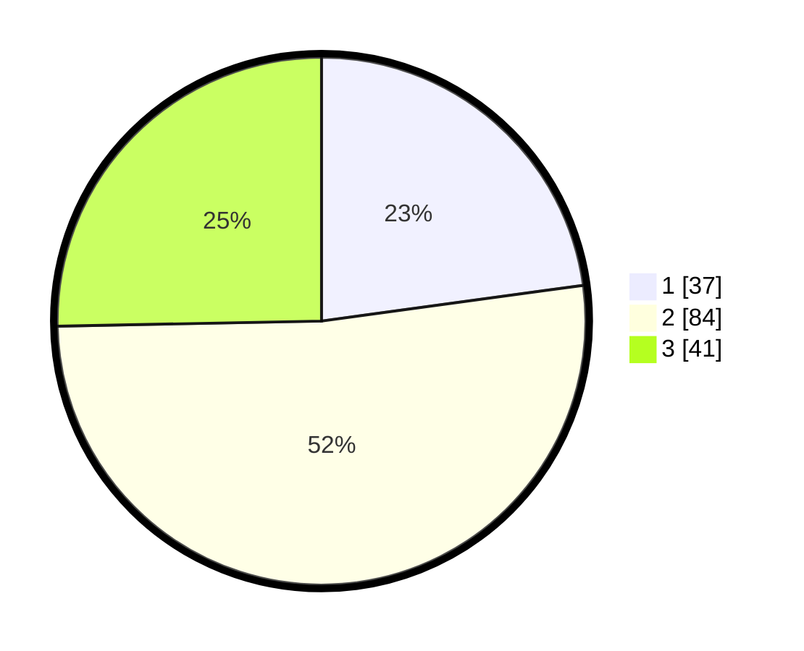

# Hasil

## Grafik

## Tabel

| No. | Nama Paslon    | Suara | Suara (raw) | Persentase |
|:--- |:-------------- | -----:| -----------:| ----------:|
| 1   | ANIES MUHAIMIN | 37    | [37][p-1]   | 22,84      |
| 2   | PRABOWO GIBRAN | 84    | [84][p-2]   | 51,85      |
| 3   | GANJAR MAHFUD  | 41    | [41][p-3]   | 25,31      |

[p-1]: https://github.com/gigit-pemilu/pemilu-2024-34-di-yogyakarta/blob/main/pilpres/hitung-suara/sub/34-di-yogyakarta/sub/01-kulon-progo/sub/12-kalibawang/sub/2003-banjarharjo/sub/011-tps/sub/paslon-1.txt
[p-2]: https://github.com/gigit-pemilu/pemilu-2024-34-di-yogyakarta/blob/main/pilpres/hitung-suara/sub/34-di-yogyakarta/sub/01-kulon-progo/sub/12-kalibawang/sub/2003-banjarharjo/sub/011-tps/sub/paslon-2.txt
[p-3]: https://github.com/gigit-pemilu/pemilu-2024-34-di-yogyakarta/blob/main/pilpres/hitung-suara/sub/34-di-yogyakarta/sub/01-kulon-progo/sub/12-kalibawang/sub/2003-banjarharjo/sub/011-tps/sub/paslon-3.txt

## Foto C Plano

https://sirekap-obj-formc.kpu.go.id/212e/pemilu/ppwp/34/01/12/20/03/3401122003011-20240216-222341--8fd2d96b-4f33-406b-855e-5710cf886c0e.jpg

https://sirekap-obj-formc.kpu.go.id/212e/pemilu/ppwp/34/01/12/20/03/3401122003011-20240215-170209--6580349c-8896-40c6-a1db-c07cd1f377ff.jpg

https://sirekap-obj-formc.kpu.go.id/212e/pemilu/ppwp/34/01/12/20/03/3401122003011-20240214-195427--de6a31b6-a98d-47c7-89e7-31d36affb126.jpg

## Metadata

| Key        | Value               |
| ---------- | ------------------- |
| Time Stamp | 2024-02-16 22:30:00 |

