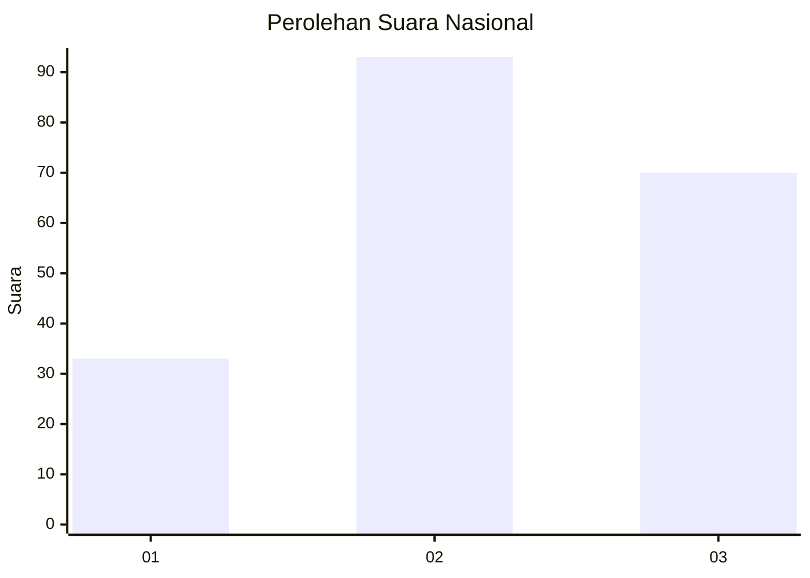
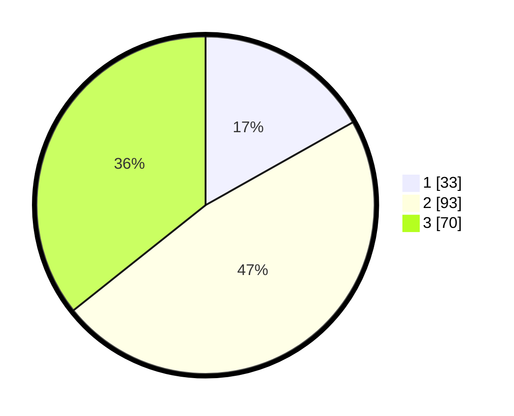

# Hasil

## Grafik

## Tabel

| No. | Nama Paslon    | Suara | Suara (raw) | Persentase |
|:--- |:-------------- | -----:| -----------:| ----------:|
| 1   | ANIES MUHAIMIN | 33    | [33][p-1]   | 16,84      |
| 2   | PRABOWO GIBRAN | 93    | [93][p-2]   | 47,45      |
| 3   | GANJAR MAHFUD  | 70    | [70][p-3]   | 35,71      |

[p-1]: https://github.com/gigit-pemilu/pemilu-2024/blob/main/pilpres/hitung-suara/sub/34-di-yogyakarta/sub/01-kulon-progo/sub/12-kalibawang/sub/2004-banjaroyo/sub/003-tps/sub/paslon-1.txt
[p-2]: https://github.com/gigit-pemilu/pemilu-2024/blob/main/pilpres/hitung-suara/sub/34-di-yogyakarta/sub/01-kulon-progo/sub/12-kalibawang/sub/2004-banjaroyo/sub/003-tps/sub/paslon-2.txt
[p-3]: https://github.com/gigit-pemilu/pemilu-2024/blob/main/pilpres/hitung-suara/sub/34-di-yogyakarta/sub/01-kulon-progo/sub/12-kalibawang/sub/2004-banjaroyo/sub/003-tps/sub/paslon-3.txt

## Foto C Plano

https://sirekap-obj-formc.kpu.go.id/7e8e/pemilu/ppwp/34/01/12/20/04/3401122004003-20240216-055219--10b1f793-dcd2-40d0-af30-758f03f4ba59.jpg

https://sirekap-obj-formc.kpu.go.id/7e8e/pemilu/ppwp/34/01/12/20/04/3401122004003-20240216-055231--167eb124-b0f7-47a9-8ae2-c662224bd8f2.jpg

https://sirekap-obj-formc.kpu.go.id/7e8e/pemilu/ppwp/34/01/12/20/04/3401122004003-20240216-055230--83337938-8329-489f-ae86-bf8a43ecbfdf.jpg

## Metadata

| Key        | Value               |
| ---------- | ------------------- |
| Time Stamp | 2024-02-21 15:00:00 |

## DATA PEMILIH TETAP

Jumlah pemilih dalam DPT: **248**.
 * L: **119**.
 * P: **129**.

## DATA PENGGUNA HAK PILIH

Jumlah pengguna hak pilih dalam DPT: **205**.
 * L: **96**.
 * P: **109**.

Jumlah pengguna hak pilih dalam DPTb: **0**.
 * L: **1**.
 * P: **0**.

Jumlah pengguna hak pilih dalam DPK: **0**.
 * L: **1**.
 * P: **0**.

Jumlah pengguna hak pilih: **207**.
 * L: **98**.
 * P: **109**.

## JUMLAH SUARA SAH DAN TIDAK SAH

JUMLAH SELURUH SUARA SAH: **196**.

JUMLAH SUARA TIDAK SAH: **11**.

JUMLAH SELURUH SUARA SAH DAN SUARA TIDAK SAH: **207**.

