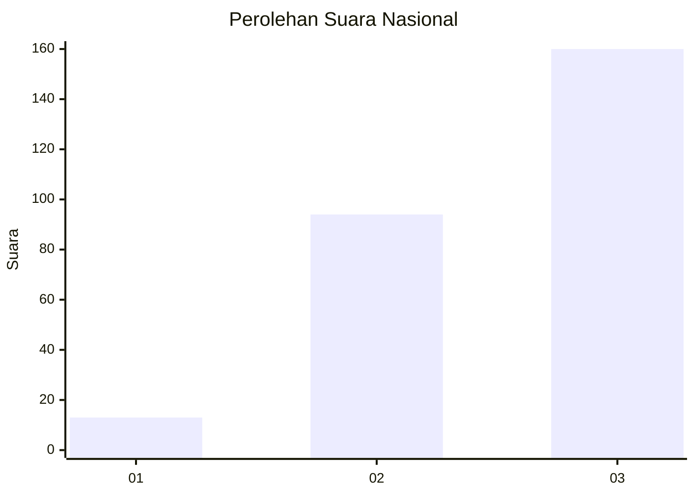
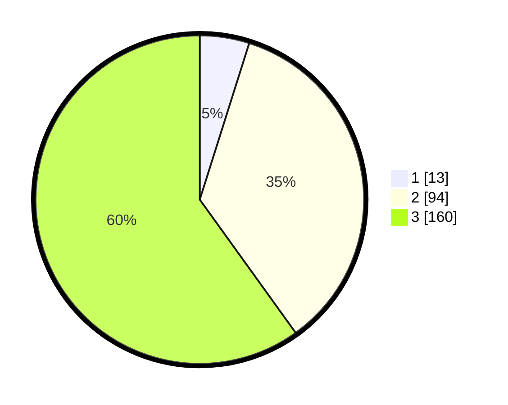

# Hasil

## Grafik

## Tabel

| No. | Nama Paslon    | Suara | Suara (raw) | Persentase |
|:--- |:-------------- | -----:| -----------:| ----------:|
| 1   | ANIES MUHAIMIN | 13    | [13][p-1]   | 4,87       |
| 2   | PRABOWO GIBRAN | 94    | [94][p-2]   | 35,21      |
| 3   | GANJAR MAHFUD  | 160   | [160][p-3]  | 59,93      |

[p-1]: https://github.com/gigit-pemilu/pemilu-2024/blob/main/pilpres/hitung-suara/sub/34-di-yogyakarta/sub/01-kulon-progo/sub/12-kalibawang/sub/2004-banjaroyo/sub/008-tps/sub/paslon-1.txt
[p-2]: https://github.com/gigit-pemilu/pemilu-2024/blob/main/pilpres/hitung-suara/sub/34-di-yogyakarta/sub/01-kulon-progo/sub/12-kalibawang/sub/2004-banjaroyo/sub/008-tps/sub/paslon-2.txt
[p-3]: https://github.com/gigit-pemilu/pemilu-2024/blob/main/pilpres/hitung-suara/sub/34-di-yogyakarta/sub/01-kulon-progo/sub/12-kalibawang/sub/2004-banjaroyo/sub/008-tps/sub/paslon-3.txt

## Foto C Plano

https://sirekap-obj-formc.kpu.go.id/c454/pemilu/ppwp/34/01/12/20/04/3401122004008-20240216-135937--3106a537-c264-41df-abe2-a530b444fc71.jpg

https://sirekap-obj-formc.kpu.go.id/c454/pemilu/ppwp/34/01/12/20/04/3401122004008-20240216-135939--b65f3a19-b266-4a76-bacc-76c508c6555c.jpg

https://sirekap-obj-formc.kpu.go.id/c454/pemilu/ppwp/34/01/12/20/04/3401122004008-20240216-135938--8fc04c87-549b-4382-bdfc-74c7e6b02a61.jpg

## Metadata

| Key        | Value               |
| ---------- | ------------------- |
| Time Stamp | 2024-02-21 17:00:00 |

## DATA PEMILIH TETAP

Jumlah pemilih dalam DPT: **295**.
 * L: **149**.
 * P: **146**.

## DATA PENGGUNA HAK PILIH

Jumlah pengguna hak pilih dalam DPT: **271**.
 * L: **137**.
 * P: **134**.

Jumlah pengguna hak pilih dalam DPTb: **6**.
 * L: **6**.
 * P: **0**.

Jumlah pengguna hak pilih dalam DPK: **1**.
 * L: **1**.
 * P: **0**.

Jumlah pengguna hak pilih: **278**.
 * L: **144**.
 * P: **134**.

## JUMLAH SUARA SAH DAN TIDAK SAH

JUMLAH SELURUH SUARA SAH: **267**.

JUMLAH SUARA TIDAK SAH: **11**.

JUMLAH SELURUH SUARA SAH DAN SUARA TIDAK SAH: **278**.

