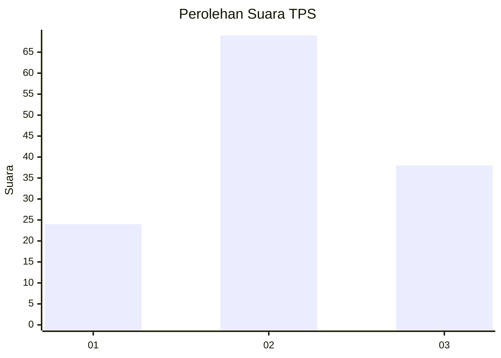
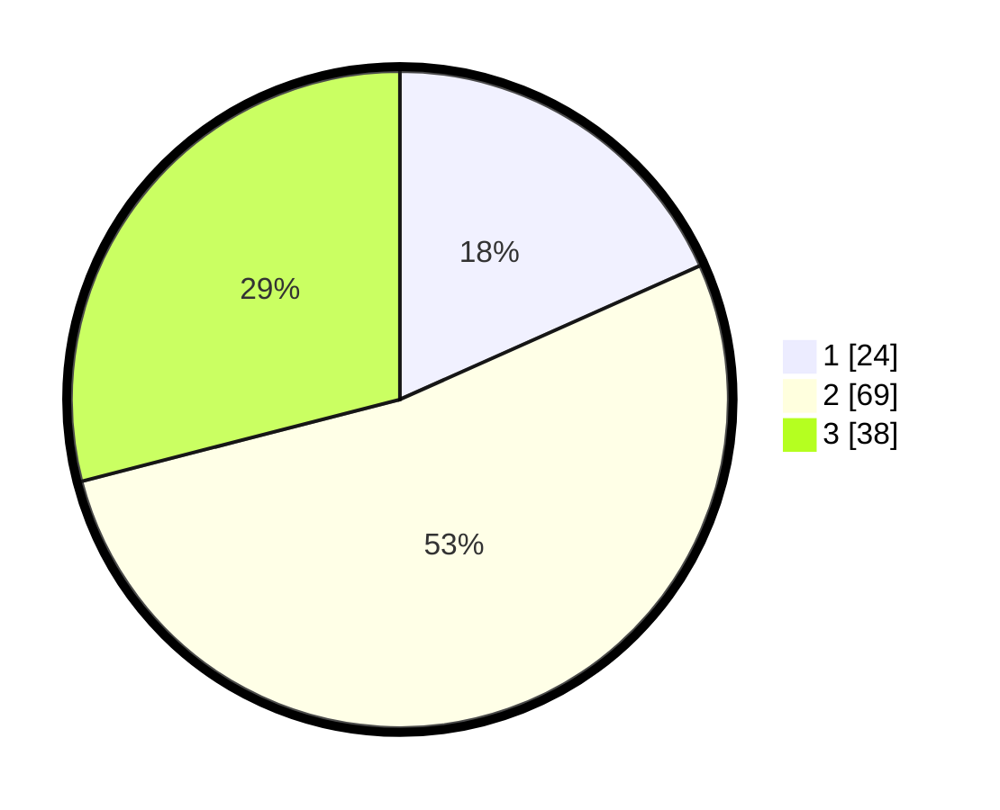

# Hasil

## Grafik

## Tabel

| No. | Nama Paslon    | Suara | Suara (raw) | Persentase |
|:--- |:-------------- | -----:| -----------:| ----------:|
| 1   | ANIES MUHAIMIN | 24    | [24][p-1]   | 18,32      |
| 2   | PRABOWO GIBRAN | 69    | [69][p-2]   | 52,67      |
| 3   | GANJAR MAHFUD  | 38    | [38][p-3]   | 29,01      |

[p-1]: https://github.com/gigit-pemilu/pemilu-2024-34-di-yogyakarta/blob/main/pilpres/hitung-suara/sub/34-di-yogyakarta/sub/02-bantul/sub/01-srandakan/sub/2001-poncosari/sub/001-tps/sub/paslon-1.txt
[p-2]: https://github.com/gigit-pemilu/pemilu-2024-34-di-yogyakarta/blob/main/pilpres/hitung-suara/sub/34-di-yogyakarta/sub/02-bantul/sub/01-srandakan/sub/2001-poncosari/sub/001-tps/sub/paslon-2.txt
[p-3]: https://github.com/gigit-pemilu/pemilu-2024-34-di-yogyakarta/blob/main/pilpres/hitung-suara/sub/34-di-yogyakarta/sub/02-bantul/sub/01-srandakan/sub/2001-poncosari/sub/001-tps/sub/paslon-3.txt

## Foto C Plano

https://sirekap-obj-formc.kpu.go.id/0d40/pemilu/ppwp/34/02/01/20/01/3402012001001-20240214-221412--92542105-201b-44dd-8a59-51f8ff010443.jpg

https://sirekap-obj-formc.kpu.go.id/0d40/pemilu/ppwp/34/02/01/20/01/3402012001001-20240214-204215--df2790d7-408b-4d94-97fb-29d3286542b2.jpg

https://sirekap-obj-formc.kpu.go.id/0d40/pemilu/ppwp/34/02/01/20/01/3402012001001-20240214-204320--68cf9c7b-e05e-4129-8cee-20fab894c086.jpg

## Metadata

| Key        | Value               |
| ---------- | ------------------- |
| Time Stamp | 2024-02-25 14:00:00 |

