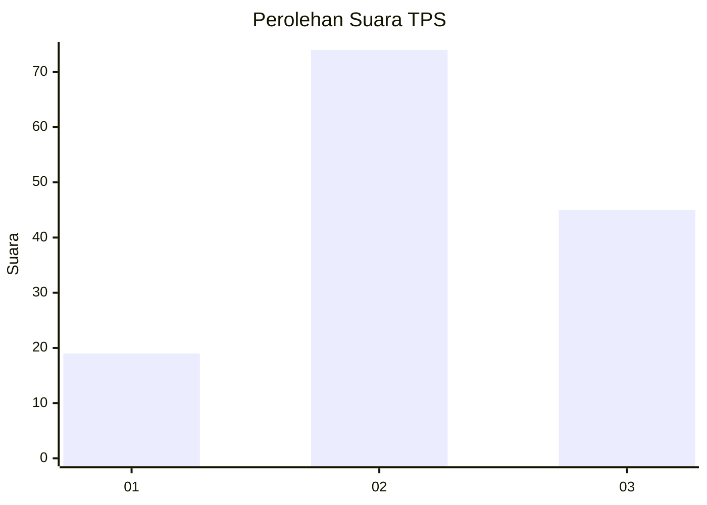
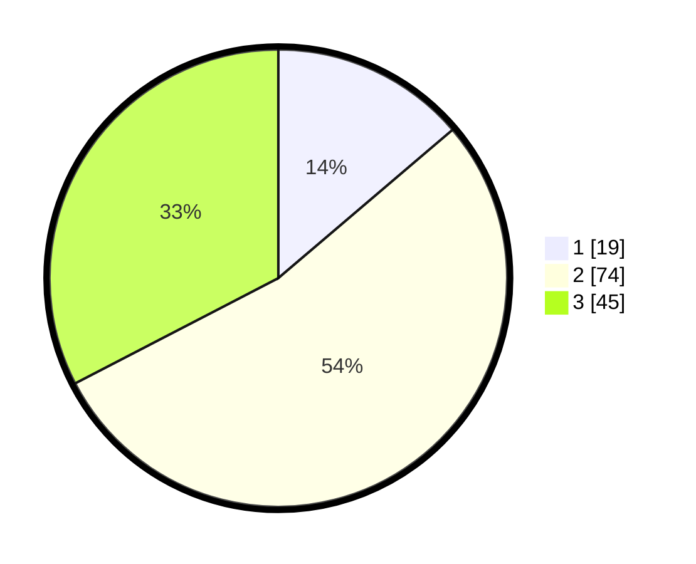

# Hasil

## Grafik

## Tabel

| No. | Nama Paslon    | Suara | Suara (raw) | Persentase |
|:--- |:-------------- | -----:| -----------:| ----------:|
| 1   | ANIES MUHAIMIN | 19    | [19][p-1]   | 13,77      |
| 2   | PRABOWO GIBRAN | 74    | [74][p-2]   | 53,62      |
| 3   | GANJAR MAHFUD  | 45    | [45][p-3]   | 32,61      |

[p-1]: https://github.com/gigit-pemilu/pemilu-2024-34-di-yogyakarta/blob/main/pilpres/hitung-suara/sub/34-di-yogyakarta/sub/02-bantul/sub/01-srandakan/sub/2001-poncosari/sub/002-tps/sub/paslon-1.txt
[p-2]: https://github.com/gigit-pemilu/pemilu-2024-34-di-yogyakarta/blob/main/pilpres/hitung-suara/sub/34-di-yogyakarta/sub/02-bantul/sub/01-srandakan/sub/2001-poncosari/sub/002-tps/sub/paslon-2.txt
[p-3]: https://github.com/gigit-pemilu/pemilu-2024-34-di-yogyakarta/blob/main/pilpres/hitung-suara/sub/34-di-yogyakarta/sub/02-bantul/sub/01-srandakan/sub/2001-poncosari/sub/002-tps/sub/paslon-3.txt

## Foto C Plano

https://sirekap-obj-formc.kpu.go.id/9ca9/pemilu/ppwp/34/02/01/20/01/3402012001002-20240214-214650--d73a9fe3-61dc-48f6-b6fd-3f62ec70a86f.jpg

https://sirekap-obj-formc.kpu.go.id/9ca9/pemilu/ppwp/34/02/01/20/01/3402012001002-20240214-214439--e4e12b1c-6c7e-4a53-85bd-4d76f6e35ec4.jpg

https://sirekap-obj-formc.kpu.go.id/9ca9/pemilu/ppwp/34/02/01/20/01/3402012001002-20240214-215004--cf44f98b-a508-415e-91e7-9776fe63b3e6.jpg

## Metadata

| Key        | Value               |
| ---------- | ------------------- |
| Time Stamp | 2024-02-15 20:30:46 |

