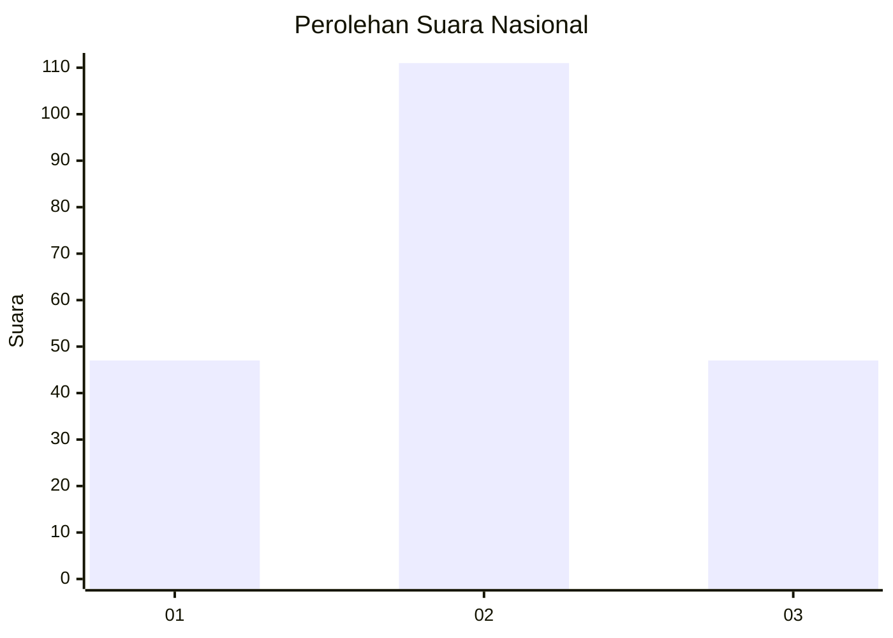
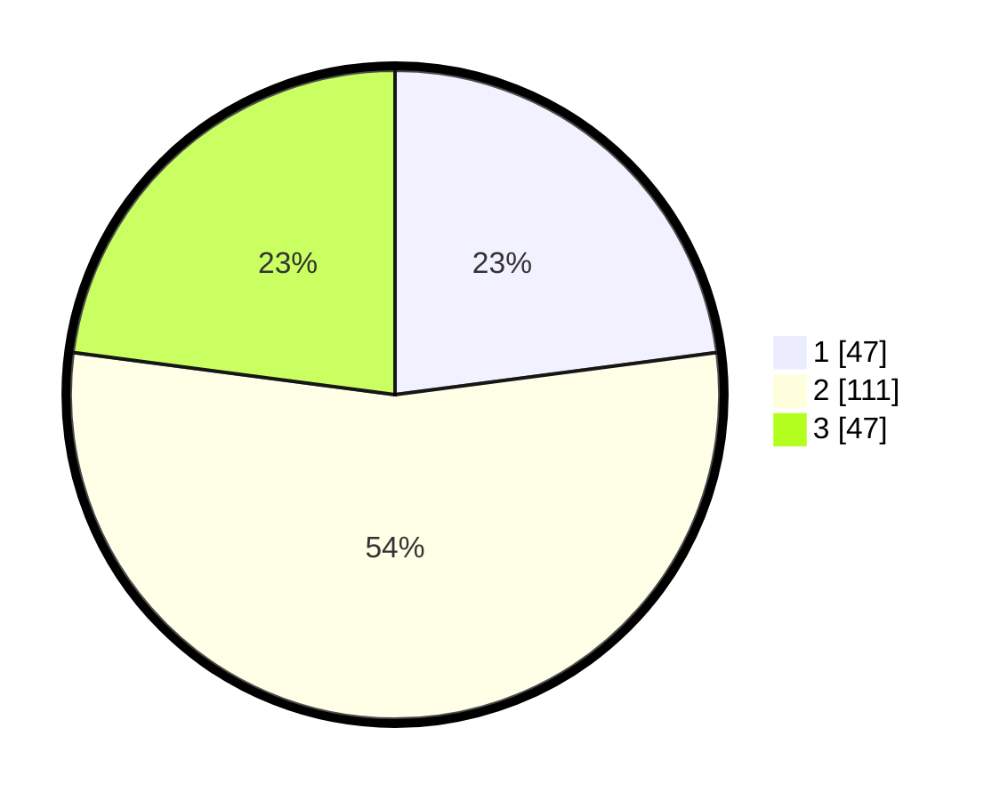

# Hasil

## Grafik

## Tabel

| No. | Nama Paslon    | Suara | Suara (raw) | Persentase |
|:--- |:-------------- | -----:| -----------:| ----------:|
| 1   | ANIES MUHAIMIN | 47    | [47][p-1]   | 22,93      |
| 2   | PRABOWO GIBRAN | 111   | [111][p-2]  | 54,15      |
| 3   | GANJAR MAHFUD  | 47    | [47][p-3]   | 22,93      |

[p-1]: https://github.com/gigit-pemilu/pemilu-2024/blob/main/pilpres/hitung-suara/sub/34-di-yogyakarta/sub/02-bantul/sub/01-srandakan/sub/2001-poncosari/sub/004-tps/sub/paslon-1.txt
[p-2]: https://github.com/gigit-pemilu/pemilu-2024/blob/main/pilpres/hitung-suara/sub/34-di-yogyakarta/sub/02-bantul/sub/01-srandakan/sub/2001-poncosari/sub/004-tps/sub/paslon-2.txt
[p-3]: https://github.com/gigit-pemilu/pemilu-2024/blob/main/pilpres/hitung-suara/sub/34-di-yogyakarta/sub/02-bantul/sub/01-srandakan/sub/2001-poncosari/sub/004-tps/sub/paslon-3.txt

## Foto C Plano

https://sirekap-obj-formc.kpu.go.id/ce23/pemilu/ppwp/34/02/01/20/01/3402012001004-20240216-174938--9ec8ff50-4ab9-4a6e-ab6c-39355e1e8128.jpg

https://sirekap-obj-formc.kpu.go.id/ce23/pemilu/ppwp/34/02/01/20/01/3402012001004-20240216-173813--8a4d56e0-edfe-43ef-b1df-eefd13eb824e.jpg

https://sirekap-obj-formc.kpu.go.id/ce23/pemilu/ppwp/34/02/01/20/01/3402012001004-20240216-173951--7f31ca6c-4da3-4e6a-ae4f-c8ddb0cc002e.jpg

## Metadata

| Key        | Value               |
| ---------- | ------------------- |
| Time Stamp | 2024-02-16 21:01:00 |

## DATA PEMILIH TETAP

Jumlah pemilih dalam DPT: **222**.
 * L: **112**.
 * P: **110**.

## DATA PENGGUNA HAK PILIH

Jumlah pengguna hak pilih dalam DPT: **199**.
 * L: **101**.
 * P: **98**.

Jumlah pengguna hak pilih dalam DPTb: **5**.
 * L: **3**.
 * P: **2**.

Jumlah pengguna hak pilih dalam DPK: **3**.
 * L: **1**.
 * P: **2**.

Jumlah pengguna hak pilih: **207**.
 * L: **105**.
 * P: **102**.

## JUMLAH SUARA SAH DAN TIDAK SAH

JUMLAH SELURUH SUARA SAH: **198**.

JUMLAH SUARA TIDAK SAH: **9**.

JUMLAH SELURUH SUARA SAH DAN SUARA TIDAK SAH: **207**.

