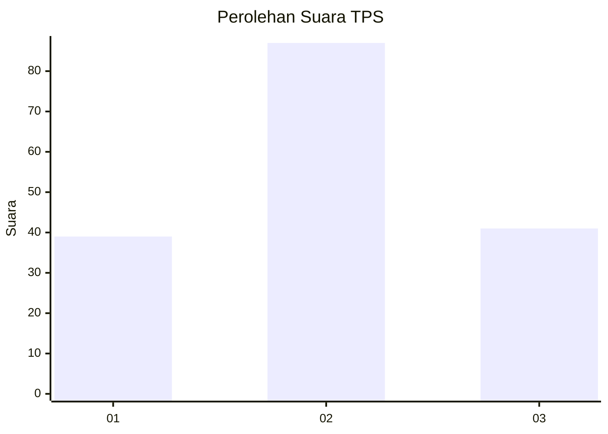
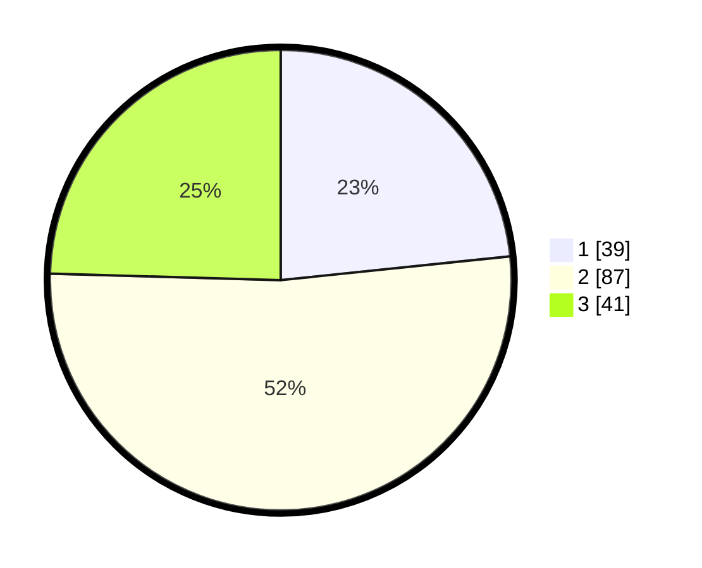

# Hasil

## Grafik

## Tabel

| No. | Nama Paslon    | Suara | Suara (raw) | Persentase |
|:--- |:-------------- | -----:| -----------:| ----------:|
| 1   | ANIES MUHAIMIN | 39    | [39][p-1]   | 23,35      |
| 2   | PRABOWO GIBRAN | 87    | [87][p-2]   | 52,10      |
| 3   | GANJAR MAHFUD  | 41    | [41][p-3]   | 24,55      |

[p-1]: https://github.com/gigit-pemilu/pemilu-2024-34-di-yogyakarta/blob/main/pilpres/hitung-suara/sub/34-di-yogyakarta/sub/02-bantul/sub/01-srandakan/sub/2001-poncosari/sub/005-tps/sub/paslon-1.txt
[p-2]: https://github.com/gigit-pemilu/pemilu-2024-34-di-yogyakarta/blob/main/pilpres/hitung-suara/sub/34-di-yogyakarta/sub/02-bantul/sub/01-srandakan/sub/2001-poncosari/sub/005-tps/sub/paslon-2.txt
[p-3]: https://github.com/gigit-pemilu/pemilu-2024-34-di-yogyakarta/blob/main/pilpres/hitung-suara/sub/34-di-yogyakarta/sub/02-bantul/sub/01-srandakan/sub/2001-poncosari/sub/005-tps/sub/paslon-3.txt

## Foto C Plano

https://sirekap-obj-formc.kpu.go.id/3f71/pemilu/ppwp/34/02/01/20/01/3402012001005-20240214-192458--846bc0cd-c730-42bf-9397-cd566a79e03f.jpg

https://sirekap-obj-formc.kpu.go.id/3f71/pemilu/ppwp/34/02/01/20/01/3402012001005-20240214-192734--a431243e-5afb-4ca2-b731-7508775cb62d.jpg

https://sirekap-obj-formc.kpu.go.id/3f71/pemilu/ppwp/34/02/01/20/01/3402012001005-20240214-192958--b74e04e3-bc14-45f8-be17-ba01f22a4b4b.jpg

## Metadata

| Key        | Value               |
| ---------- | ------------------- |
| Time Stamp | 2024-02-15 21:30:27 |

## DATA PEMILIH TETAP

Jumlah pemilih dalam DPT: **188**.
 * L: **87**.
 * P: **101**.

## DATA PENGGUNA HAK PILIH

Jumlah pengguna hak pilih dalam DPT: **168**.
 * L: **82**.
 * P: **86**.

Jumlah pengguna hak pilih dalam DPTb: **4**.
 * L: **1**.
 * P: **3**.

Jumlah pengguna hak pilih dalam DPK: **0**.
 * L: **0**.
 * P: **0**.

Jumlah pengguna hak pilih: **172**.
 * L: **83**.
 * P: **89**.

## JUMLAH SUARA SAH DAN TIDAK SAH

JUMLAH SELURUH SUARA SAH: **167**.

JUMLAH SUARA TIDAK SAH: **5**.

JUMLAH SELURUH SUARA SAH DAN SUARA TIDAK SAH: **172**.

