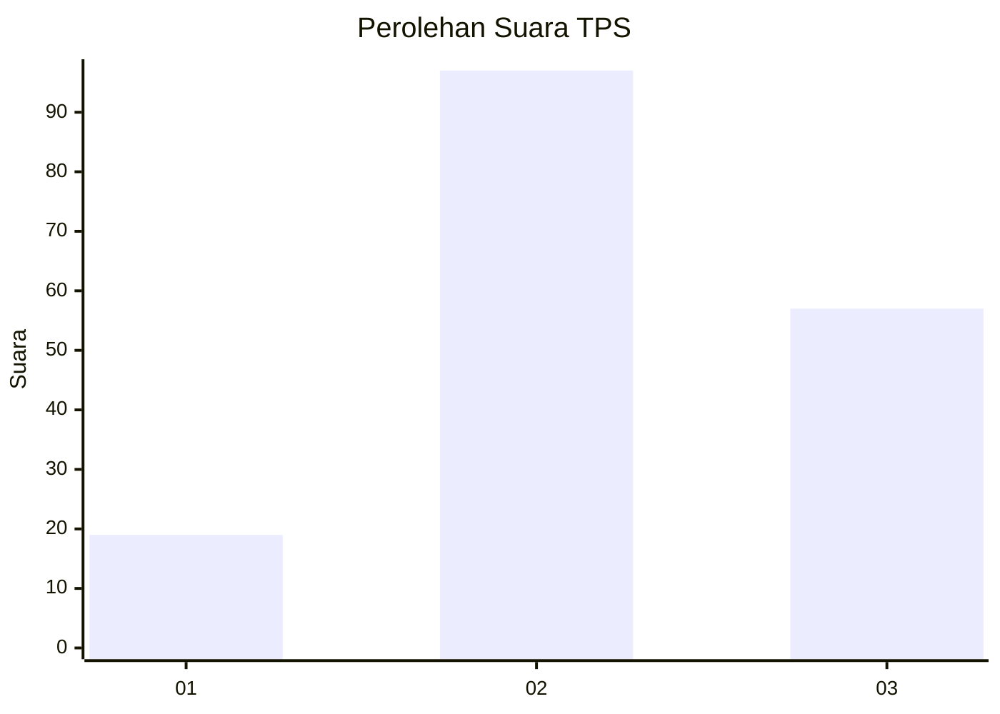
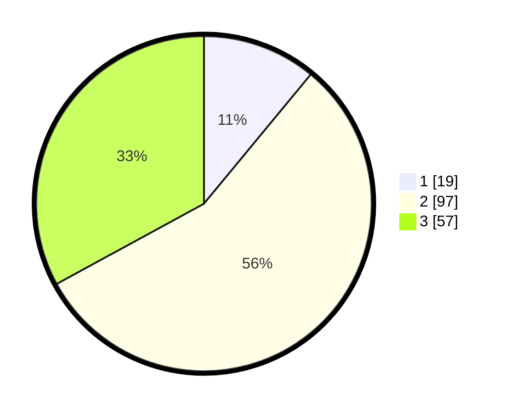

# Hasil

## Grafik

## Tabel

| No. | Nama Paslon    | Suara | Suara (raw) | Persentase |
|:--- |:-------------- | -----:| -----------:| ----------:|
| 1   | ANIES MUHAIMIN | 19    | [19][p-1]   | 10,98      |
| 2   | PRABOWO GIBRAN | 97    | [97][p-2]   | 56,07      |
| 3   | GANJAR MAHFUD  | 57    | [57][p-3]   | 32,95      |

[p-1]: https://github.com/gigit-pemilu/pemilu-2024-34-di-yogyakarta/blob/main/pilpres/hitung-suara/sub/34-di-yogyakarta/sub/02-bantul/sub/01-srandakan/sub/2001-poncosari/sub/006-tps/sub/paslon-1.txt
[p-2]: https://github.com/gigit-pemilu/pemilu-2024-34-di-yogyakarta/blob/main/pilpres/hitung-suara/sub/34-di-yogyakarta/sub/02-bantul/sub/01-srandakan/sub/2001-poncosari/sub/006-tps/sub/paslon-2.txt
[p-3]: https://github.com/gigit-pemilu/pemilu-2024-34-di-yogyakarta/blob/main/pilpres/hitung-suara/sub/34-di-yogyakarta/sub/02-bantul/sub/01-srandakan/sub/2001-poncosari/sub/006-tps/sub/paslon-3.txt

## Foto C Plano

https://sirekap-obj-formc.kpu.go.id/3c90/pemilu/ppwp/34/02/01/20/01/3402012001006-20240216-011617--e7ed1baf-3668-4546-8681-4b375aaa5505.jpg

https://sirekap-obj-formc.kpu.go.id/3c90/pemilu/ppwp/34/02/01/20/01/3402012001006-20240216-011621--26fc819b-8e34-472b-b20b-c13aa403789b.jpg

https://sirekap-obj-formc.kpu.go.id/3c90/pemilu/ppwp/34/02/01/20/01/3402012001006-20240216-011619--7622ce1c-8c39-4127-97a3-e41cb4e6a642.jpg

## Metadata

| Key        | Value               |
| ---------- | ------------------- |
| Time Stamp | 2024-02-16 12:51:22 |

## DATA PEMILIH TETAP

Jumlah pemilih dalam DPT: **200**.
 * L: **96**.
 * P: **104**.

## DATA PENGGUNA HAK PILIH

Jumlah pengguna hak pilih dalam DPT: **176**.
 * L: **87**.
 * P: **89**.

Jumlah pengguna hak pilih dalam DPTb: **3**.
 * L: **0**.
 * P: **3**.

Jumlah pengguna hak pilih dalam DPK: **0**.
 * L: **0**.
 * P: **0**.

Jumlah pengguna hak pilih: **179**.
 * L: **87**.
 * P: **92**.

## JUMLAH SUARA SAH DAN TIDAK SAH

JUMLAH SELURUH SUARA SAH: **173**.

JUMLAH SUARA TIDAK SAH: **6**.

JUMLAH SELURUH SUARA SAH DAN SUARA TIDAK SAH: **179**.

