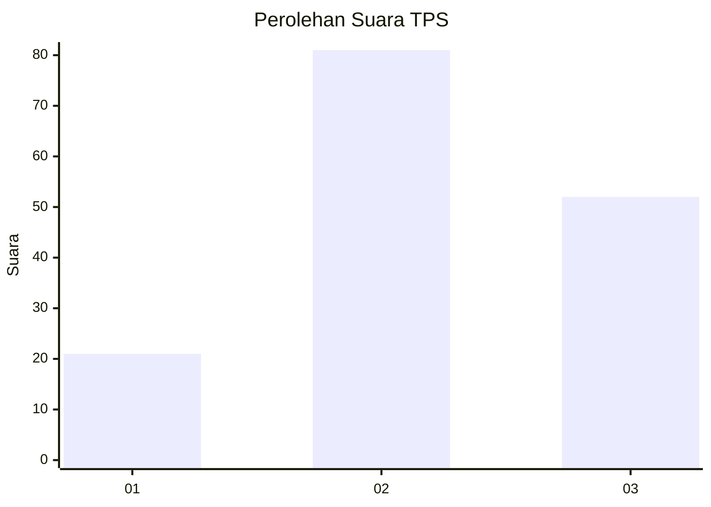
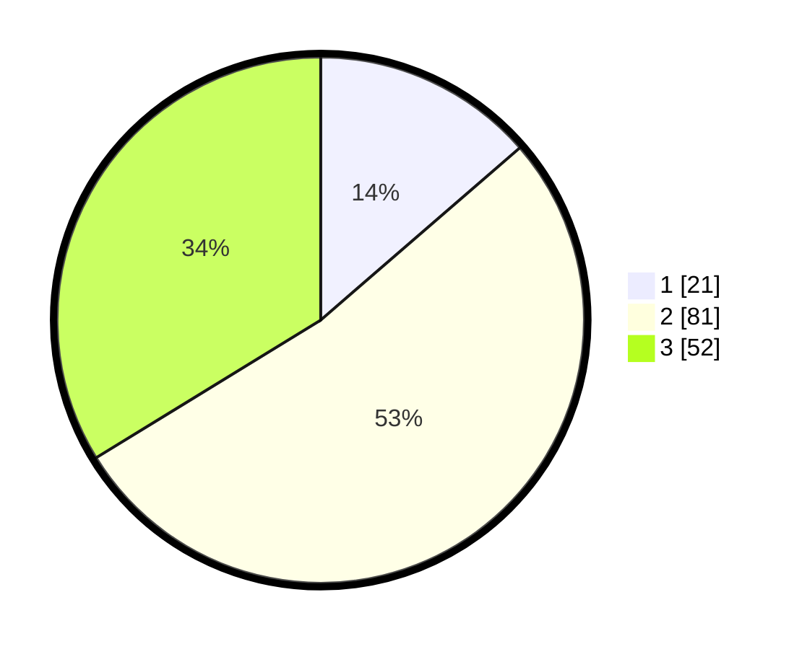

# Hasil

## Grafik

## Tabel

| No. | Nama Paslon    | Suara | Suara (raw) | Persentase |
|:--- |:-------------- | -----:| -----------:| ----------:|
| 1   | ANIES MUHAIMIN | 21    | [21][p-1]   | 13,64      |
| 2   | PRABOWO GIBRAN | 81    | [81][p-2]   | 52,60      |
| 3   | GANJAR MAHFUD  | 52    | [52][p-3]   | 33,77      |

[p-1]: https://github.com/gigit-pemilu/pemilu-2024-34-di-yogyakarta/blob/main/pilpres/hitung-suara/sub/34-di-yogyakarta/sub/02-bantul/sub/01-srandakan/sub/2001-poncosari/sub/015-tps/sub/paslon-1.txt
[p-2]: https://github.com/gigit-pemilu/pemilu-2024-34-di-yogyakarta/blob/main/pilpres/hitung-suara/sub/34-di-yogyakarta/sub/02-bantul/sub/01-srandakan/sub/2001-poncosari/sub/015-tps/sub/paslon-2.txt
[p-3]: https://github.com/gigit-pemilu/pemilu-2024-34-di-yogyakarta/blob/main/pilpres/hitung-suara/sub/34-di-yogyakarta/sub/02-bantul/sub/01-srandakan/sub/2001-poncosari/sub/015-tps/sub/paslon-3.txt

## Foto C Plano

https://sirekap-obj-formc.kpu.go.id/3932/pemilu/ppwp/34/02/01/20/01/3402012001015-20240215-000108--24323da8-fdf4-41c0-95d2-95f52b7805f8.jpg

https://sirekap-obj-formc.kpu.go.id/3932/pemilu/ppwp/34/02/01/20/01/3402012001015-20240215-000348--c0656d9d-1684-4fba-9a9e-5ccbef9de44c.jpg

https://sirekap-obj-formc.kpu.go.id/3932/pemilu/ppwp/34/02/01/20/01/3402012001015-20240215-000905--23b8d937-86ea-49c7-8624-b83c024db257.jpg

## Metadata

| Key        | Value               |
| ---------- | ------------------- |
| Time Stamp | 2024-02-15 21:30:27 |

