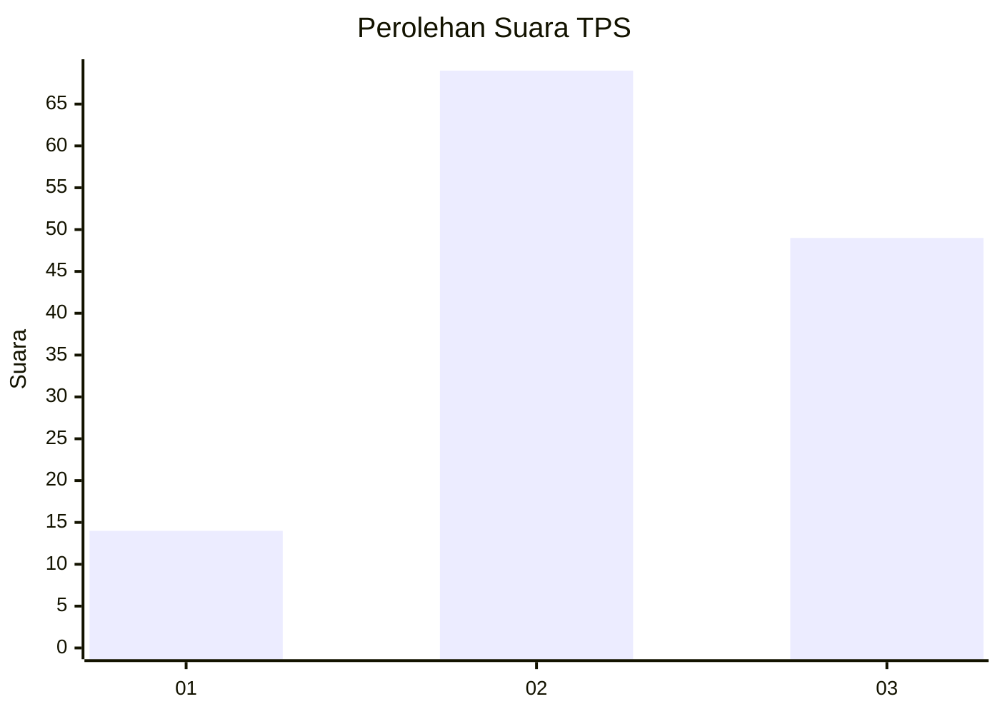
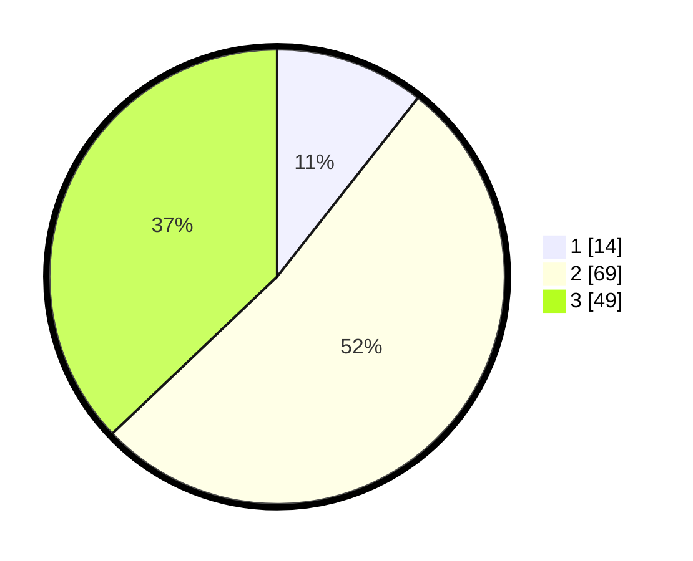

# Hasil

## Grafik

## Tabel

| No. | Nama Paslon    | Suara | Suara (raw) | Persentase |
|:--- |:-------------- | -----:| -----------:| ----------:|
| 1   | ANIES MUHAIMIN | 14    | [14][p-1]   | 10,61      |
| 2   | PRABOWO GIBRAN | 69    | [69][p-2]   | 52,27      |
| 3   | GANJAR MAHFUD  | 49    | [49][p-3]   | 37,12      |

[p-1]: https://github.com/gigit-pemilu/pemilu-2024-34-di-yogyakarta/blob/main/pilpres/hitung-suara/sub/34-di-yogyakarta/sub/02-bantul/sub/01-srandakan/sub/2001-poncosari/sub/018-tps/sub/paslon-1.txt
[p-2]: https://github.com/gigit-pemilu/pemilu-2024-34-di-yogyakarta/blob/main/pilpres/hitung-suara/sub/34-di-yogyakarta/sub/02-bantul/sub/01-srandakan/sub/2001-poncosari/sub/018-tps/sub/paslon-2.txt
[p-3]: https://github.com/gigit-pemilu/pemilu-2024-34-di-yogyakarta/blob/main/pilpres/hitung-suara/sub/34-di-yogyakarta/sub/02-bantul/sub/01-srandakan/sub/2001-poncosari/sub/018-tps/sub/paslon-3.txt

## Foto C Plano

https://sirekap-obj-formc.kpu.go.id/fcd8/pemilu/ppwp/34/02/01/20/01/3402012001018-20240216-135147--447883fb-2ffc-4686-8441-56f5298f7c8d.jpg

https://sirekap-obj-formc.kpu.go.id/fcd8/pemilu/ppwp/34/02/01/20/01/3402012001018-20240216-135148--585213ef-833b-4532-89d0-3bc777a1fb8d.jpg

https://sirekap-obj-formc.kpu.go.id/fcd8/pemilu/ppwp/34/02/01/20/01/3402012001018-20240216-135148--35d4d5e5-01ca-4f8e-a82b-7337ec62ae29.jpg

## Metadata

| Key        | Value               |
| ---------- | ------------------- |
| Time Stamp | 2024-02-19 17:00:00 |

## DATA PEMILIH TETAP

Jumlah pemilih dalam DPT: **161**.
 * L: **76**.
 * P: **85**.

## DATA PENGGUNA HAK PILIH

Jumlah pengguna hak pilih dalam DPT: **139**.
 * L: **68**.
 * P: **71**.

Jumlah pengguna hak pilih dalam DPTb: **0**.
 * L: **0**.
 * P: **0**.

Jumlah pengguna hak pilih dalam DPK: **0**.
 * L: **0**.
 * P: **0**.

Jumlah pengguna hak pilih: **139**.
 * L: **68**.
 * P: **71**.

## JUMLAH SUARA SAH DAN TIDAK SAH

JUMLAH SELURUH SUARA SAH: **132**.

JUMLAH SUARA TIDAK SAH: **7**.

JUMLAH SELURUH SUARA SAH DAN SUARA TIDAK SAH: **139**.

