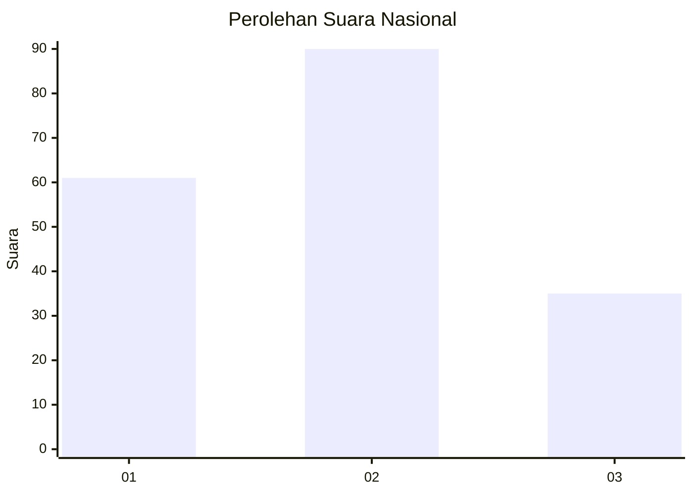
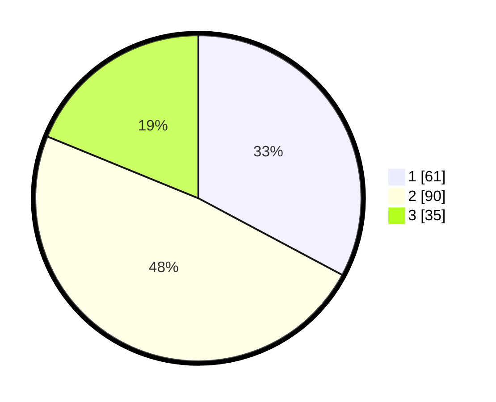

# Hasil

## Grafik

## Tabel

| No. | Nama Paslon    | Suara | Suara (raw) | Persentase |
|:--- |:-------------- | -----:| -----------:| ----------:|
| 1   | ANIES MUHAIMIN | 61    | [61][p-1]   | 32,80      |
| 2   | PRABOWO GIBRAN | 90    | [90][p-2]   | 48,39      |
| 3   | GANJAR MAHFUD  | 35    | [35][p-3]   | 18,82      |

[p-1]: https://github.com/gigit-pemilu/pemilu-2024/blob/main/pilpres/hitung-suara/sub/34-di-yogyakarta/sub/02-bantul/sub/01-srandakan/sub/2001-poncosari/sub/020-tps/sub/paslon-1.txt
[p-2]: https://github.com/gigit-pemilu/pemilu-2024/blob/main/pilpres/hitung-suara/sub/34-di-yogyakarta/sub/02-bantul/sub/01-srandakan/sub/2001-poncosari/sub/020-tps/sub/paslon-2.txt
[p-3]: https://github.com/gigit-pemilu/pemilu-2024/blob/main/pilpres/hitung-suara/sub/34-di-yogyakarta/sub/02-bantul/sub/01-srandakan/sub/2001-poncosari/sub/020-tps/sub/paslon-3.txt

## Foto C Plano

https://sirekap-obj-formc.kpu.go.id/fba3/pemilu/ppwp/34/02/01/20/01/3402012001020-20240215-025756--a1ecf348-d30f-482e-9ad0-40a23873931c.jpg

https://sirekap-obj-formc.kpu.go.id/fba3/pemilu/ppwp/34/02/01/20/01/3402012001020-20240214-184951--d07d04ca-9ca9-4709-a164-0fed32f2fbca.jpg

https://sirekap-obj-formc.kpu.go.id/fba3/pemilu/ppwp/34/02/01/20/01/3402012001020-20240215-025915--fe37ca3f-d3de-4607-bd88-c54ceb34b0ba.jpg

## Metadata

| Key        | Value               |
| ---------- | ------------------- |
| Time Stamp | 2024-02-15 21:30:27 |

