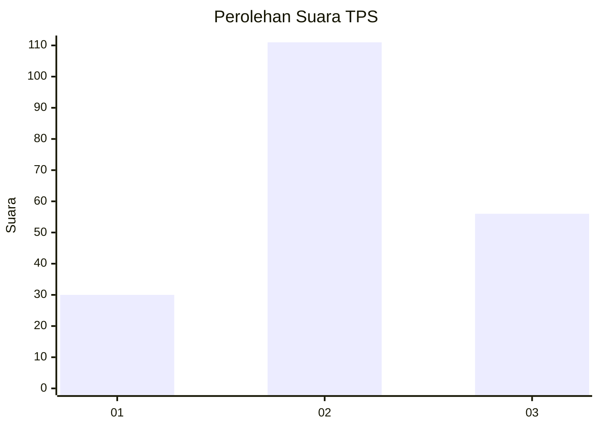
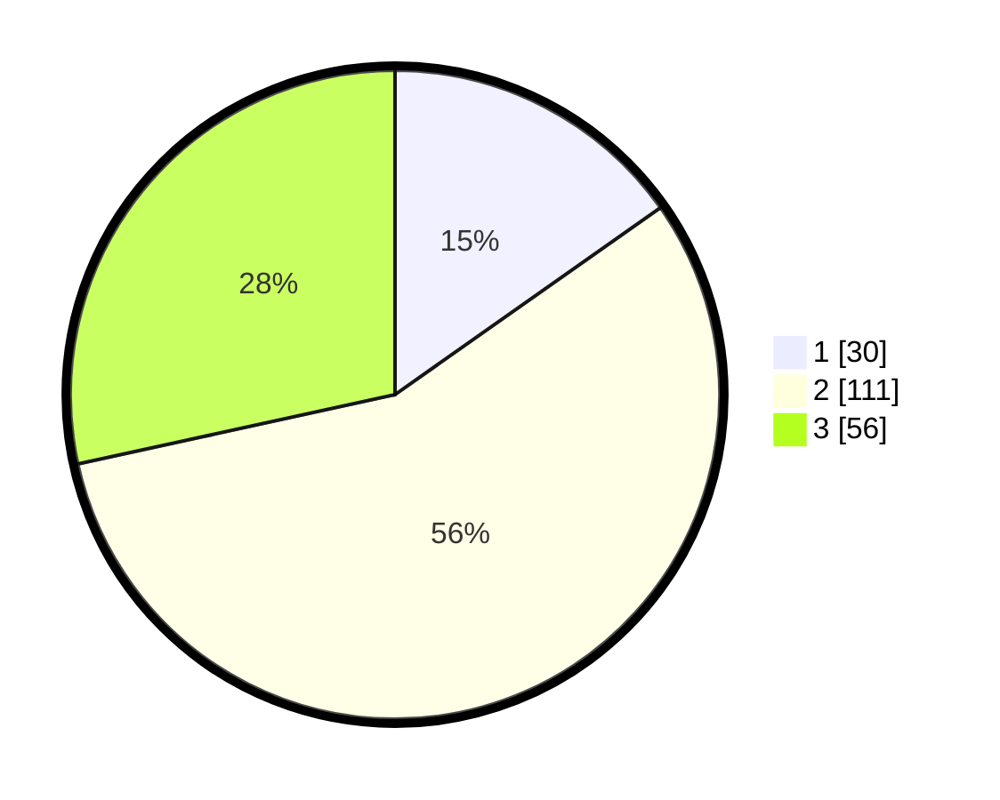

# Hasil

## Grafik

## Tabel

| No. | Nama Paslon    | Suara | Suara (raw) | Persentase |
|:--- |:-------------- | -----:| -----------:| ----------:|
| 1   | ANIES MUHAIMIN | 30    | [30][p-1]   | 15,23      |
| 2   | PRABOWO GIBRAN | 111   | [111][p-2]  | 56,35      |
| 3   | GANJAR MAHFUD  | 56    | [56][p-3]   | 28,43      |

[p-1]: https://github.com/gigit-pemilu/pemilu-2024-34-di-yogyakarta/blob/main/pilpres/hitung-suara/sub/34-di-yogyakarta/sub/02-bantul/sub/01-srandakan/sub/2001-poncosari/sub/021-tps/sub/paslon-1.txt
[p-2]: https://github.com/gigit-pemilu/pemilu-2024-34-di-yogyakarta/blob/main/pilpres/hitung-suara/sub/34-di-yogyakarta/sub/02-bantul/sub/01-srandakan/sub/2001-poncosari/sub/021-tps/sub/paslon-2.txt
[p-3]: https://github.com/gigit-pemilu/pemilu-2024-34-di-yogyakarta/blob/main/pilpres/hitung-suara/sub/34-di-yogyakarta/sub/02-bantul/sub/01-srandakan/sub/2001-poncosari/sub/021-tps/sub/paslon-3.txt

## Foto C Plano

https://sirekap-obj-formc.kpu.go.id/40c3/pemilu/ppwp/34/02/01/20/01/3402012001021-20240216-132736--97c23eae-fee7-4e66-9fcd-f0550b192d08.jpg

https://sirekap-obj-formc.kpu.go.id/40c3/pemilu/ppwp/34/02/01/20/01/3402012001021-20240216-132737--2a0cdb01-4b13-451c-ae81-c366ba808437.jpg

https://sirekap-obj-formc.kpu.go.id/40c3/pemilu/ppwp/34/02/01/20/01/3402012001021-20240216-132737--69983f53-ae0b-4a60-85f2-021ac5196030.jpg

## Metadata

| Key        | Value               |
| ---------- | ------------------- |
| Time Stamp | 2024-02-19 17:00:00 |

## DATA PEMILIH TETAP

Jumlah pemilih dalam DPT: **197**.
 * L: **108**.
 * P: **97**.

## DATA PENGGUNA HAK PILIH

Jumlah pengguna hak pilih dalam DPT: **197**.
 * L: **100**.
 * P: **97**.

Jumlah pengguna hak pilih dalam DPTb: **4**.
 * L: **2**.
 * P: **2**.

Jumlah pengguna hak pilih dalam DPK: **0**.
 * L: **0**.
 * P: **0**.

Jumlah pengguna hak pilih: **201**.
 * L: **102**.
 * P: **99**.

## JUMLAH SUARA SAH DAN TIDAK SAH

JUMLAH SELURUH SUARA SAH: **197**.

JUMLAH SUARA TIDAK SAH: **4**.

JUMLAH SELURUH SUARA SAH DAN SUARA TIDAK SAH: **201**.

