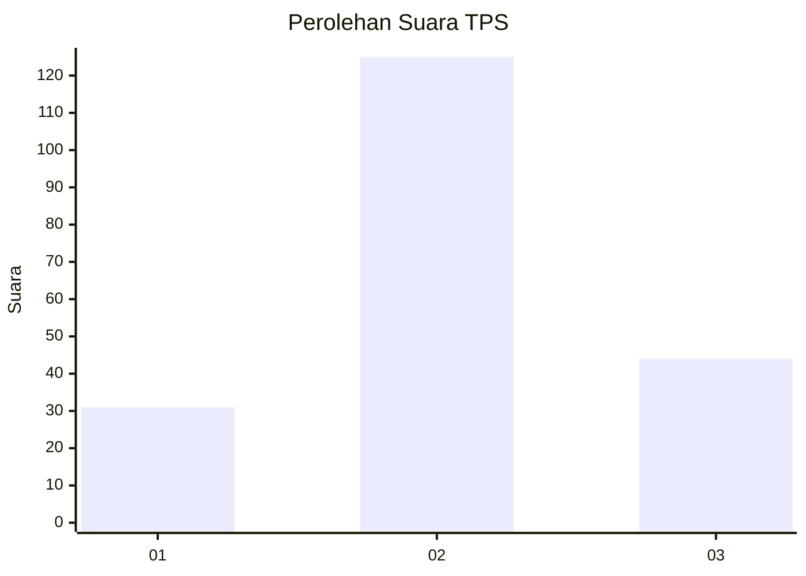
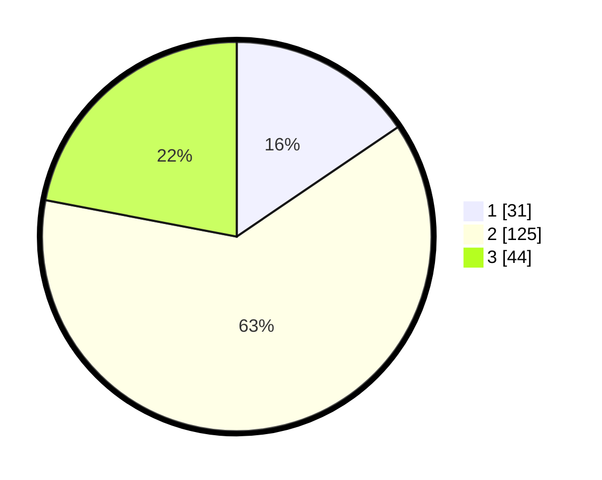

# Hasil

## Grafik

## Tabel

| No. | Nama Paslon    | Suara | Suara (raw) | Persentase |
|:--- |:-------------- | -----:| -----------:| ----------:|
| 1   | ANIES MUHAIMIN | 31    | [31][p-1]   | 15,50      |
| 2   | PRABOWO GIBRAN | 125   | [125][p-2]  | 62,50      |
| 3   | GANJAR MAHFUD  | 44    | [44][p-3]   | 22,00      |

[p-1]: https://github.com/gigit-pemilu/pemilu-2024-34-di-yogyakarta/blob/main/pilpres/hitung-suara/sub/34-di-yogyakarta/sub/02-bantul/sub/01-srandakan/sub/2001-poncosari/sub/025-tps/sub/paslon-1.txt
[p-2]: https://github.com/gigit-pemilu/pemilu-2024-34-di-yogyakarta/blob/main/pilpres/hitung-suara/sub/34-di-yogyakarta/sub/02-bantul/sub/01-srandakan/sub/2001-poncosari/sub/025-tps/sub/paslon-2.txt
[p-3]: https://github.com/gigit-pemilu/pemilu-2024-34-di-yogyakarta/blob/main/pilpres/hitung-suara/sub/34-di-yogyakarta/sub/02-bantul/sub/01-srandakan/sub/2001-poncosari/sub/025-tps/sub/paslon-3.txt

## Foto C Plano

https://sirekap-obj-formc.kpu.go.id/f054/pemilu/ppwp/34/02/01/20/01/3402012001025-20240215-002336--4631e889-4d7d-45de-b3df-5285b7d742d5.jpg

https://sirekap-obj-formc.kpu.go.id/f054/pemilu/ppwp/34/02/01/20/01/3402012001025-20240215-002427--ba28da99-2d66-42aa-b3e0-be0f49eb72fc.jpg

https://sirekap-obj-formc.kpu.go.id/f054/pemilu/ppwp/34/02/01/20/01/3402012001025-20240215-002528--c58ec47a-4a6d-48d2-b788-ac55b93337bf.jpg

## Metadata

| Key        | Value               |
| ---------- | ------------------- |
| Time Stamp | 2024-02-24 22:31:28 |

