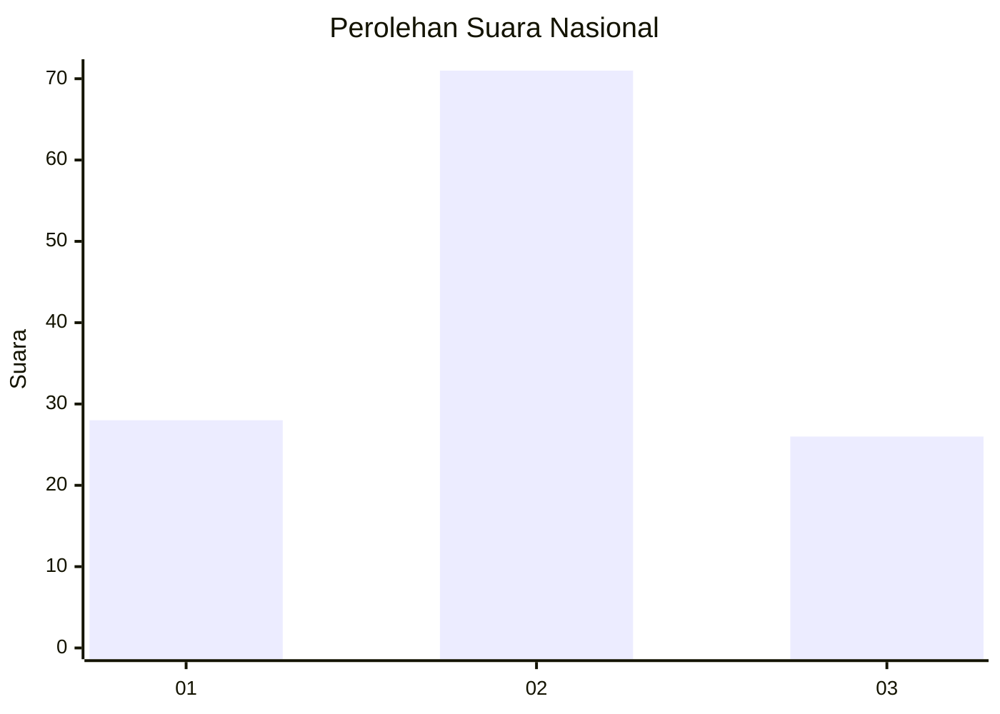
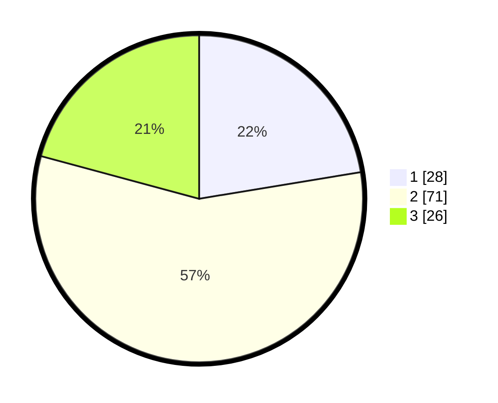

# Hasil

## Grafik

## Tabel

| No. | Nama Paslon    | Suara | Suara (raw) | Persentase |
|:--- |:-------------- | -----:| -----------:| ----------:|
| 1   | ANIES MUHAIMIN | 28    | [28][p-1]   | 22,40      |
| 2   | PRABOWO GIBRAN | 71    | [71][p-2]   | 56,80      |
| 3   | GANJAR MAHFUD  | 26    | [26][p-3]   | 20,80      |

[p-1]: https://github.com/gigit-pemilu/pemilu-2024/blob/main/pilpres/hitung-suara/sub/34-di-yogyakarta/sub/02-bantul/sub/01-srandakan/sub/2001-poncosari/sub/029-tps/sub/paslon-1.txt
[p-2]: https://github.com/gigit-pemilu/pemilu-2024/blob/main/pilpres/hitung-suara/sub/34-di-yogyakarta/sub/02-bantul/sub/01-srandakan/sub/2001-poncosari/sub/029-tps/sub/paslon-2.txt
[p-3]: https://github.com/gigit-pemilu/pemilu-2024/blob/main/pilpres/hitung-suara/sub/34-di-yogyakarta/sub/02-bantul/sub/01-srandakan/sub/2001-poncosari/sub/029-tps/sub/paslon-3.txt

## Foto C Plano

https://sirekap-obj-formc.kpu.go.id/bb66/pemilu/ppwp/34/02/01/20/01/3402012001029-20240217-010033--e31cb5ce-a617-44e9-a1b0-47ed23ac551c.jpg

https://sirekap-obj-formc.kpu.go.id/bb66/pemilu/ppwp/34/02/01/20/01/3402012001029-20240217-010035--e12fb2d1-b7e9-41e9-b47f-08c2b905487e.jpg

https://sirekap-obj-formc.kpu.go.id/bb66/pemilu/ppwp/34/02/01/20/01/3402012001029-20240217-010034--44b3cb0e-a476-4c07-b3ff-6138f0dd62d4.jpg

## Metadata

| Key        | Value               |
| ---------- | ------------------- |
| Time Stamp | 2024-02-19 17:00:00 |

## DATA PEMILIH TETAP

Jumlah pemilih dalam DPT: **135**.
 * L: **72**.
 * P: **63**.

## DATA PENGGUNA HAK PILIH

Jumlah pengguna hak pilih dalam DPT: **124**.
 * L: **68**.
 * P: **56**.

Jumlah pengguna hak pilih dalam DPTb: **4**.
 * L: **1**.
 * P: **3**.

Jumlah pengguna hak pilih dalam DPK: **0**.
 * L: **0**.
 * P: **0**.

Jumlah pengguna hak pilih: **128**.
 * L: **69**.
 * P: **59**.

## JUMLAH SUARA SAH DAN TIDAK SAH

JUMLAH SELURUH SUARA SAH: **125**.

JUMLAH SUARA TIDAK SAH: **3**.

JUMLAH SELURUH SUARA SAH DAN SUARA TIDAK SAH: **128**.

