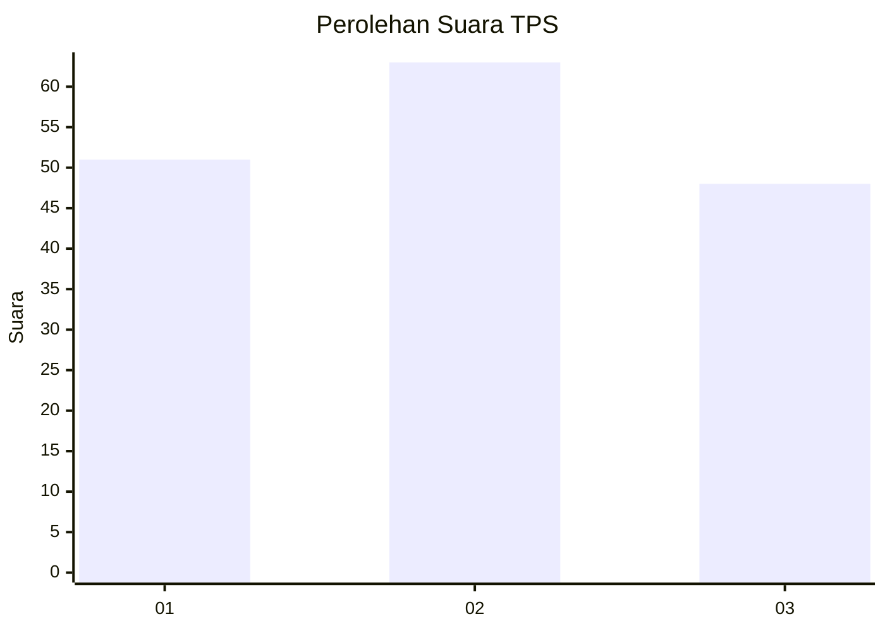
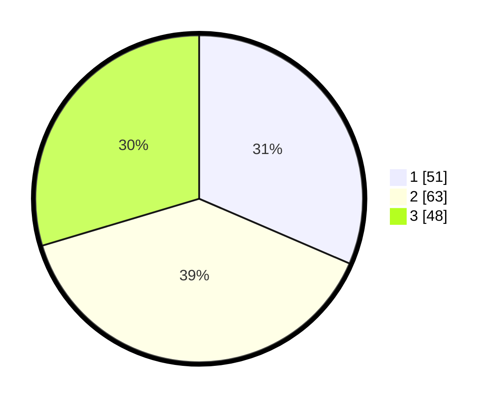

# Hasil

## Grafik

## Tabel

| No. | Nama Paslon    | Suara | Suara (raw) | Persentase |
|:--- |:-------------- | -----:| -----------:| ----------:|
| 1   | ANIES MUHAIMIN | 51    | [51][p-1]   | 31,48      |
| 2   | PRABOWO GIBRAN | 63    | [63][p-2]   | 38,89      |
| 3   | GANJAR MAHFUD  | 48    | [48][p-3]   | 29,63      |

[p-1]: https://github.com/gigit-pemilu/pemilu-2024-34-di-yogyakarta/blob/main/pilpres/hitung-suara/sub/34-di-yogyakarta/sub/02-bantul/sub/01-srandakan/sub/2001-poncosari/sub/030-tps/sub/paslon-1.txt
[p-2]: https://github.com/gigit-pemilu/pemilu-2024-34-di-yogyakarta/blob/main/pilpres/hitung-suara/sub/34-di-yogyakarta/sub/02-bantul/sub/01-srandakan/sub/2001-poncosari/sub/030-tps/sub/paslon-2.txt
[p-3]: https://github.com/gigit-pemilu/pemilu-2024-34-di-yogyakarta/blob/main/pilpres/hitung-suara/sub/34-di-yogyakarta/sub/02-bantul/sub/01-srandakan/sub/2001-poncosari/sub/030-tps/sub/paslon-3.txt

## Foto C Plano

https://sirekap-obj-formc.kpu.go.id/3f08/pemilu/ppwp/34/02/01/20/01/3402012001030-20240214-234448--91141833-289f-4123-8e34-8a646964bb32.jpg

https://sirekap-obj-formc.kpu.go.id/3f08/pemilu/ppwp/34/02/01/20/01/3402012001030-20240214-234554--2974c6d9-391e-4c27-a1d5-b5095d144b6a.jpg

https://sirekap-obj-formc.kpu.go.id/3f08/pemilu/ppwp/34/02/01/20/01/3402012001030-20240214-234645--237cfd6d-5277-47f9-83a4-690fe8c317d1.jpg

## Metadata

| Key        | Value               |
| ---------- | ------------------- |
| Time Stamp | 2024-02-15 21:01:18 |

