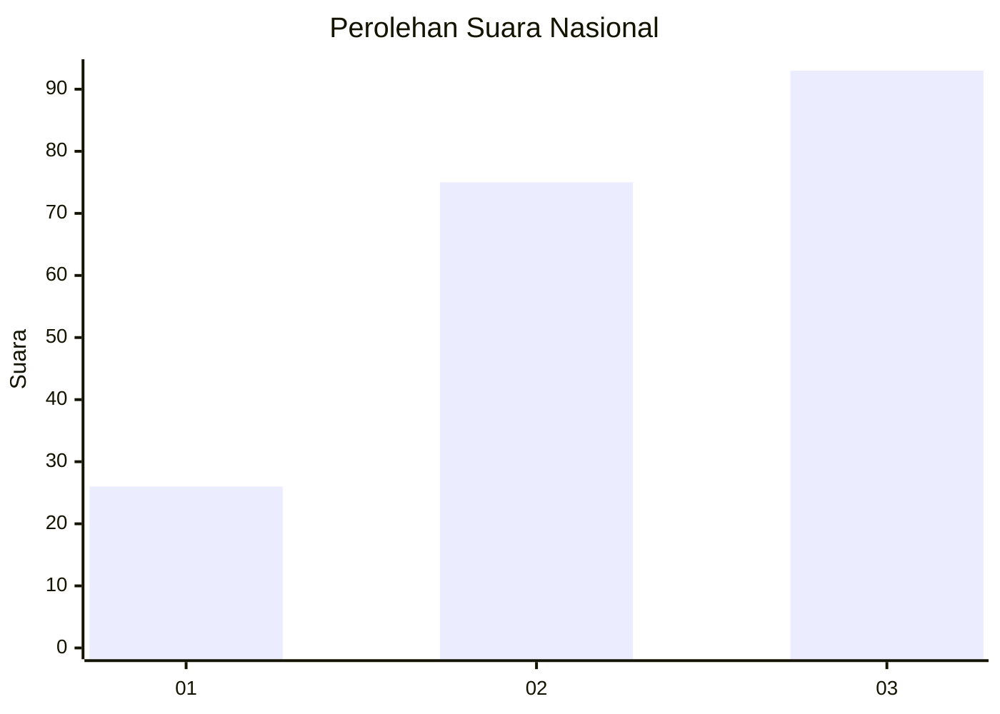
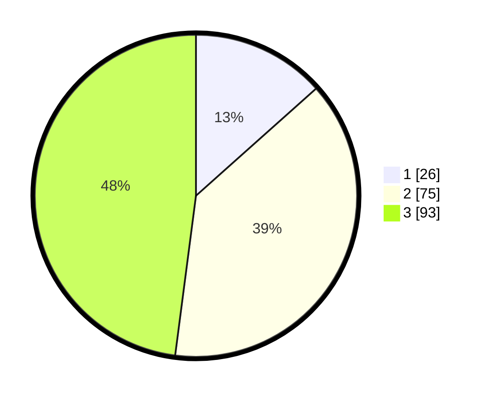

# Hasil

## Grafik

## Tabel

| No. | Nama Paslon    | Suara | Suara (raw) | Persentase |
|:--- |:-------------- | -----:| -----------:| ----------:|
| 1   | ANIES MUHAIMIN | 26    | [26][p-1]   | 13,40      |
| 2   | PRABOWO GIBRAN | 75    | [75][p-2]   | 38,66      |
| 3   | GANJAR MAHFUD  | 93    | [93][p-3]   | 47,94      |

[p-1]: https://github.com/gigit-pemilu/pemilu-2024/blob/main/pilpres/hitung-suara/sub/34-di-yogyakarta/sub/02-bantul/sub/01-srandakan/sub/2001-poncosari/sub/036-tps/sub/paslon-1.txt
[p-2]: https://github.com/gigit-pemilu/pemilu-2024/blob/main/pilpres/hitung-suara/sub/34-di-yogyakarta/sub/02-bantul/sub/01-srandakan/sub/2001-poncosari/sub/036-tps/sub/paslon-2.txt
[p-3]: https://github.com/gigit-pemilu/pemilu-2024/blob/main/pilpres/hitung-suara/sub/34-di-yogyakarta/sub/02-bantul/sub/01-srandakan/sub/2001-poncosari/sub/036-tps/sub/paslon-3.txt

## Foto C Plano

https://sirekap-obj-formc.kpu.go.id/3a7c/pemilu/ppwp/34/02/01/20/01/3402012001036-20240214-232442--80f9af8c-44f8-4e79-91bb-9ebf0bacc49b.jpg

https://sirekap-obj-formc.kpu.go.id/3a7c/pemilu/ppwp/34/02/01/20/01/3402012001036-20240214-225509--34cb6e57-7ac2-40bd-89e3-cf9038e3c862.jpg

https://sirekap-obj-formc.kpu.go.id/3a7c/pemilu/ppwp/34/02/01/20/01/3402012001036-20240214-233845--a050f27b-f0d8-4545-9c7b-5d7d5bc59f66.jpg

## Metadata

| Key        | Value               |
| ---------- | ------------------- |
| Time Stamp | 2024-02-15 21:01:18 |

