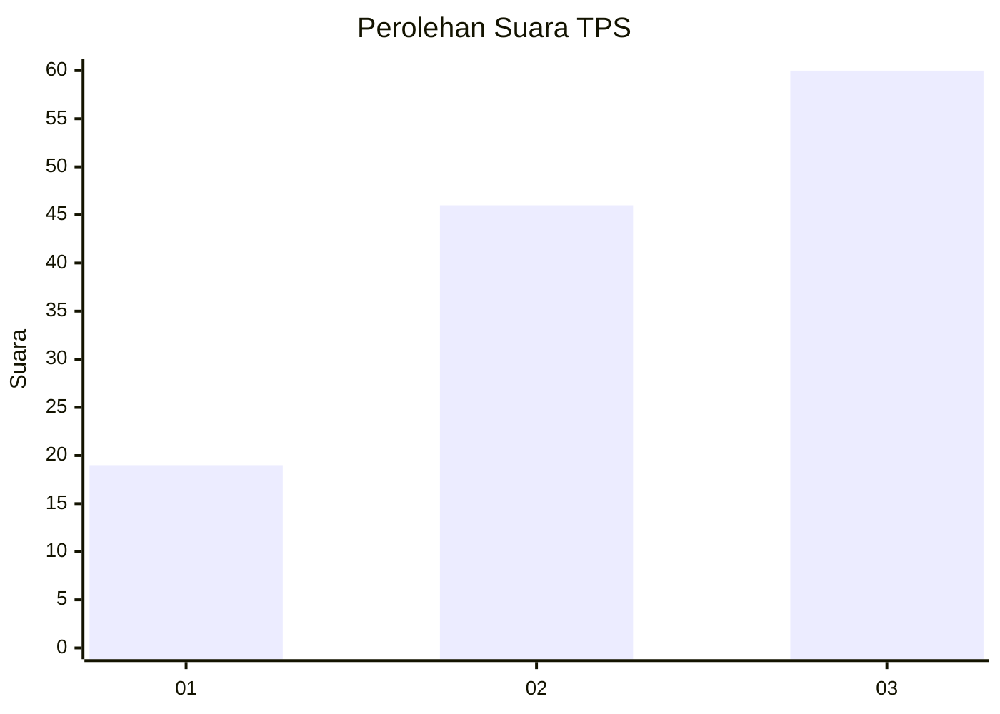
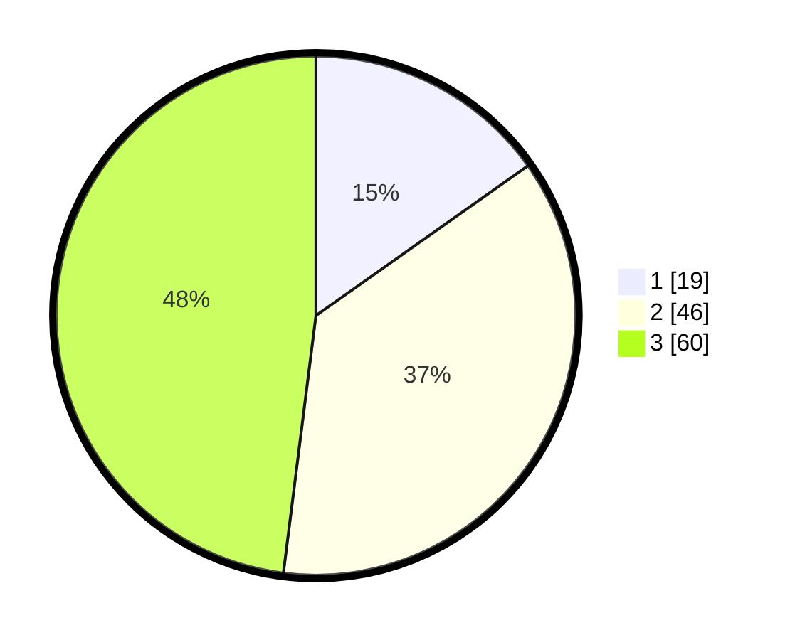

# Hasil

## Grafik

## Tabel

| No. | Nama Paslon    | Suara | Suara (raw) | Persentase |
|:--- |:-------------- | -----:| -----------:| ----------:|
| 1   | ANIES MUHAIMIN | 19    | [19][p-1]   | 15,20      |
| 2   | PRABOWO GIBRAN | 46    | [46][p-2]   | 36,80      |
| 3   | GANJAR MAHFUD  | 60    | [60][p-3]   | 48,00      |

[p-1]: https://github.com/gigit-pemilu/pemilu-2024-34-di-yogyakarta/blob/main/pilpres/hitung-suara/sub/34-di-yogyakarta/sub/02-bantul/sub/01-srandakan/sub/2001-poncosari/sub/038-tps/sub/paslon-1.txt
[p-2]: https://github.com/gigit-pemilu/pemilu-2024-34-di-yogyakarta/blob/main/pilpres/hitung-suara/sub/34-di-yogyakarta/sub/02-bantul/sub/01-srandakan/sub/2001-poncosari/sub/038-tps/sub/paslon-2.txt
[p-3]: https://github.com/gigit-pemilu/pemilu-2024-34-di-yogyakarta/blob/main/pilpres/hitung-suara/sub/34-di-yogyakarta/sub/02-bantul/sub/01-srandakan/sub/2001-poncosari/sub/038-tps/sub/paslon-3.txt

## Foto C Plano

https://sirekap-obj-formc.kpu.go.id/5e02/pemilu/ppwp/34/02/01/20/01/3402012001038-20240215-063326--583791c8-9ec1-4962-8b27-fc92f6a72794.jpg

https://sirekap-obj-formc.kpu.go.id/5e02/pemilu/ppwp/34/02/01/20/01/3402012001038-20240214-220323--89afe1af-3f6f-4a0a-92a2-afb01aa0c842.jpg

https://sirekap-obj-formc.kpu.go.id/5e02/pemilu/ppwp/34/02/01/20/01/3402012001038-20240215-063631--9f37c5da-321c-4f5f-8c7e-762c0d5a2b29.jpg

## Metadata

| Key        | Value               |
| ---------- | ------------------- |
| Time Stamp | 2024-02-15 21:01:18 |

