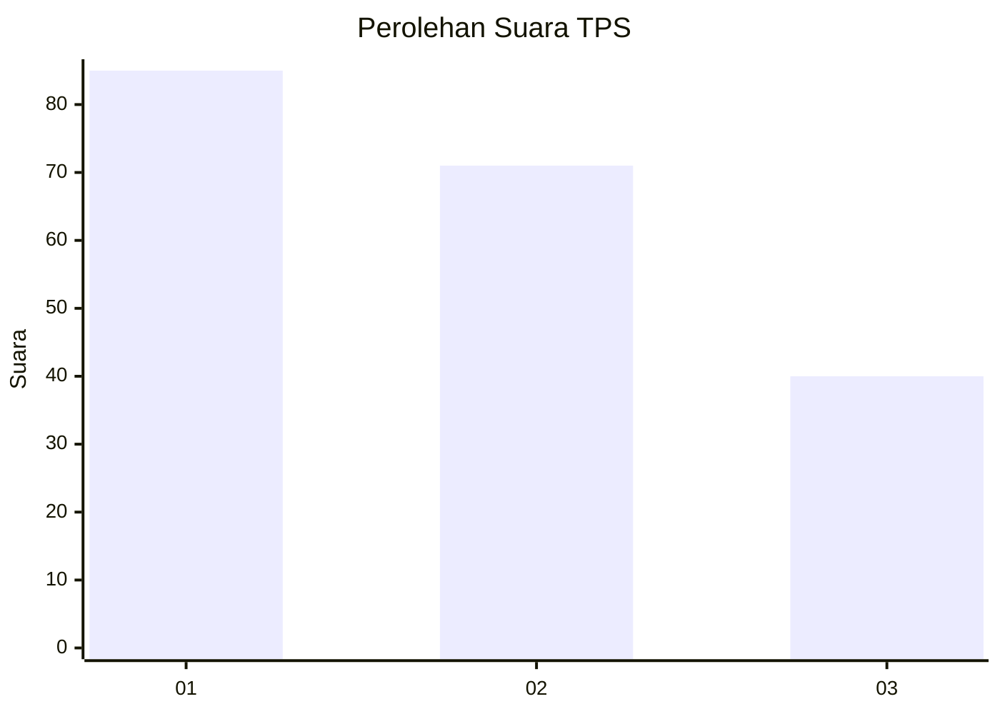
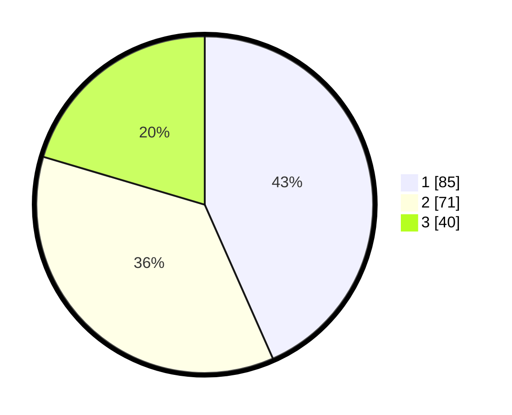

# Hasil

## Grafik

## Tabel

| No. | Nama Paslon    | Suara | Suara (raw) | Persentase |
|:--- |:-------------- | -----:| -----------:| ----------:|
| 1   | ANIES MUHAIMIN | 85    | [85][p-1]   | 43,37      |
| 2   | PRABOWO GIBRAN | 71    | [71][p-2]   | 36,22      |
| 3   | GANJAR MAHFUD  | 40    | [40][p-3]   | 20,41      |

[p-1]: https://github.com/gigit-pemilu/pemilu-2024-34-di-yogyakarta/blob/main/pilpres/hitung-suara/sub/34-di-yogyakarta/sub/02-bantul/sub/01-srandakan/sub/2001-poncosari/sub/043-tps/sub/paslon-1.txt
[p-2]: https://github.com/gigit-pemilu/pemilu-2024-34-di-yogyakarta/blob/main/pilpres/hitung-suara/sub/34-di-yogyakarta/sub/02-bantul/sub/01-srandakan/sub/2001-poncosari/sub/043-tps/sub/paslon-2.txt
[p-3]: https://github.com/gigit-pemilu/pemilu-2024-34-di-yogyakarta/blob/main/pilpres/hitung-suara/sub/34-di-yogyakarta/sub/02-bantul/sub/01-srandakan/sub/2001-poncosari/sub/043-tps/sub/paslon-3.txt

## Foto C Plano

https://sirekap-obj-formc.kpu.go.id/1162/pemilu/ppwp/34/02/01/20/01/3402012001043-20240214-231038--d6636e56-f82d-4504-b58e-a78b66d81103.jpg

https://sirekap-obj-formc.kpu.go.id/1162/pemilu/ppwp/34/02/01/20/01/3402012001043-20240214-231136--2aaa935b-653d-4771-8ed0-9510c04087c1.jpg

https://sirekap-obj-formc.kpu.go.id/1162/pemilu/ppwp/34/02/01/20/01/3402012001043-20240214-231240--6aae7430-9d38-4b2f-8931-3dcb8317489b.jpg

## Metadata

| Key        | Value               |
| ---------- | ------------------- |
| Time Stamp | 2024-02-15 21:30:27 |

