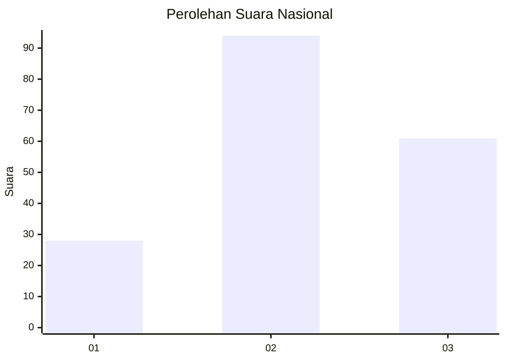
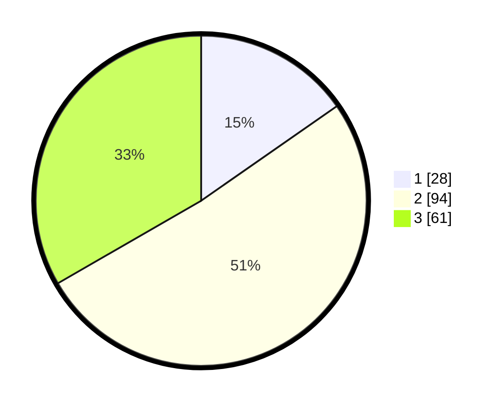

# Hasil

## Grafik

## Tabel

| No. | Nama Paslon    | Suara | Suara (raw) | Persentase |
|:--- |:-------------- | -----:| -----------:| ----------:|
| 1   | ANIES MUHAIMIN | 28    | [28][p-1]   | 15,30      |
| 2   | PRABOWO GIBRAN | 94    | [94][p-2]   | 51,37      |
| 3   | GANJAR MAHFUD  | 61    | [61][p-3]   | 33,33      |

[p-1]: https://github.com/gigit-pemilu/pemilu-2024/blob/main/pilpres/hitung-suara/sub/34-di-yogyakarta/sub/02-bantul/sub/01-srandakan/sub/2002-trimurti/sub/001-tps/sub/paslon-1.txt
[p-2]: https://github.com/gigit-pemilu/pemilu-2024/blob/main/pilpres/hitung-suara/sub/34-di-yogyakarta/sub/02-bantul/sub/01-srandakan/sub/2002-trimurti/sub/001-tps/sub/paslon-2.txt
[p-3]: https://github.com/gigit-pemilu/pemilu-2024/blob/main/pilpres/hitung-suara/sub/34-di-yogyakarta/sub/02-bantul/sub/01-srandakan/sub/2002-trimurti/sub/001-tps/sub/paslon-3.txt

## Foto C Plano

https://sirekap-obj-formc.kpu.go.id/8ac5/pemilu/ppwp/34/02/01/20/02/3402012002001-20240214-224134--6636bbe8-aebe-4e3c-b3d8-df36c22fd3ed.jpg

https://sirekap-obj-formc.kpu.go.id/8ac5/pemilu/ppwp/34/02/01/20/02/3402012002001-20240214-224240--dc40a424-7ac6-4fb8-a8d4-7dd78f649f64.jpg

https://sirekap-obj-formc.kpu.go.id/8ac5/pemilu/ppwp/34/02/01/20/02/3402012002001-20240216-175244--547c9c62-c914-4b24-a040-b6d431665895.jpg

## Metadata

| Key        | Value               |
| ---------- | ------------------- |
| Time Stamp | 2024-02-16 21:01:00 |

