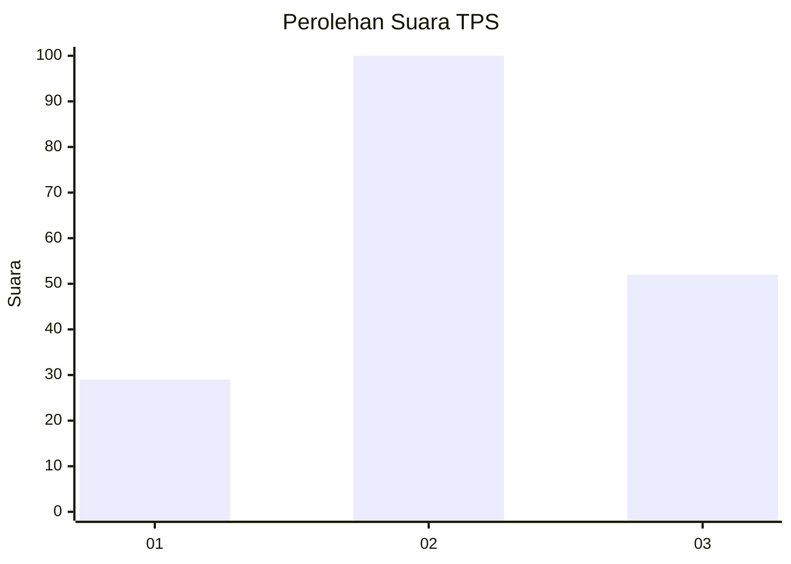
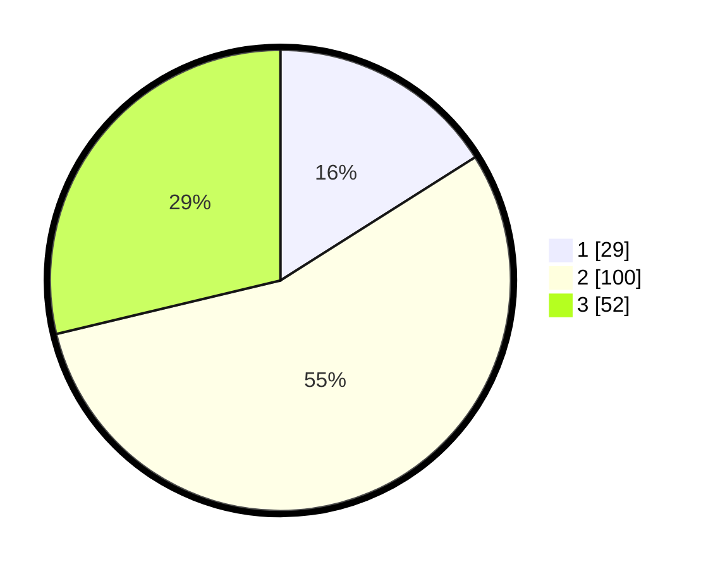

# Hasil

## Grafik

## Tabel

| No. | Nama Paslon    | Suara | Suara (raw) | Persentase |
|:--- |:-------------- | -----:| -----------:| ----------:|
| 1   | ANIES MUHAIMIN | 29    | [29][p-1]   | 16,02      |
| 2   | PRABOWO GIBRAN | 100   | [100][p-2]  | 55,25      |
| 3   | GANJAR MAHFUD  | 52    | [52][p-3]   | 28,73      |

[p-1]: https://github.com/gigit-pemilu/pemilu-2024-34-di-yogyakarta/blob/main/pilpres/hitung-suara/sub/34-di-yogyakarta/sub/02-bantul/sub/01-srandakan/sub/2002-trimurti/sub/002-tps/sub/paslon-1.txt
[p-2]: https://github.com/gigit-pemilu/pemilu-2024-34-di-yogyakarta/blob/main/pilpres/hitung-suara/sub/34-di-yogyakarta/sub/02-bantul/sub/01-srandakan/sub/2002-trimurti/sub/002-tps/sub/paslon-2.txt
[p-3]: https://github.com/gigit-pemilu/pemilu-2024-34-di-yogyakarta/blob/main/pilpres/hitung-suara/sub/34-di-yogyakarta/sub/02-bantul/sub/01-srandakan/sub/2002-trimurti/sub/002-tps/sub/paslon-3.txt

## Foto C Plano

https://sirekap-obj-formc.kpu.go.id/7da2/pemilu/ppwp/34/02/01/20/02/3402012002002-20240214-232311--eadeaa72-d444-4a6c-bb72-37d87bacf2e7.jpg

https://sirekap-obj-formc.kpu.go.id/7da2/pemilu/ppwp/34/02/01/20/02/3402012002002-20240214-232406--ca099a43-7c2b-4b9e-b950-f92b21ce1f2a.jpg

https://sirekap-obj-formc.kpu.go.id/7da2/pemilu/ppwp/34/02/01/20/02/3402012002002-20240214-232508--10609a12-1d59-4f88-8ee2-862ef9e59fe4.jpg

## Metadata

| Key        | Value               |
| ---------- | ------------------- |
| Time Stamp | 2024-02-15 21:01:18 |

