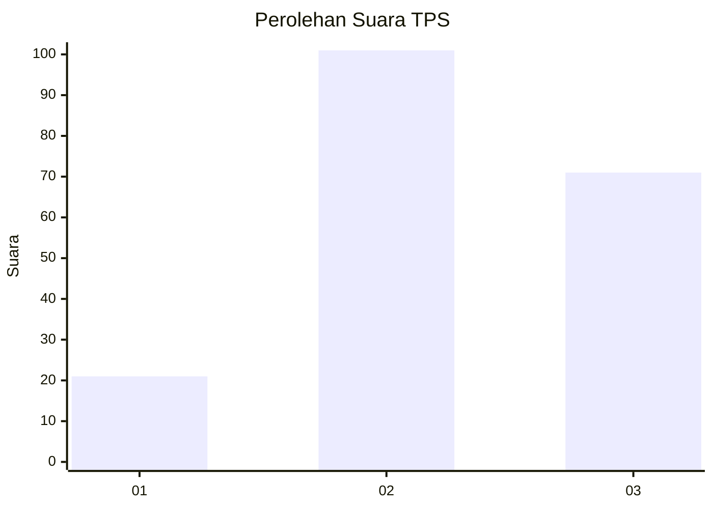
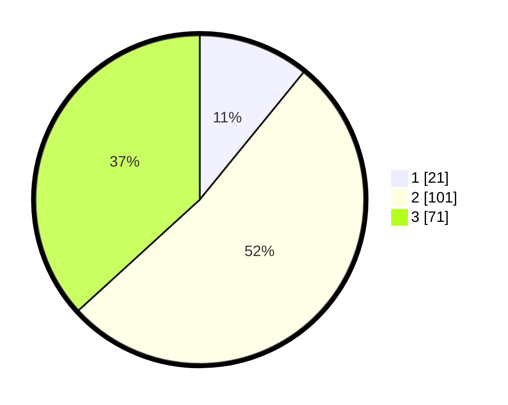

# Hasil

## Grafik

## Tabel

| No. | Nama Paslon    | Suara | Suara (raw) | Persentase |
|:--- |:-------------- | -----:| -----------:| ----------:|
| 1   | ANIES MUHAIMIN | 21    | [21][p-1]   | 10,88      |
| 2   | PRABOWO GIBRAN | 101   | [101][p-2]  | 52,33      |
| 3   | GANJAR MAHFUD  | 71    | [71][p-3]   | 36,79      |

[p-1]: https://github.com/gigit-pemilu/pemilu-2024-34-di-yogyakarta/blob/main/pilpres/hitung-suara/sub/34-di-yogyakarta/sub/02-bantul/sub/01-srandakan/sub/2002-trimurti/sub/005-tps/sub/paslon-1.txt
[p-2]: https://github.com/gigit-pemilu/pemilu-2024-34-di-yogyakarta/blob/main/pilpres/hitung-suara/sub/34-di-yogyakarta/sub/02-bantul/sub/01-srandakan/sub/2002-trimurti/sub/005-tps/sub/paslon-2.txt
[p-3]: https://github.com/gigit-pemilu/pemilu-2024-34-di-yogyakarta/blob/main/pilpres/hitung-suara/sub/34-di-yogyakarta/sub/02-bantul/sub/01-srandakan/sub/2002-trimurti/sub/005-tps/sub/paslon-3.txt

## Foto C Plano

https://sirekap-obj-formc.kpu.go.id/1e37/pemilu/ppwp/34/02/01/20/02/3402012002005-20240216-060647--5d8ee4c4-e7a8-4675-9af5-9227671b81a3.jpg

https://sirekap-obj-formc.kpu.go.id/1e37/pemilu/ppwp/34/02/01/20/02/3402012002005-20240216-060652--51cd0a26-1c01-4c3b-b957-6e3ec398a063.jpg

https://sirekap-obj-formc.kpu.go.id/1e37/pemilu/ppwp/34/02/01/20/02/3402012002005-20240216-164306--c2117781-d47d-41d4-8677-a7d87d426d07.jpg

## Metadata

| Key        | Value               |
| ---------- | ------------------- |
| Time Stamp | 2024-02-16 17:00:00 |

