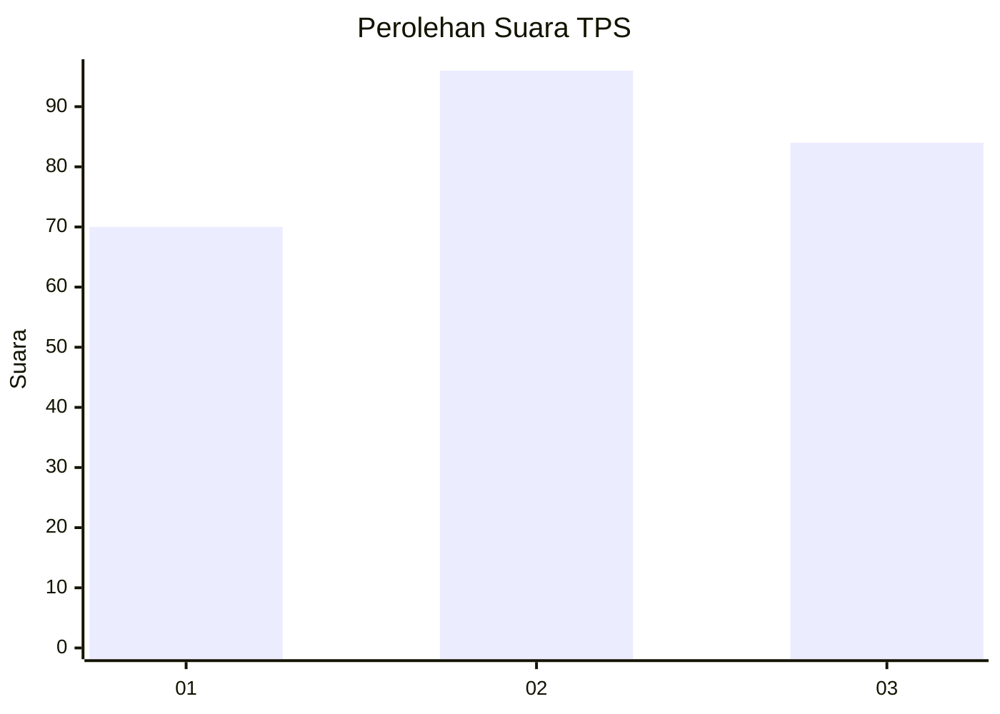
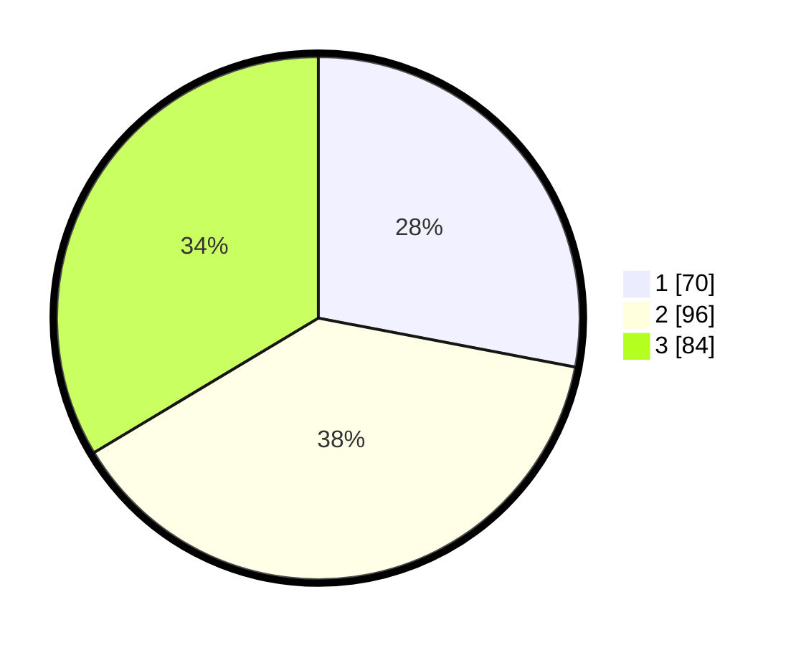

# Hasil

## Grafik

## Tabel

| No. | Nama Paslon    | Suara | Suara (raw) | Persentase |
|:--- |:-------------- | -----:| -----------:| ----------:|
| 1   | ANIES MUHAIMIN | 70    | [70][p-1]   | 28,00      |
| 2   | PRABOWO GIBRAN | 96    | [96][p-2]   | 38,40      |
| 3   | GANJAR MAHFUD  | 84    | [84][p-3]   | 33,60      |

[p-1]: https://github.com/gigit-pemilu/pemilu-2024-34-di-yogyakarta/blob/main/pilpres/hitung-suara/sub/34-di-yogyakarta/sub/02-bantul/sub/01-srandakan/sub/2002-trimurti/sub/006-tps/sub/paslon-1.txt
[p-2]: https://github.com/gigit-pemilu/pemilu-2024-34-di-yogyakarta/blob/main/pilpres/hitung-suara/sub/34-di-yogyakarta/sub/02-bantul/sub/01-srandakan/sub/2002-trimurti/sub/006-tps/sub/paslon-2.txt
[p-3]: https://github.com/gigit-pemilu/pemilu-2024-34-di-yogyakarta/blob/main/pilpres/hitung-suara/sub/34-di-yogyakarta/sub/02-bantul/sub/01-srandakan/sub/2002-trimurti/sub/006-tps/sub/paslon-3.txt

## Foto C Plano

https://sirekap-obj-formc.kpu.go.id/bb64/pemilu/ppwp/34/02/01/20/02/3402012002006-20240215-000805--204972dc-05a5-4e91-8829-6b98af3a943d.jpg

https://sirekap-obj-formc.kpu.go.id/bb64/pemilu/ppwp/34/02/01/20/02/3402012002006-20240215-000846--4499a548-7a35-4e79-9c56-fe7403a4b1a2.jpg

https://sirekap-obj-formc.kpu.go.id/bb64/pemilu/ppwp/34/02/01/20/02/3402012002006-20240215-000916--eb6155dd-46bf-4636-8d3c-341a0973461d.jpg

## Metadata

| Key        | Value               |
| ---------- | ------------------- |
| Time Stamp | 2024-02-15 21:01:18 |

