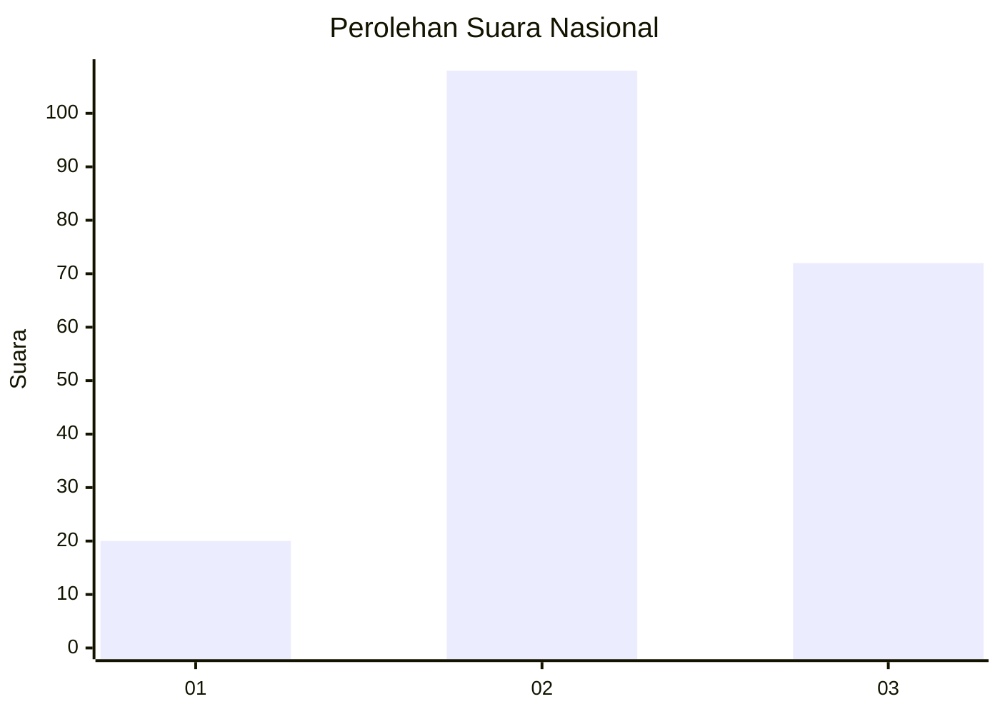
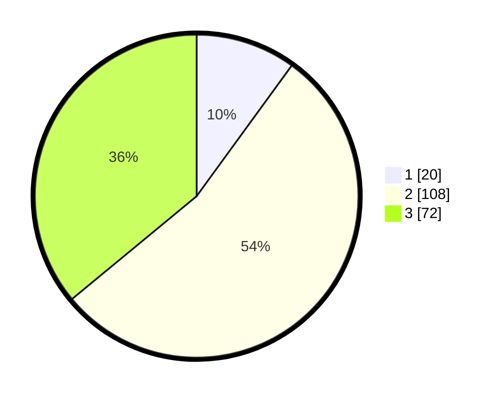

# Hasil

## Grafik

## Tabel

| No. | Nama Paslon    | Suara | Suara (raw) | Persentase |
|:--- |:-------------- | -----:| -----------:| ----------:|
| 1   | ANIES MUHAIMIN | 20    | [20][p-1]   | 10,00      |
| 2   | PRABOWO GIBRAN | 108   | [108][p-2]  | 54,00      |
| 3   | GANJAR MAHFUD  | 72    | [72][p-3]   | 36,00      |

[p-1]: https://github.com/gigit-pemilu/pemilu-2024/blob/main/pilpres/hitung-suara/sub/34-di-yogyakarta/sub/02-bantul/sub/01-srandakan/sub/2002-trimurti/sub/013-tps/sub/paslon-1.txt
[p-2]: https://github.com/gigit-pemilu/pemilu-2024/blob/main/pilpres/hitung-suara/sub/34-di-yogyakarta/sub/02-bantul/sub/01-srandakan/sub/2002-trimurti/sub/013-tps/sub/paslon-2.txt
[p-3]: https://github.com/gigit-pemilu/pemilu-2024/blob/main/pilpres/hitung-suara/sub/34-di-yogyakarta/sub/02-bantul/sub/01-srandakan/sub/2002-trimurti/sub/013-tps/sub/paslon-3.txt

## Foto C Plano

https://sirekap-obj-formc.kpu.go.id/27e0/pemilu/ppwp/34/02/01/20/02/3402012002013-20240215-002102--de2aa70b-daa1-40fa-8f93-2871c16adc9e.jpg

https://sirekap-obj-formc.kpu.go.id/27e0/pemilu/ppwp/34/02/01/20/02/3402012002013-20240214-195345--f86772bb-dcdc-4662-9271-cadc41b2acec.jpg

https://sirekap-obj-formc.kpu.go.id/27e0/pemilu/ppwp/34/02/01/20/02/3402012002013-20240214-195448--d9b0799c-6e9a-471f-85fd-ebd7a5a5bc14.jpg

## Metadata

| Key        | Value               |
| ---------- | ------------------- |
| Time Stamp | 2024-02-15 21:01:18 |

