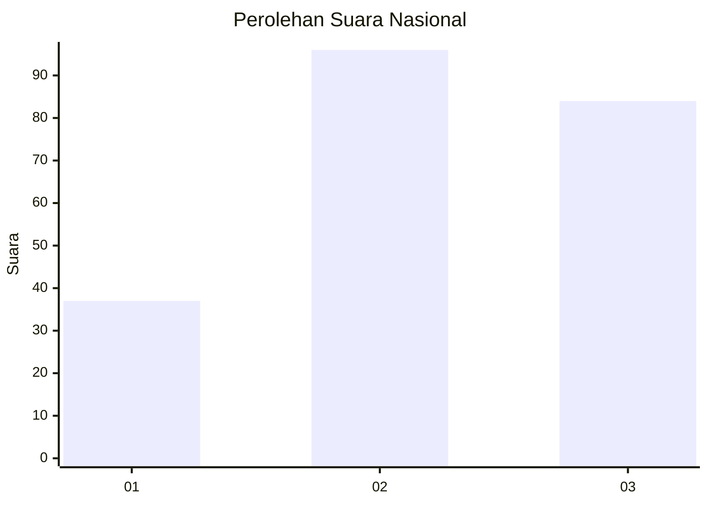
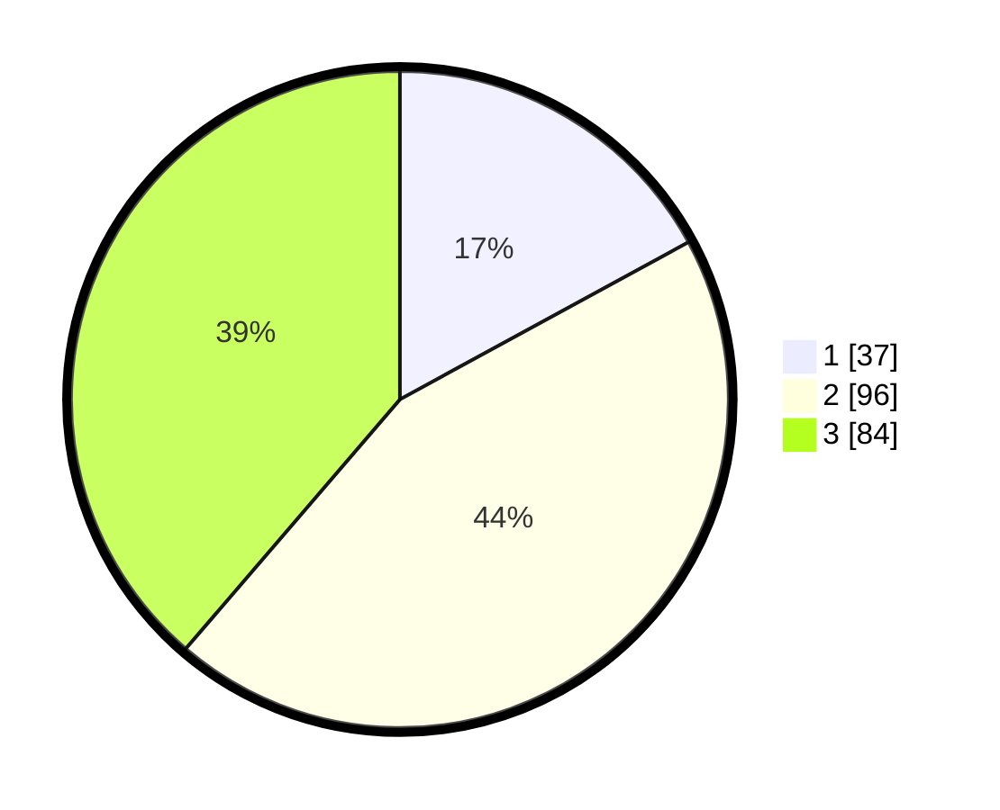

# Hasil

## Grafik

## Tabel

| No. | Nama Paslon    | Suara | Suara (raw) | Persentase |
|:--- |:-------------- | -----:| -----------:| ----------:|
| 1   | ANIES MUHAIMIN | 37    | [37][p-1]   | 17,05      |
| 2   | PRABOWO GIBRAN | 96    | [96][p-2]   | 44,24      |
| 3   | GANJAR MAHFUD  | 84    | [84][p-3]   | 38,71      |

[p-1]: https://github.com/gigit-pemilu/pemilu-2024/blob/main/pilpres/hitung-suara/sub/34-di-yogyakarta/sub/02-bantul/sub/01-srandakan/sub/2002-trimurti/sub/014-tps/sub/paslon-1.txt
[p-2]: https://github.com/gigit-pemilu/pemilu-2024/blob/main/pilpres/hitung-suara/sub/34-di-yogyakarta/sub/02-bantul/sub/01-srandakan/sub/2002-trimurti/sub/014-tps/sub/paslon-2.txt
[p-3]: https://github.com/gigit-pemilu/pemilu-2024/blob/main/pilpres/hitung-suara/sub/34-di-yogyakarta/sub/02-bantul/sub/01-srandakan/sub/2002-trimurti/sub/014-tps/sub/paslon-3.txt

## Foto C Plano

https://sirekap-obj-formc.kpu.go.id/a94d/pemilu/ppwp/34/02/01/20/02/3402012002014-20240221-082919--fb96e3a4-8a32-4ec2-b0e4-d22e2759f1dd.jpg

https://sirekap-obj-formc.kpu.go.id/a94d/pemilu/ppwp/34/02/01/20/02/3402012002014-20240221-082959--b25d4908-1942-45a0-b8cc-9abe3296fb1e.jpg

https://sirekap-obj-formc.kpu.go.id/a94d/pemilu/ppwp/34/02/01/20/02/3402012002014-20240221-083039--db308f33-491a-4a26-8d71-c19c6c7de9a0.jpg

## Metadata

| Key        | Value               |
| ---------- | ------------------- |
| Time Stamp | 2024-02-22 16:00:00 |

