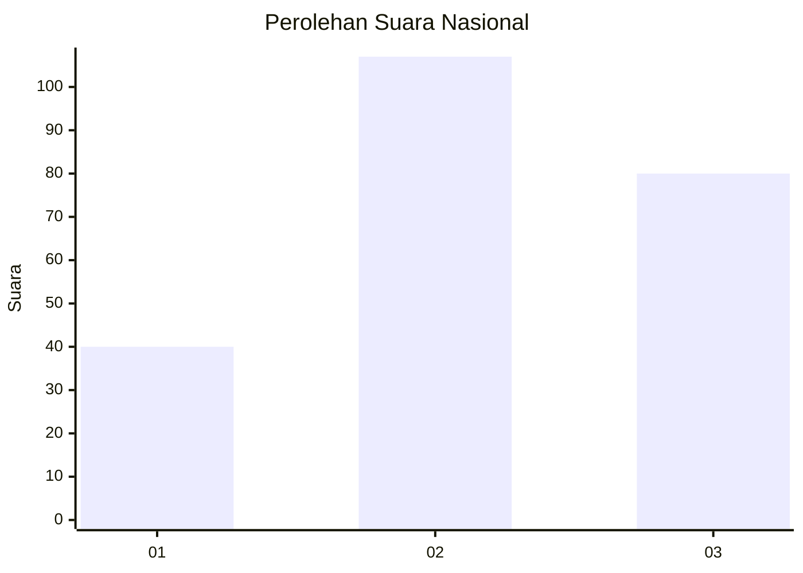
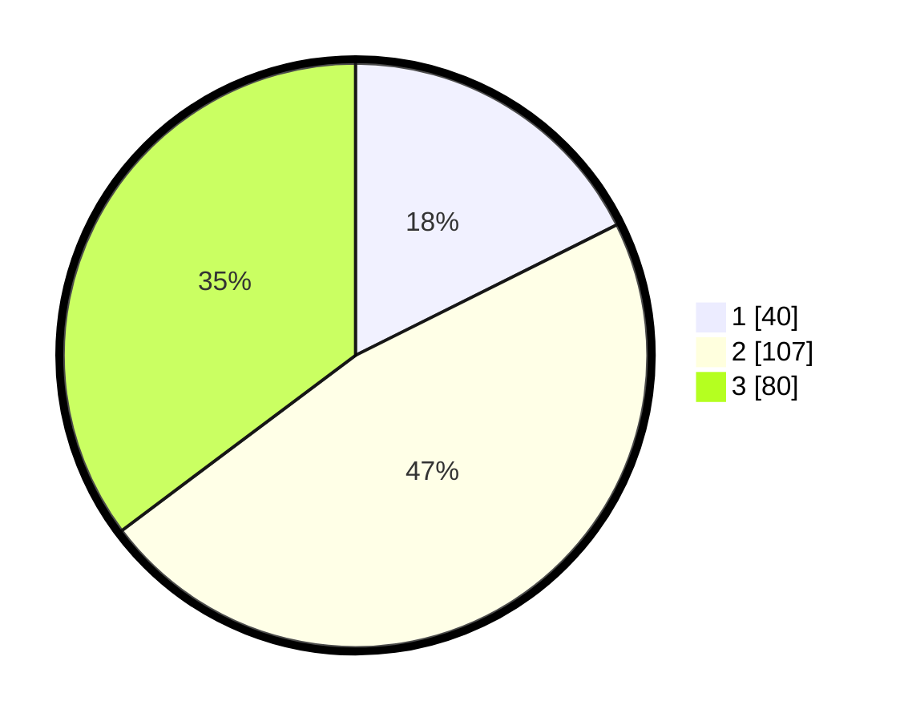

# Hasil

## Grafik

## Tabel

| No. | Nama Paslon    | Suara | Suara (raw) | Persentase |
|:--- |:-------------- | -----:| -----------:| ----------:|
| 1   | ANIES MUHAIMIN | 40    | [40][p-1]   | 17,62      |
| 2   | PRABOWO GIBRAN | 107   | [107][p-2]  | 47,14      |
| 3   | GANJAR MAHFUD  | 80    | [80][p-3]   | 35,24      |

[p-1]: https://github.com/gigit-pemilu/pemilu-2024/blob/main/pilpres/hitung-suara/sub/34-di-yogyakarta/sub/02-bantul/sub/01-srandakan/sub/2002-trimurti/sub/015-tps/sub/paslon-1.txt
[p-2]: https://github.com/gigit-pemilu/pemilu-2024/blob/main/pilpres/hitung-suara/sub/34-di-yogyakarta/sub/02-bantul/sub/01-srandakan/sub/2002-trimurti/sub/015-tps/sub/paslon-2.txt
[p-3]: https://github.com/gigit-pemilu/pemilu-2024/blob/main/pilpres/hitung-suara/sub/34-di-yogyakarta/sub/02-bantul/sub/01-srandakan/sub/2002-trimurti/sub/015-tps/sub/paslon-3.txt

## Foto C Plano

https://sirekap-obj-formc.kpu.go.id/183f/pemilu/ppwp/34/02/01/20/02/3402012002015-20240214-233049--eedd8bbc-a20c-442f-81e2-3c413476c7de.jpg

https://sirekap-obj-formc.kpu.go.id/183f/pemilu/ppwp/34/02/01/20/02/3402012002015-20240214-233007--17047a4e-a659-40b3-b80e-6f1fef7bc6e1.jpg

https://sirekap-obj-formc.kpu.go.id/183f/pemilu/ppwp/34/02/01/20/02/3402012002015-20240214-232833--81ab7ec6-4ca8-413e-b770-8431c027c1c6.jpg

## Metadata

| Key        | Value               |
| ---------- | ------------------- |
| Time Stamp | 2024-02-25 16:00:00 |

