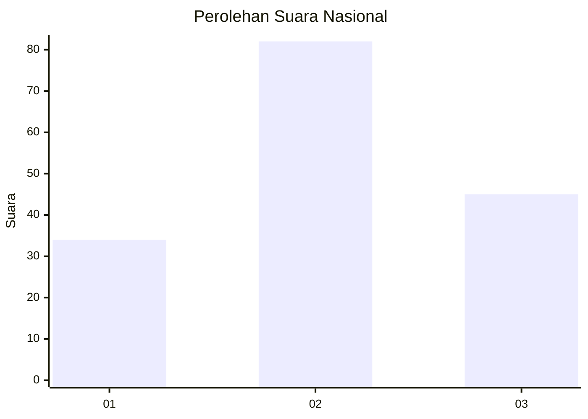
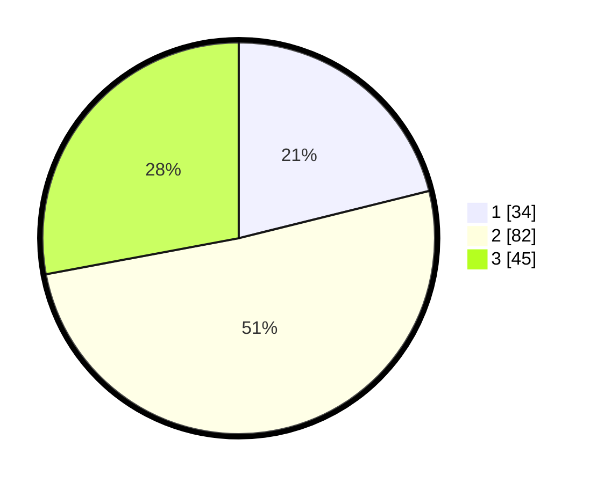

# Hasil

## Grafik

## Tabel

| No. | Nama Paslon    | Suara | Suara (raw) | Persentase |
|:--- |:-------------- | -----:| -----------:| ----------:|
| 1   | ANIES MUHAIMIN | 34    | [34][p-1]   | 21,12      |
| 2   | PRABOWO GIBRAN | 82    | [82][p-2]   | 50,93      |
| 3   | GANJAR MAHFUD  | 45    | [45][p-3]   | 27,95      |

[p-1]: https://github.com/gigit-pemilu/pemilu-2024/blob/main/pilpres/hitung-suara/sub/34-di-yogyakarta/sub/02-bantul/sub/01-srandakan/sub/2002-trimurti/sub/016-tps/sub/paslon-1.txt
[p-2]: https://github.com/gigit-pemilu/pemilu-2024/blob/main/pilpres/hitung-suara/sub/34-di-yogyakarta/sub/02-bantul/sub/01-srandakan/sub/2002-trimurti/sub/016-tps/sub/paslon-2.txt
[p-3]: https://github.com/gigit-pemilu/pemilu-2024/blob/main/pilpres/hitung-suara/sub/34-di-yogyakarta/sub/02-bantul/sub/01-srandakan/sub/2002-trimurti/sub/016-tps/sub/paslon-3.txt

## Foto C Plano

https://sirekap-obj-formc.kpu.go.id/51ac/pemilu/ppwp/34/02/01/20/02/3402012002016-20240218-102133--dc57e755-96e8-4f5c-ab20-bfb46d9675fd.jpg

https://sirekap-obj-formc.kpu.go.id/51ac/pemilu/ppwp/34/02/01/20/02/3402012002016-20240218-102220--9813dcf3-5fc0-4964-9b6e-90714a0219bc.jpg

https://sirekap-obj-formc.kpu.go.id/51ac/pemilu/ppwp/34/02/01/20/02/3402012002016-20240218-102722--9e0c5746-84cc-4205-b18b-cc94cd3b89d1.jpg

## Metadata

| Key        | Value               |
| ---------- | ------------------- |
| Time Stamp | 2024-02-19 06:16:00 |

## DATA PEMILIH TETAP

Jumlah pemilih dalam DPT: **693**.
 * L: **94**.
 * P: **99**.

## DATA PENGGUNA HAK PILIH

Jumlah pengguna hak pilih dalam DPT: **359**.
 * L: **77**.
 * P: **82**.

Jumlah pengguna hak pilih dalam DPTb: **9**.
 * L: **5**.
 * P: **7**.

Jumlah pengguna hak pilih dalam DPK: **4**.
 * L: **2**.
 * P: **22**.

Jumlah pengguna hak pilih: **664**.
 * L: **84**.
 * P: **83**.

## JUMLAH SUARA SAH DAN TIDAK SAH

JUMLAH SELURUH SUARA SAH: **162**.

JUMLAH SUARA TIDAK SAH: **2**.

JUMLAH SELURUH SUARA SAH DAN SUARA TIDAK SAH: **164**.

