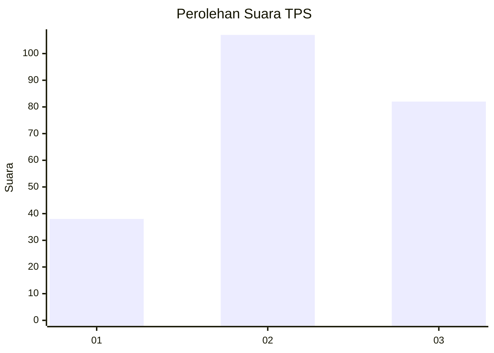
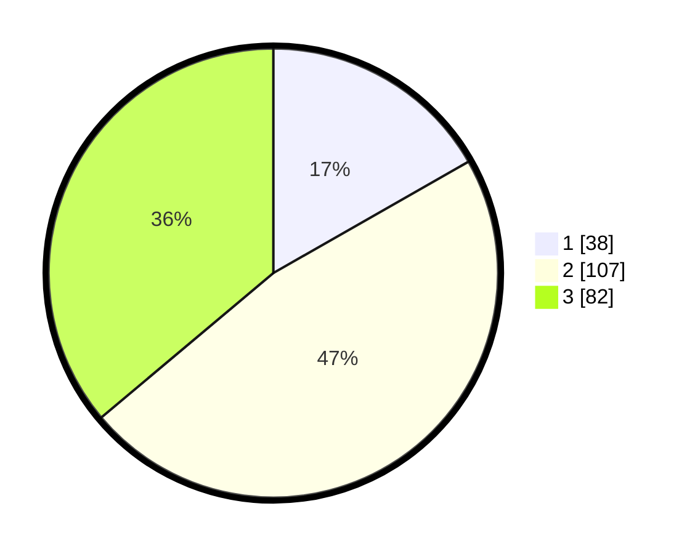

# Hasil

## Grafik

## Tabel

| No. | Nama Paslon    | Suara | Suara (raw) | Persentase |
|:--- |:-------------- | -----:| -----------:| ----------:|
| 1   | ANIES MUHAIMIN | 38    | [38][p-1]   | 16,74      |
| 2   | PRABOWO GIBRAN | 107   | [107][p-2]  | 47,14      |
| 3   | GANJAR MAHFUD  | 82    | [82][p-3]   | 36,12      |

[p-1]: https://github.com/gigit-pemilu/pemilu-2024-34-di-yogyakarta/blob/main/pilpres/hitung-suara/sub/34-di-yogyakarta/sub/02-bantul/sub/01-srandakan/sub/2002-trimurti/sub/018-tps/sub/paslon-1.txt
[p-2]: https://github.com/gigit-pemilu/pemilu-2024-34-di-yogyakarta/blob/main/pilpres/hitung-suara/sub/34-di-yogyakarta/sub/02-bantul/sub/01-srandakan/sub/2002-trimurti/sub/018-tps/sub/paslon-2.txt
[p-3]: https://github.com/gigit-pemilu/pemilu-2024-34-di-yogyakarta/blob/main/pilpres/hitung-suara/sub/34-di-yogyakarta/sub/02-bantul/sub/01-srandakan/sub/2002-trimurti/sub/018-tps/sub/paslon-3.txt

## Foto C Plano

https://sirekap-obj-formc.kpu.go.id/a357/pemilu/ppwp/34/02/01/20/02/3402012002018-20240214-203235--b7857bf1-a772-49c3-b60e-c81dc7884462.jpg

https://sirekap-obj-formc.kpu.go.id/a357/pemilu/ppwp/34/02/01/20/02/3402012002018-20240214-203339--2b0a1f01-72aa-4293-ba90-739aa0909238.jpg

https://sirekap-obj-formc.kpu.go.id/a357/pemilu/ppwp/34/02/01/20/02/3402012002018-20240214-202829--b279f68c-f2e6-457d-8114-196531c24851.jpg

## Metadata

| Key        | Value               |
| ---------- | ------------------- |
| Time Stamp | 2024-02-15 21:01:18 |

