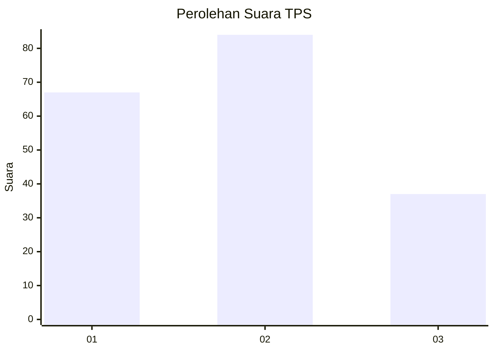
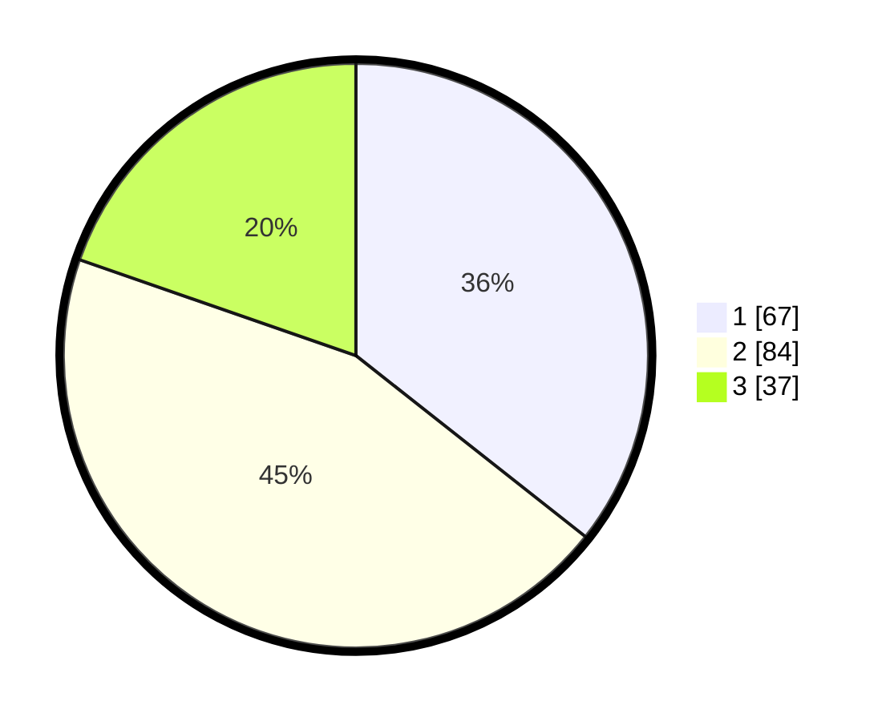

# Hasil

## Grafik

## Tabel

| No. | Nama Paslon    | Suara | Suara (raw) | Persentase |
|:--- |:-------------- | -----:| -----------:| ----------:|
| 1   | ANIES MUHAIMIN | 67    | [67][p-1]   | 35,64      |
| 2   | PRABOWO GIBRAN | 84    | [84][p-2]   | 44,68      |
| 3   | GANJAR MAHFUD  | 37    | [37][p-3]   | 19,68      |

[p-1]: https://github.com/gigit-pemilu/pemilu-2024-34-di-yogyakarta/blob/main/pilpres/hitung-suara/sub/34-di-yogyakarta/sub/02-bantul/sub/01-srandakan/sub/2002-trimurti/sub/020-tps/sub/paslon-1.txt
[p-2]: https://github.com/gigit-pemilu/pemilu-2024-34-di-yogyakarta/blob/main/pilpres/hitung-suara/sub/34-di-yogyakarta/sub/02-bantul/sub/01-srandakan/sub/2002-trimurti/sub/020-tps/sub/paslon-2.txt
[p-3]: https://github.com/gigit-pemilu/pemilu-2024-34-di-yogyakarta/blob/main/pilpres/hitung-suara/sub/34-di-yogyakarta/sub/02-bantul/sub/01-srandakan/sub/2002-trimurti/sub/020-tps/sub/paslon-3.txt

## Foto C Plano

https://sirekap-obj-formc.kpu.go.id/9409/pemilu/ppwp/34/02/01/20/02/3402012002020-20240215-010907--dabd4f6a-f806-42c4-8631-6ae428531c46.jpg

https://sirekap-obj-formc.kpu.go.id/9409/pemilu/ppwp/34/02/01/20/02/3402012002020-20240215-011057--a568ccad-d8d2-4860-b618-b82d9cc1fa16.jpg

https://sirekap-obj-formc.kpu.go.id/9409/pemilu/ppwp/34/02/01/20/02/3402012002020-20240215-011235--17decaf4-5962-46f1-a266-4ac68d6c0e50.jpg

## Metadata

| Key        | Value               |
| ---------- | ------------------- |
| Time Stamp | 2024-02-25 12:00:00 |

