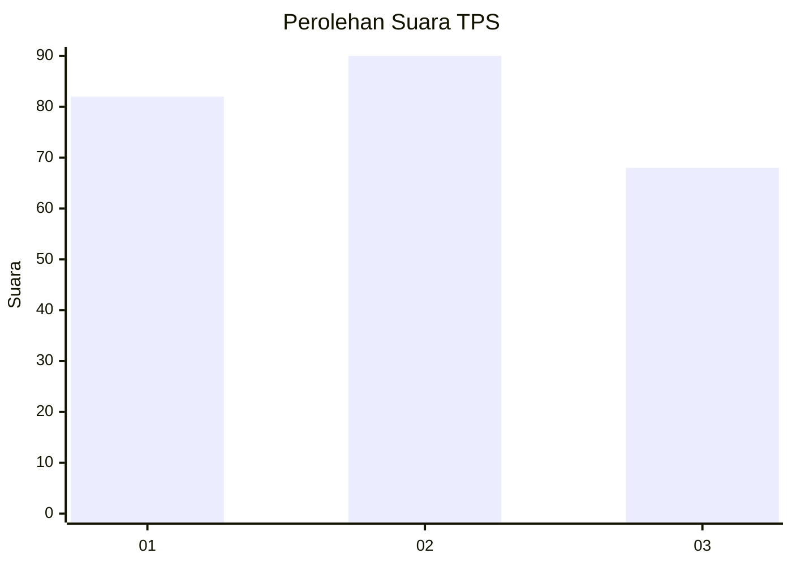
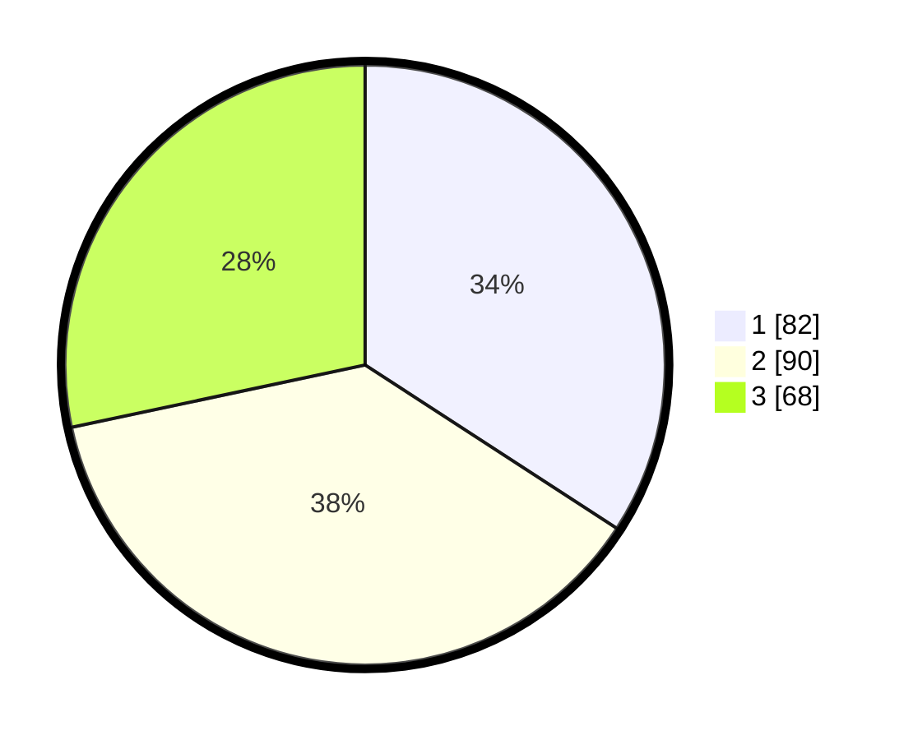

# Hasil

## Grafik

## Tabel

| No. | Nama Paslon    | Suara | Suara (raw) | Persentase |
|:--- |:-------------- | -----:| -----------:| ----------:|
| 1   | ANIES MUHAIMIN | 82    | [82][p-1]   | 34,17      |
| 2   | PRABOWO GIBRAN | 90    | [90][p-2]   | 37,50      |
| 3   | GANJAR MAHFUD  | 68    | [68][p-3]   | 28,33      |

[p-1]: https://github.com/gigit-pemilu/pemilu-2024-34-di-yogyakarta/blob/main/pilpres/hitung-suara/sub/34-di-yogyakarta/sub/02-bantul/sub/01-srandakan/sub/2002-trimurti/sub/028-tps/sub/paslon-1.txt
[p-2]: https://github.com/gigit-pemilu/pemilu-2024-34-di-yogyakarta/blob/main/pilpres/hitung-suara/sub/34-di-yogyakarta/sub/02-bantul/sub/01-srandakan/sub/2002-trimurti/sub/028-tps/sub/paslon-2.txt
[p-3]: https://github.com/gigit-pemilu/pemilu-2024-34-di-yogyakarta/blob/main/pilpres/hitung-suara/sub/34-di-yogyakarta/sub/02-bantul/sub/01-srandakan/sub/2002-trimurti/sub/028-tps/sub/paslon-3.txt

## Foto C Plano

https://sirekap-obj-formc.kpu.go.id/da53/pemilu/ppwp/34/02/01/20/02/3402012002028-20240215-012427--7b7171ea-871a-4f86-a58b-f78747369002.jpg

https://sirekap-obj-formc.kpu.go.id/da53/pemilu/ppwp/34/02/01/20/02/3402012002028-20240215-012514--f5bd6ce5-2e73-4165-b059-ca33bed7908d.jpg

https://sirekap-obj-formc.kpu.go.id/da53/pemilu/ppwp/34/02/01/20/02/3402012002028-20240215-012710--bc40da71-13a9-499b-b078-d005b20df1dc.jpg

## Metadata

| Key        | Value               |
| ---------- | ------------------- |
| Time Stamp | 2024-02-15 21:01:18 |

