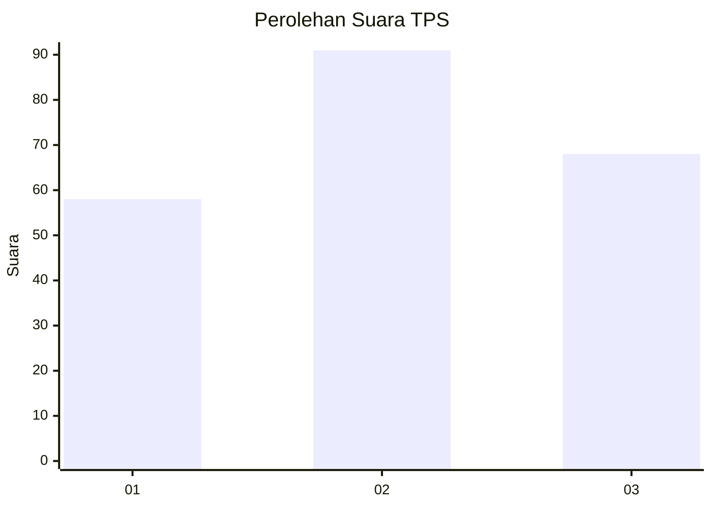
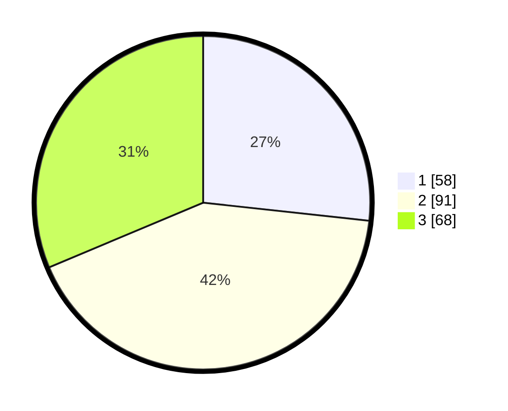

# Hasil

## Grafik

## Tabel

| No. | Nama Paslon    | Suara | Suara (raw) | Persentase |
|:--- |:-------------- | -----:| -----------:| ----------:|
| 1   | ANIES MUHAIMIN | 58    | [58][p-1]   | 26,73      |
| 2   | PRABOWO GIBRAN | 91    | [91][p-2]   | 41,94      |
| 3   | GANJAR MAHFUD  | 68    | [68][p-3]   | 31,34      |

[p-1]: https://github.com/gigit-pemilu/pemilu-2024-34-di-yogyakarta/blob/main/pilpres/hitung-suara/sub/34-di-yogyakarta/sub/02-bantul/sub/01-srandakan/sub/2002-trimurti/sub/029-tps/sub/paslon-1.txt
[p-2]: https://github.com/gigit-pemilu/pemilu-2024-34-di-yogyakarta/blob/main/pilpres/hitung-suara/sub/34-di-yogyakarta/sub/02-bantul/sub/01-srandakan/sub/2002-trimurti/sub/029-tps/sub/paslon-2.txt
[p-3]: https://github.com/gigit-pemilu/pemilu-2024-34-di-yogyakarta/blob/main/pilpres/hitung-suara/sub/34-di-yogyakarta/sub/02-bantul/sub/01-srandakan/sub/2002-trimurti/sub/029-tps/sub/paslon-3.txt

## Foto C Plano

https://sirekap-obj-formc.kpu.go.id/6217/pemilu/ppwp/34/02/01/20/02/3402012002029-20240221-082450--457b62ed-b2ac-494d-8a86-aab2efe36023.jpg

https://sirekap-obj-formc.kpu.go.id/6217/pemilu/ppwp/34/02/01/20/02/3402012002029-20240221-082529--a2ad223e-c4c4-49ef-aa41-623ad094004e.jpg

https://sirekap-obj-formc.kpu.go.id/6217/pemilu/ppwp/34/02/01/20/02/3402012002029-20240221-082607--66cf1bc1-eedd-4ab8-a24f-af3a8de18859.jpg

## Metadata

| Key        | Value               |
| ---------- | ------------------- |
| Time Stamp | 2024-02-22 16:00:00 |

