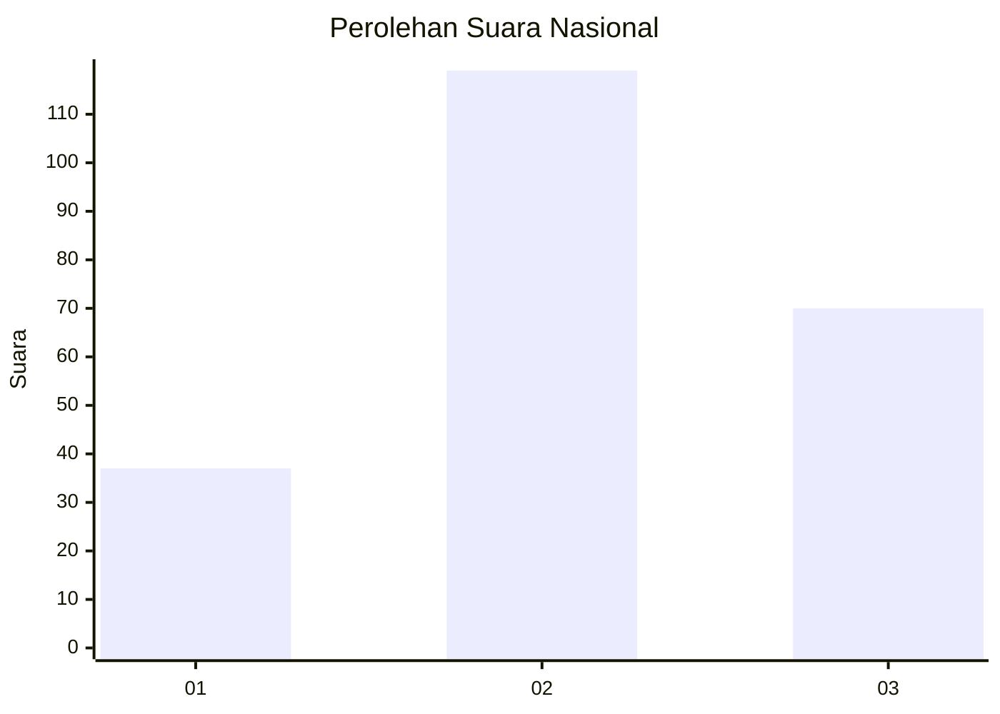
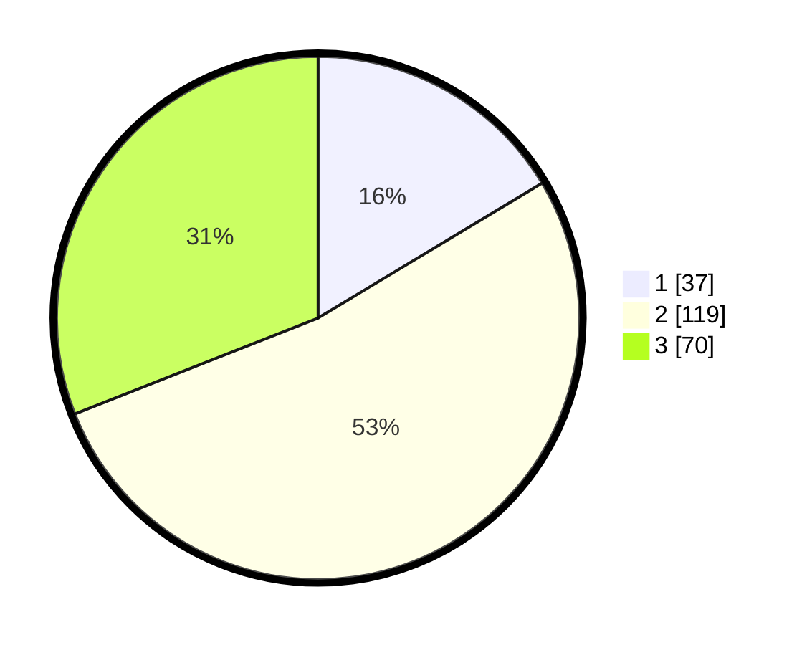

# Hasil

## Grafik

## Tabel

| No. | Nama Paslon    | Suara | Suara (raw) | Persentase |
|:--- |:-------------- | -----:| -----------:| ----------:|
| 1   | ANIES MUHAIMIN | 37    | [37][p-1]   | 16,37      |
| 2   | PRABOWO GIBRAN | 119   | [119][p-2]  | 52,65      |
| 3   | GANJAR MAHFUD  | 70    | [70][p-3]   | 30,97      |

[p-1]: https://github.com/gigit-pemilu/pemilu-2024/blob/main/pilpres/hitung-suara/sub/34-di-yogyakarta/sub/02-bantul/sub/01-srandakan/sub/2002-trimurti/sub/031-tps/sub/paslon-1.txt
[p-2]: https://github.com/gigit-pemilu/pemilu-2024/blob/main/pilpres/hitung-suara/sub/34-di-yogyakarta/sub/02-bantul/sub/01-srandakan/sub/2002-trimurti/sub/031-tps/sub/paslon-2.txt
[p-3]: https://github.com/gigit-pemilu/pemilu-2024/blob/main/pilpres/hitung-suara/sub/34-di-yogyakarta/sub/02-bantul/sub/01-srandakan/sub/2002-trimurti/sub/031-tps/sub/paslon-3.txt

## Foto C Plano

https://sirekap-obj-formc.kpu.go.id/aa84/pemilu/ppwp/34/02/01/20/02/3402012002031-20240215-010535--eb534cba-958f-4047-b839-a49d47f5f72e.jpg

https://sirekap-obj-formc.kpu.go.id/aa84/pemilu/ppwp/34/02/01/20/02/3402012002031-20240215-010627--014e2112-b127-427d-97d1-6863bbad8b20.jpg

https://sirekap-obj-formc.kpu.go.id/aa84/pemilu/ppwp/34/02/01/20/02/3402012002031-20240215-022719--a3f39c41-d85f-4c21-85ea-5b97709fabae.jpg

## Metadata

| Key        | Value               |
| ---------- | ------------------- |
| Time Stamp | 2024-02-15 21:01:18 |

