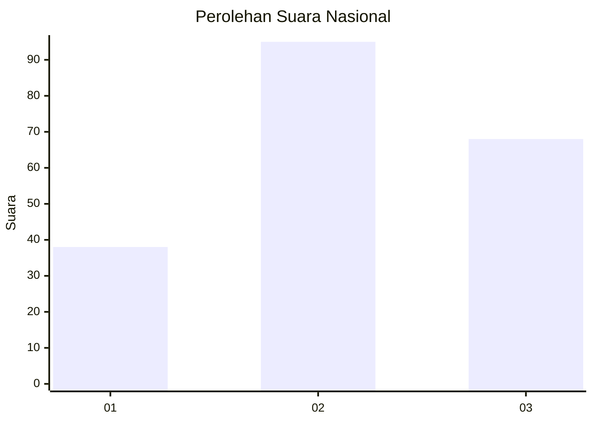
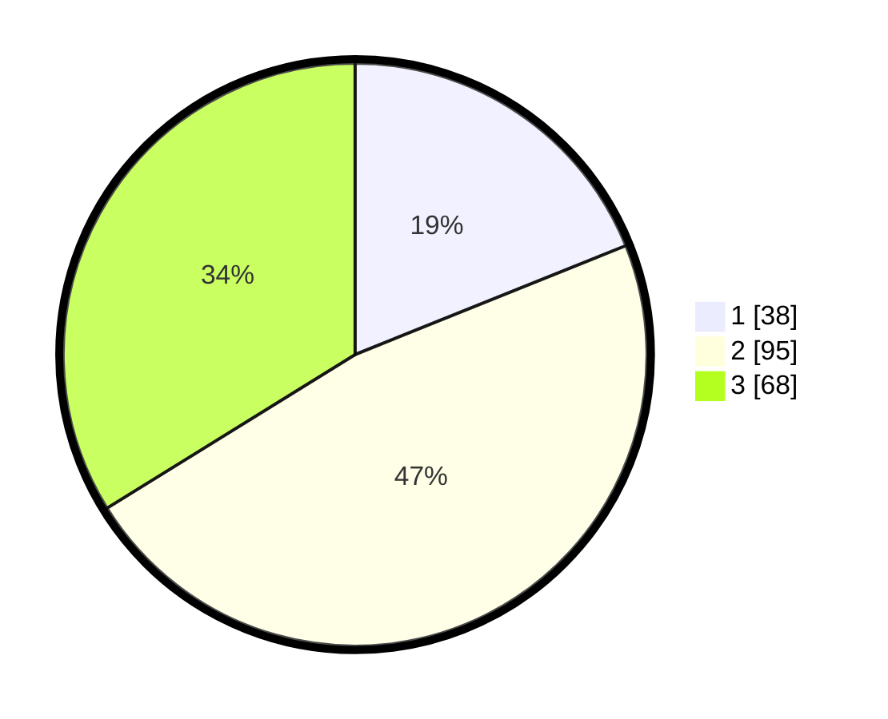

# Hasil

## Grafik

## Tabel

| No. | Nama Paslon    | Suara | Suara (raw) | Persentase |
|:--- |:-------------- | -----:| -----------:| ----------:|
| 1   | ANIES MUHAIMIN | 38    | [38][p-1]   | 18,91      |
| 2   | PRABOWO GIBRAN | 95    | [95][p-2]   | 47,26      |
| 3   | GANJAR MAHFUD  | 68    | [68][p-3]   | 33,83      |

[p-1]: https://github.com/gigit-pemilu/pemilu-2024/blob/main/pilpres/hitung-suara/sub/34-di-yogyakarta/sub/02-bantul/sub/01-srandakan/sub/2002-trimurti/sub/038-tps/sub/paslon-1.txt
[p-2]: https://github.com/gigit-pemilu/pemilu-2024/blob/main/pilpres/hitung-suara/sub/34-di-yogyakarta/sub/02-bantul/sub/01-srandakan/sub/2002-trimurti/sub/038-tps/sub/paslon-2.txt
[p-3]: https://github.com/gigit-pemilu/pemilu-2024/blob/main/pilpres/hitung-suara/sub/34-di-yogyakarta/sub/02-bantul/sub/01-srandakan/sub/2002-trimurti/sub/038-tps/sub/paslon-3.txt

## Foto C Plano

https://sirekap-obj-formc.kpu.go.id/4cbf/pemilu/ppwp/34/02/01/20/02/3402012002038-20240214-230715--e1633358-0c67-4cb6-985c-00339b170b89.jpg

https://sirekap-obj-formc.kpu.go.id/4cbf/pemilu/ppwp/34/02/01/20/02/3402012002038-20240214-230818--32a8c4d6-8c0a-435c-ac91-fdedfbb3ac74.jpg

https://sirekap-obj-formc.kpu.go.id/4cbf/pemilu/ppwp/34/02/01/20/02/3402012002038-20240214-230924--6745dc13-e233-4d0f-b1b7-cf83db5e4ee6.jpg

## Metadata

| Key        | Value               |
| ---------- | ------------------- |
| Time Stamp | 2024-02-15 21:01:18 |

