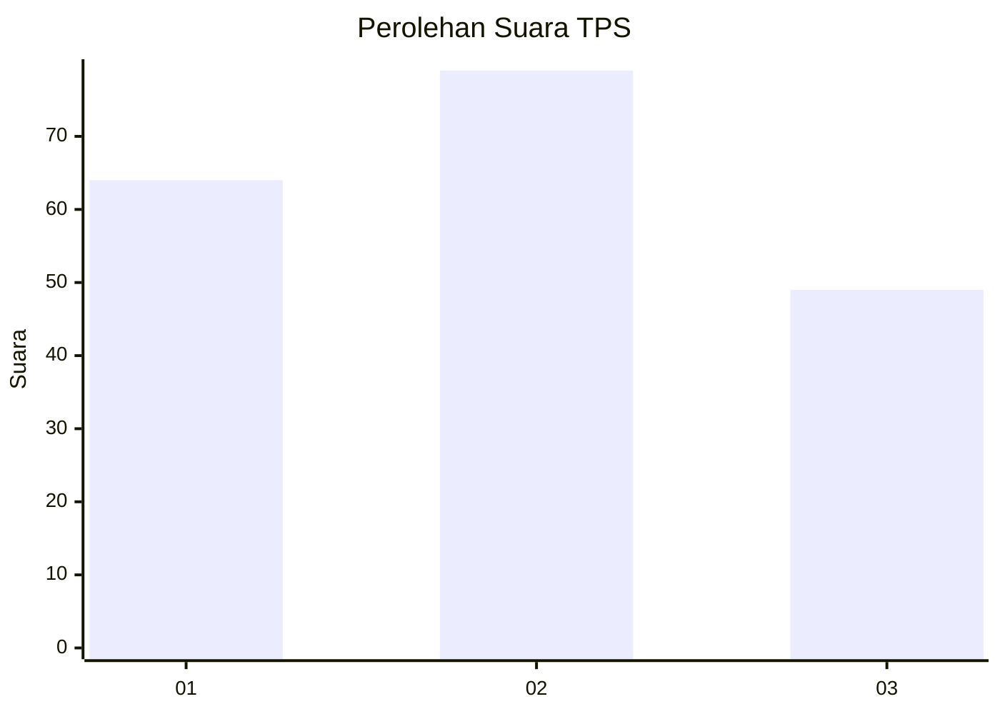
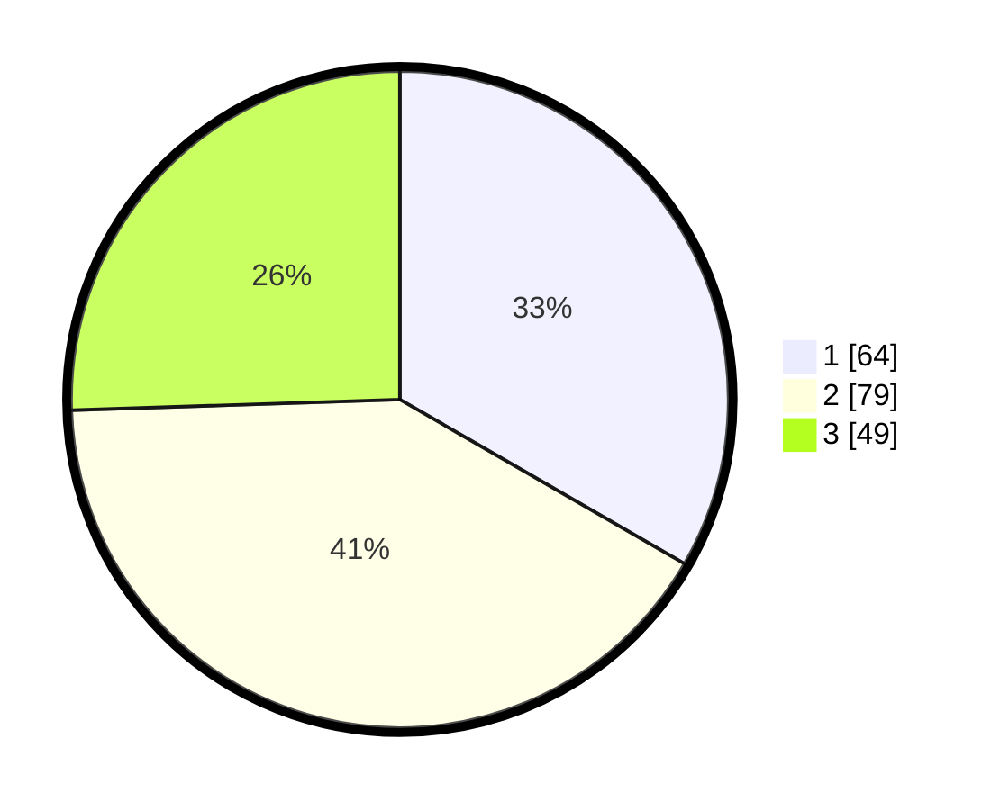

# Hasil

## Grafik

## Tabel

| No. | Nama Paslon    | Suara | Suara (raw) | Persentase |
|:--- |:-------------- | -----:| -----------:| ----------:|
| 1   | ANIES MUHAIMIN | 64    | [64][p-1]   | 33,33      |
| 2   | PRABOWO GIBRAN | 79    | [79][p-2]   | 41,15      |
| 3   | GANJAR MAHFUD  | 49    | [49][p-3]   | 25,52      |

[p-1]: https://github.com/gigit-pemilu/pemilu-2024-34-di-yogyakarta/blob/main/pilpres/hitung-suara/sub/34-di-yogyakarta/sub/02-bantul/sub/01-srandakan/sub/2002-trimurti/sub/046-tps/sub/paslon-1.txt
[p-2]: https://github.com/gigit-pemilu/pemilu-2024-34-di-yogyakarta/blob/main/pilpres/hitung-suara/sub/34-di-yogyakarta/sub/02-bantul/sub/01-srandakan/sub/2002-trimurti/sub/046-tps/sub/paslon-2.txt
[p-3]: https://github.com/gigit-pemilu/pemilu-2024-34-di-yogyakarta/blob/main/pilpres/hitung-suara/sub/34-di-yogyakarta/sub/02-bantul/sub/01-srandakan/sub/2002-trimurti/sub/046-tps/sub/paslon-3.txt

## Foto C Plano

https://sirekap-obj-formc.kpu.go.id/684b/pemilu/ppwp/34/02/01/20/02/3402012002046-20240214-222432--1861d8ec-5338-470d-9385-5d16528e265e.jpg

https://sirekap-obj-formc.kpu.go.id/684b/pemilu/ppwp/34/02/01/20/02/3402012002046-20240214-213000--49027305-62eb-4caa-8628-fa5f9232ad0e.jpg

https://sirekap-obj-formc.kpu.go.id/684b/pemilu/ppwp/34/02/01/20/02/3402012002046-20240214-233103--64c4a229-2601-46a6-a7bc-67cfb9c3126f.jpg

## Metadata

| Key        | Value               |
| ---------- | ------------------- |
| Time Stamp | 2024-02-25 11:00:00 |

