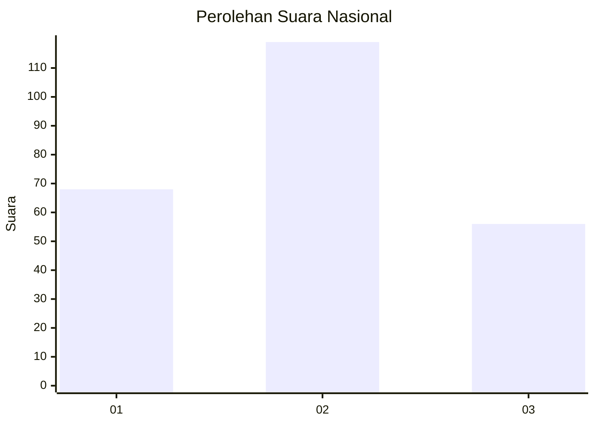
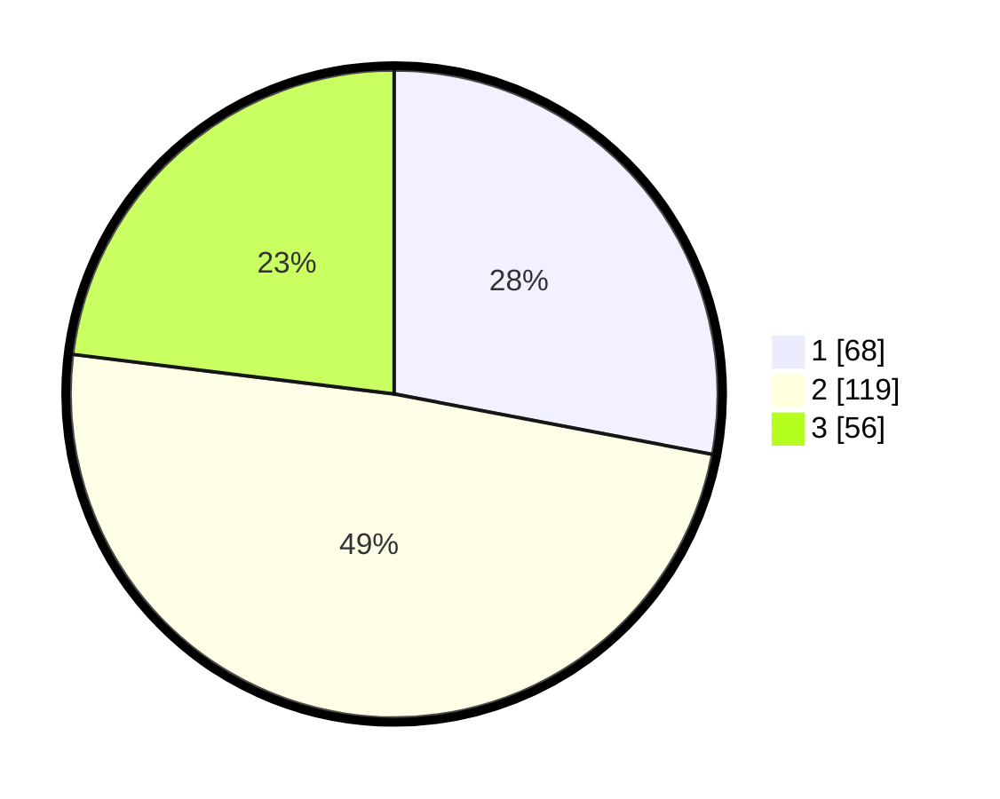

# Hasil

## Grafik

## Tabel

| No. | Nama Paslon    | Suara | Suara (raw) | Persentase |
|:--- |:-------------- | -----:| -----------:| ----------:|
| 1   | ANIES MUHAIMIN | 68    | [68][p-1]   | 27,98      |
| 2   | PRABOWO GIBRAN | 119   | [119][p-2]  | 48,97      |
| 3   | GANJAR MAHFUD  | 56    | [56][p-3]   | 23,05      |

[p-1]: https://github.com/gigit-pemilu/pemilu-2024/blob/main/pilpres/hitung-suara/sub/34-di-yogyakarta/sub/02-bantul/sub/01-srandakan/sub/2002-trimurti/sub/049-tps/sub/paslon-1.txt
[p-2]: https://github.com/gigit-pemilu/pemilu-2024/blob/main/pilpres/hitung-suara/sub/34-di-yogyakarta/sub/02-bantul/sub/01-srandakan/sub/2002-trimurti/sub/049-tps/sub/paslon-2.txt
[p-3]: https://github.com/gigit-pemilu/pemilu-2024/blob/main/pilpres/hitung-suara/sub/34-di-yogyakarta/sub/02-bantul/sub/01-srandakan/sub/2002-trimurti/sub/049-tps/sub/paslon-3.txt

## Foto C Plano

https://sirekap-obj-formc.kpu.go.id/2653/pemilu/ppwp/34/02/01/20/02/3402012002049-20240215-013447--4999a13e-8166-4377-ad64-fd94af8f04fd.jpg

https://sirekap-obj-formc.kpu.go.id/2653/pemilu/ppwp/34/02/01/20/02/3402012002049-20240215-013720--85894426-5ad6-422e-9034-0e7050170419.jpg

https://sirekap-obj-formc.kpu.go.id/2653/pemilu/ppwp/34/02/01/20/02/3402012002049-20240215-013821--1e527be5-22bd-4576-b0b8-149adf4ab363.jpg

## Metadata

| Key        | Value               |
| ---------- | ------------------- |
| Time Stamp | 2024-02-16 12:51:22 |

