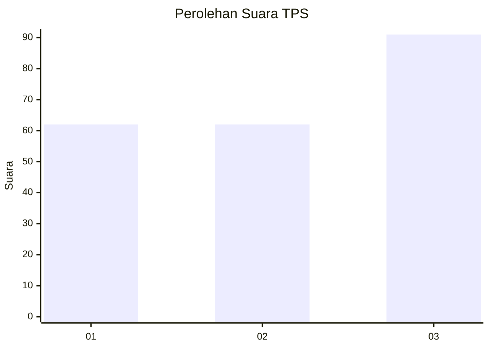
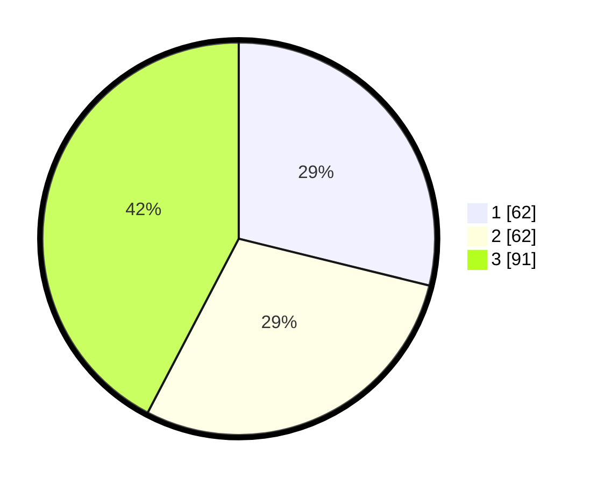

# Hasil

## Grafik

## Tabel

| No. | Nama Paslon    | Suara | Suara (raw) | Persentase |
|:--- |:-------------- | -----:| -----------:| ----------:|
| 1   | ANIES MUHAIMIN | 62    | [62][p-1]   | 28,84      |
| 2   | PRABOWO GIBRAN | 62    | [62][p-2]   | 28,84      |
| 3   | GANJAR MAHFUD  | 91    | [91][p-3]   | 42,33      |

[p-1]: https://github.com/gigit-pemilu/pemilu-2024-34-di-yogyakarta/blob/main/pilpres/hitung-suara/sub/34-di-yogyakarta/sub/02-bantul/sub/01-srandakan/sub/2002-trimurti/sub/052-tps/sub/paslon-1.txt
[p-2]: https://github.com/gigit-pemilu/pemilu-2024-34-di-yogyakarta/blob/main/pilpres/hitung-suara/sub/34-di-yogyakarta/sub/02-bantul/sub/01-srandakan/sub/2002-trimurti/sub/052-tps/sub/paslon-2.txt
[p-3]: https://github.com/gigit-pemilu/pemilu-2024-34-di-yogyakarta/blob/main/pilpres/hitung-suara/sub/34-di-yogyakarta/sub/02-bantul/sub/01-srandakan/sub/2002-trimurti/sub/052-tps/sub/paslon-3.txt

## Foto C Plano

https://sirekap-obj-formc.kpu.go.id/2801/pemilu/ppwp/34/02/01/20/02/3402012002052-20240221-081844--edb47796-3c7d-405e-a688-22c6e3df9f46.jpg

https://sirekap-obj-formc.kpu.go.id/2801/pemilu/ppwp/34/02/01/20/02/3402012002052-20240221-081931--7bc7e98a-7561-4f75-a8c0-4e2533f261dd.jpg

https://sirekap-obj-formc.kpu.go.id/2801/pemilu/ppwp/34/02/01/20/02/3402012002052-20240221-082016--fc57d9ea-9404-4745-a65e-26a3e75a5d75.jpg

## Metadata

| Key        | Value               |
| ---------- | ------------------- |
| Time Stamp | 2024-02-24 22:31:28 |

