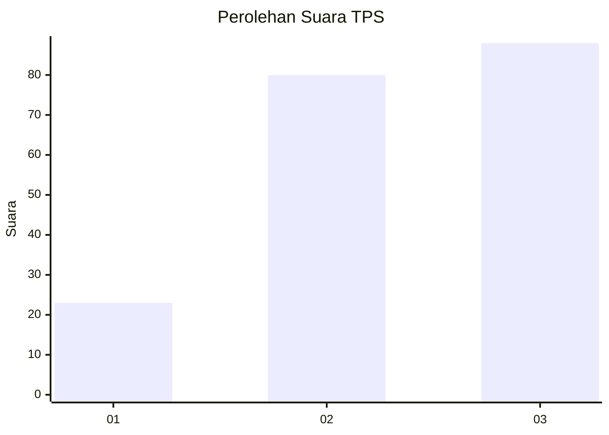
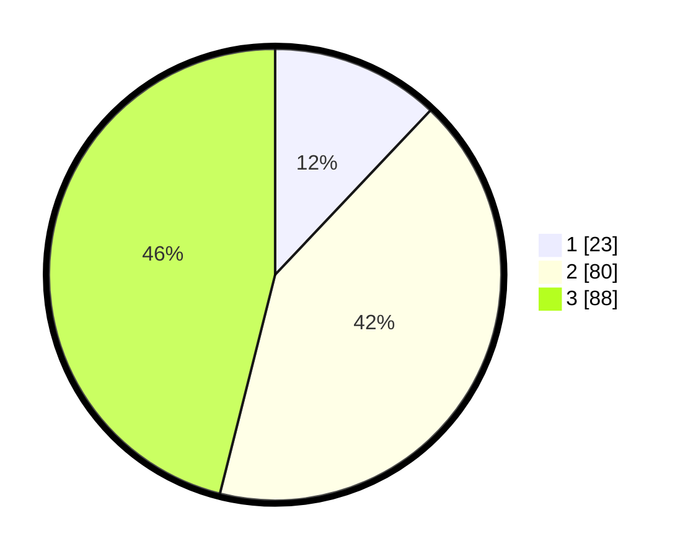

# Hasil

## Grafik

## Tabel

| No. | Nama Paslon    | Suara | Suara (raw) | Persentase |
|:--- |:-------------- | -----:| -----------:| ----------:|
| 1   | ANIES MUHAIMIN | 23    | [23][p-1]   | 12,04      |
| 2   | PRABOWO GIBRAN | 80    | [80][p-2]   | 41,88      |
| 3   | GANJAR MAHFUD  | 88    | [88][p-3]   | 46,07      |

[p-1]: https://github.com/gigit-pemilu/pemilu-2024-34-di-yogyakarta/blob/main/pilpres/hitung-suara/sub/34-di-yogyakarta/sub/02-bantul/sub/01-srandakan/sub/2002-trimurti/sub/059-tps/sub/paslon-1.txt
[p-2]: https://github.com/gigit-pemilu/pemilu-2024-34-di-yogyakarta/blob/main/pilpres/hitung-suara/sub/34-di-yogyakarta/sub/02-bantul/sub/01-srandakan/sub/2002-trimurti/sub/059-tps/sub/paslon-2.txt
[p-3]: https://github.com/gigit-pemilu/pemilu-2024-34-di-yogyakarta/blob/main/pilpres/hitung-suara/sub/34-di-yogyakarta/sub/02-bantul/sub/01-srandakan/sub/2002-trimurti/sub/059-tps/sub/paslon-3.txt

## Foto C Plano

https://sirekap-obj-formc.kpu.go.id/b53e/pemilu/ppwp/34/02/01/20/02/3402012002059-20240215-000445--48dcfeba-8b01-4cba-b710-90c6828dbab3.jpg

https://sirekap-obj-formc.kpu.go.id/b53e/pemilu/ppwp/34/02/01/20/02/3402012002059-20240215-000606--75a29267-50f9-441e-966d-b43bb3310828.jpg

https://sirekap-obj-formc.kpu.go.id/b53e/pemilu/ppwp/34/02/01/20/02/3402012002059-20240215-000820--f3234517-8e19-47ea-9de5-9a5ea96e78d4.jpg

## Metadata

| Key        | Value               |
| ---------- | ------------------- |
| Time Stamp | 2024-02-24 22:31:28 |

