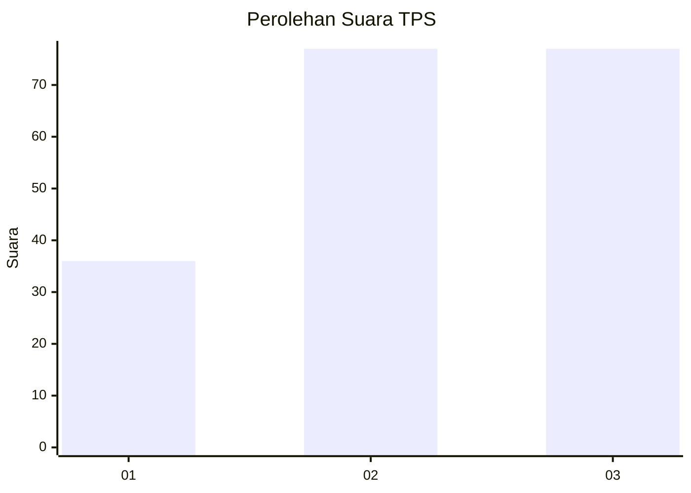
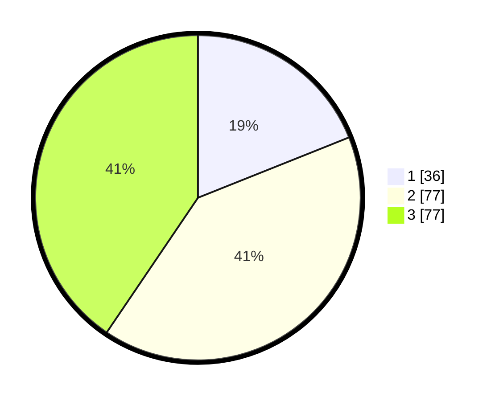

# Hasil

## Grafik

## Tabel

| No. | Nama Paslon    | Suara | Suara (raw) | Persentase |
|:--- |:-------------- | -----:| -----------:| ----------:|
| 1   | ANIES MUHAIMIN | 36    | [36][p-1]   | 18,95      |
| 2   | PRABOWO GIBRAN | 77    | [77][p-2]   | 40,53      |
| 3   | GANJAR MAHFUD  | 77    | [77][p-3]   | 40,53      |

[p-1]: https://github.com/gigit-pemilu/pemilu-2024-34-di-yogyakarta/blob/main/pilpres/hitung-suara/sub/34-di-yogyakarta/sub/02-bantul/sub/01-srandakan/sub/2002-trimurti/sub/060-tps/sub/paslon-1.txt
[p-2]: https://github.com/gigit-pemilu/pemilu-2024-34-di-yogyakarta/blob/main/pilpres/hitung-suara/sub/34-di-yogyakarta/sub/02-bantul/sub/01-srandakan/sub/2002-trimurti/sub/060-tps/sub/paslon-2.txt
[p-3]: https://github.com/gigit-pemilu/pemilu-2024-34-di-yogyakarta/blob/main/pilpres/hitung-suara/sub/34-di-yogyakarta/sub/02-bantul/sub/01-srandakan/sub/2002-trimurti/sub/060-tps/sub/paslon-3.txt

## Foto C Plano

https://sirekap-obj-formc.kpu.go.id/2c7b/pemilu/ppwp/34/02/01/20/02/3402012002060-20240214-214117--bb18d101-9970-463a-bf1f-d5bbb690569f.jpg

https://sirekap-obj-formc.kpu.go.id/2c7b/pemilu/ppwp/34/02/01/20/02/3402012002060-20240214-214231--0a6c3c73-e166-4a2d-afb7-fb92df9f7e3b.jpg

https://sirekap-obj-formc.kpu.go.id/2c7b/pemilu/ppwp/34/02/01/20/02/3402012002060-20240214-214402--a7c4e0e2-80c0-4279-8a17-d668bd95ff2d.jpg

## Metadata

| Key        | Value               |
| ---------- | ------------------- |
| Time Stamp | 2024-02-22 16:00:00 |

