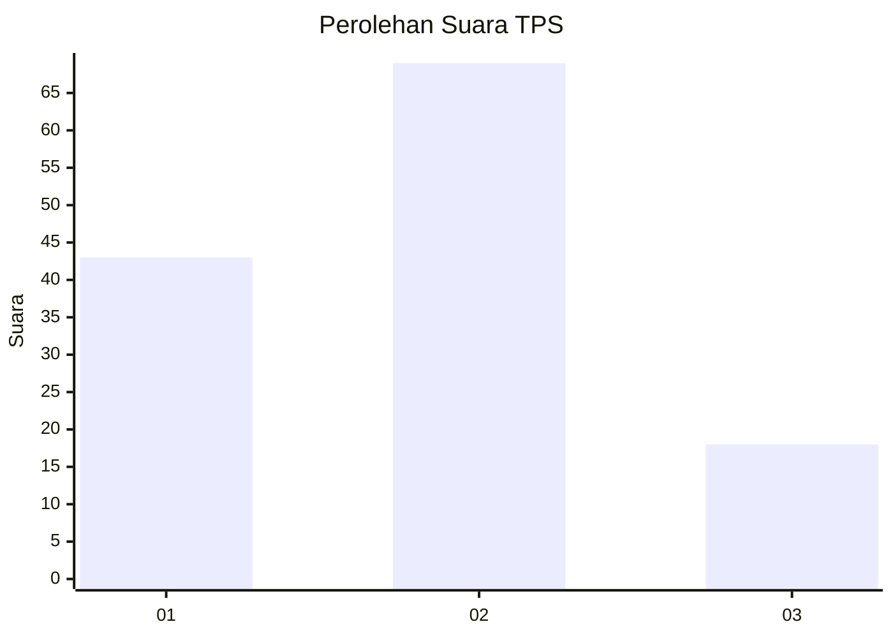
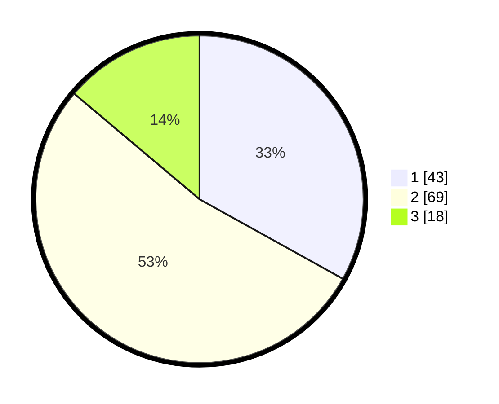

# Hasil

## Grafik

## Tabel

| No. | Nama Paslon    | Suara | Suara (raw) | Persentase |
|:--- |:-------------- | -----:| -----------:| ----------:|
| 1   | ANIES MUHAIMIN | 43    | [43][p-1]   | 33,08      |
| 2   | PRABOWO GIBRAN | 69    | [69][p-2]   | 53,08      |
| 3   | GANJAR MAHFUD  | 18    | [18][p-3]   | 13,85      |

[p-1]: https://github.com/gigit-pemilu/pemilu-2024-34-di-yogyakarta/blob/main/pilpres/hitung-suara/sub/34-di-yogyakarta/sub/02-bantul/sub/02-sanden/sub/2001-gadingsari/sub/005-tps/sub/paslon-1.txt
[p-2]: https://github.com/gigit-pemilu/pemilu-2024-34-di-yogyakarta/blob/main/pilpres/hitung-suara/sub/34-di-yogyakarta/sub/02-bantul/sub/02-sanden/sub/2001-gadingsari/sub/005-tps/sub/paslon-2.txt
[p-3]: https://github.com/gigit-pemilu/pemilu-2024-34-di-yogyakarta/blob/main/pilpres/hitung-suara/sub/34-di-yogyakarta/sub/02-bantul/sub/02-sanden/sub/2001-gadingsari/sub/005-tps/sub/paslon-3.txt

## Foto C Plano

https://sirekap-obj-formc.kpu.go.id/321a/pemilu/ppwp/34/02/02/20/01/3402022001005-20240214-212852--4eeac7ad-213c-47a6-b43d-e73b7171a337.jpg

https://sirekap-obj-formc.kpu.go.id/321a/pemilu/ppwp/34/02/02/20/01/3402022001005-20240214-224724--d0ad4066-d305-4bc5-92fe-64ac57413a0b.jpg

https://sirekap-obj-formc.kpu.go.id/321a/pemilu/ppwp/34/02/02/20/01/3402022001005-20240214-225104--84791874-3d9c-4430-8c74-11c02895fc0a.jpg

## Metadata

| Key        | Value               |
| ---------- | ------------------- |
| Time Stamp | 2024-02-24 22:31:28 |

