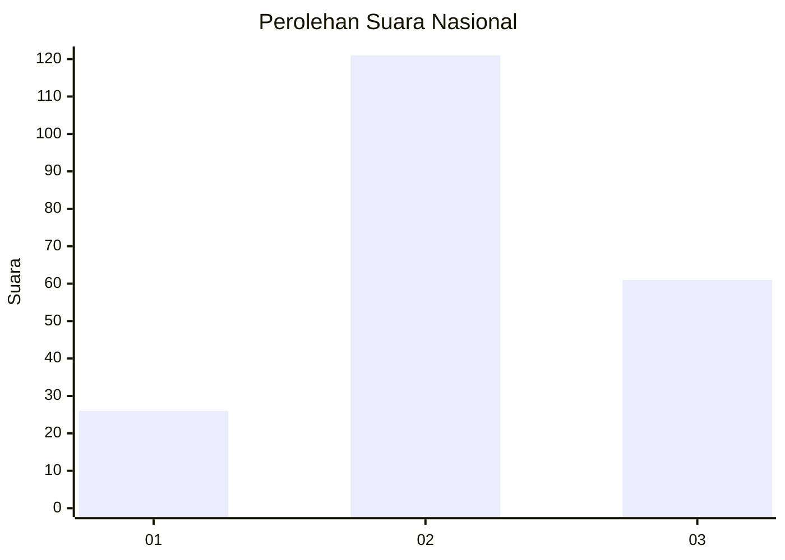
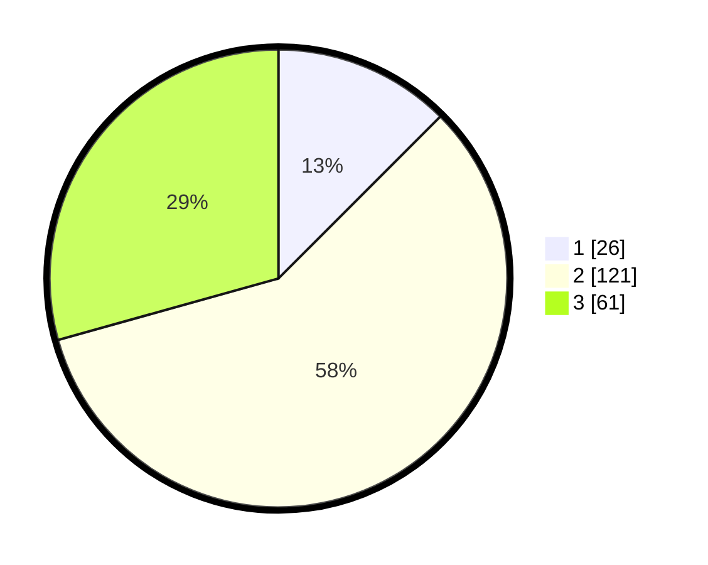

# Hasil

## Grafik

## Tabel

| No. | Nama Paslon    | Suara | Suara (raw) | Persentase |
|:--- |:-------------- | -----:| -----------:| ----------:|
| 1   | ANIES MUHAIMIN | 26    | [26][p-1]   | 12,50      |
| 2   | PRABOWO GIBRAN | 121   | [121][p-2]  | 58,17      |
| 3   | GANJAR MAHFUD  | 61    | [61][p-3]   | 29,33      |

[p-1]: https://github.com/gigit-pemilu/pemilu-2024/blob/main/pilpres/hitung-suara/sub/34-di-yogyakarta/sub/02-bantul/sub/02-sanden/sub/2001-gadingsari/sub/007-tps/sub/paslon-1.txt
[p-2]: https://github.com/gigit-pemilu/pemilu-2024/blob/main/pilpres/hitung-suara/sub/34-di-yogyakarta/sub/02-bantul/sub/02-sanden/sub/2001-gadingsari/sub/007-tps/sub/paslon-2.txt
[p-3]: https://github.com/gigit-pemilu/pemilu-2024/blob/main/pilpres/hitung-suara/sub/34-di-yogyakarta/sub/02-bantul/sub/02-sanden/sub/2001-gadingsari/sub/007-tps/sub/paslon-3.txt

## Foto C Plano

https://sirekap-obj-formc.kpu.go.id/a2e6/pemilu/ppwp/34/02/02/20/01/3402022001007-20240214-225058--315ba491-cfa6-4ef3-912d-4f30be0e2686.jpg

https://sirekap-obj-formc.kpu.go.id/a2e6/pemilu/ppwp/34/02/02/20/01/3402022001007-20240214-225152--d3da4eea-ebea-40ff-9bbe-00a172e30078.jpg

https://sirekap-obj-formc.kpu.go.id/a2e6/pemilu/ppwp/34/02/02/20/01/3402022001007-20240214-225508--25cf35f6-d54c-45a0-a7ae-1b6d49e0dacf.jpg

## Metadata

| Key        | Value               |
| ---------- | ------------------- |
| Time Stamp | 2024-02-17 16:00:02 |

