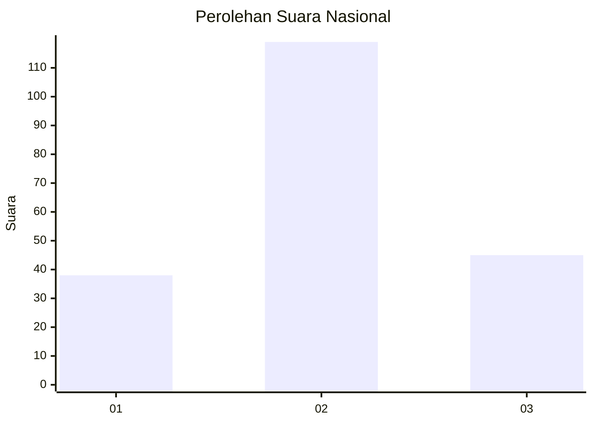
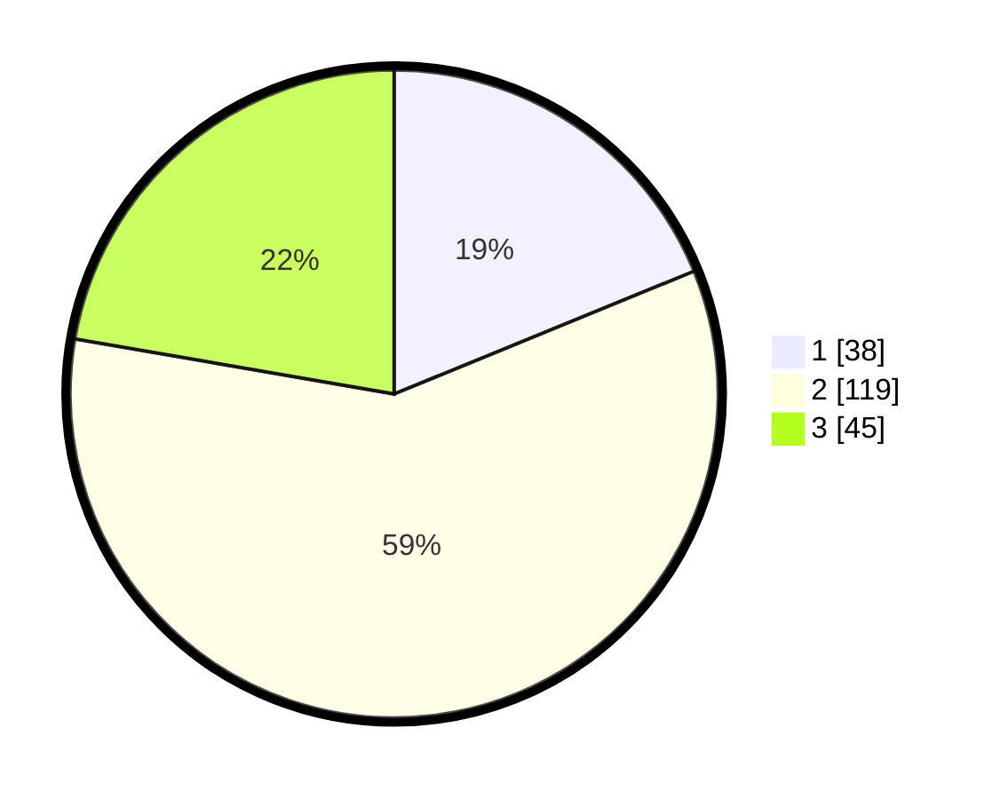

# Hasil

## Grafik

## Tabel

| No. | Nama Paslon    | Suara | Suara (raw) | Persentase |
|:--- |:-------------- | -----:| -----------:| ----------:|
| 1   | ANIES MUHAIMIN | 38    | [38][p-1]   | 18,81      |
| 2   | PRABOWO GIBRAN | 119   | [119][p-2]  | 58,91      |
| 3   | GANJAR MAHFUD  | 45    | [45][p-3]   | 22,28      |

[p-1]: https://github.com/gigit-pemilu/pemilu-2024/blob/main/pilpres/hitung-suara/sub/34-di-yogyakarta/sub/02-bantul/sub/02-sanden/sub/2001-gadingsari/sub/008-tps/sub/paslon-1.txt
[p-2]: https://github.com/gigit-pemilu/pemilu-2024/blob/main/pilpres/hitung-suara/sub/34-di-yogyakarta/sub/02-bantul/sub/02-sanden/sub/2001-gadingsari/sub/008-tps/sub/paslon-2.txt
[p-3]: https://github.com/gigit-pemilu/pemilu-2024/blob/main/pilpres/hitung-suara/sub/34-di-yogyakarta/sub/02-bantul/sub/02-sanden/sub/2001-gadingsari/sub/008-tps/sub/paslon-3.txt

## Foto C Plano

https://sirekap-obj-formc.kpu.go.id/be42/pemilu/ppwp/34/02/02/20/01/3402022001008-20240216-115716--9212f11a-5f5a-4577-bbb3-97c0b10855b2.jpg

https://sirekap-obj-formc.kpu.go.id/be42/pemilu/ppwp/34/02/02/20/01/3402022001008-20240216-115724--5e75c233-b3b6-4105-99a0-891028c9e079.jpg

https://sirekap-obj-formc.kpu.go.id/be42/pemilu/ppwp/34/02/02/20/01/3402022001008-20240216-115720--99e93df3-b5a7-4661-89c2-ba0fb6af87b5.jpg

## Metadata

| Key        | Value               |
| ---------- | ------------------- |
| Time Stamp | 2024-02-16 12:51:22 |

## DATA PEMILIH TETAP

Jumlah pemilih dalam DPT: **228**.
 * L: **119**.
 * P: **109**.

## DATA PENGGUNA HAK PILIH

Jumlah pengguna hak pilih dalam DPT: **213**.
 * L: **109**.
 * P: **104**.

Jumlah pengguna hak pilih dalam DPTb: **0**.
 * L: **0**.
 * P: **0**.

Jumlah pengguna hak pilih dalam DPK: **0**.
 * L: **0**.
 * P: **0**.

Jumlah pengguna hak pilih: **213**.
 * L: **109**.
 * P: **104**.

## JUMLAH SUARA SAH DAN TIDAK SAH

JUMLAH SELURUH SUARA SAH: **202**.

JUMLAH SUARA TIDAK SAH: **11**.

JUMLAH SELURUH SUARA SAH DAN SUARA TIDAK SAH: **213**.

