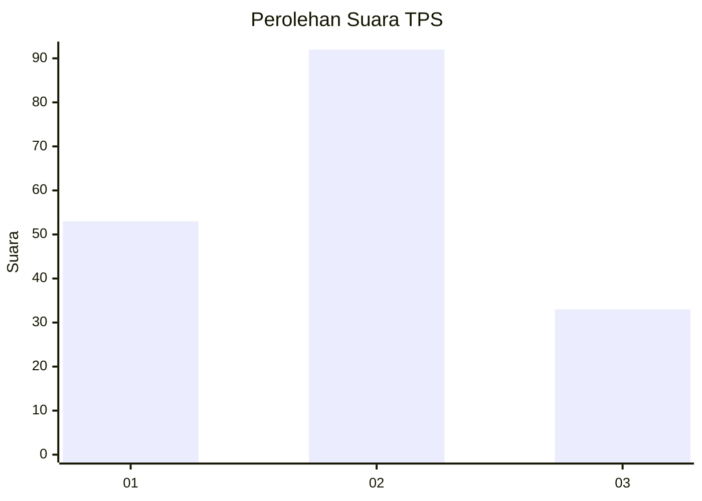
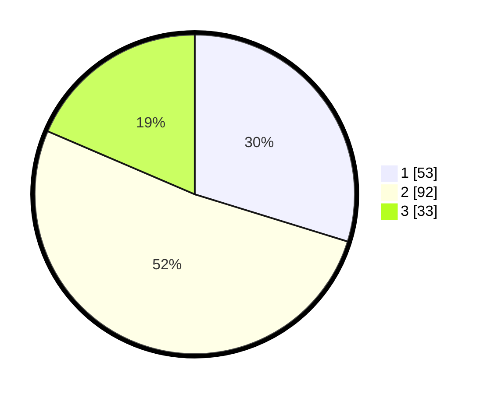

# Hasil

## Grafik

## Tabel

| No. | Nama Paslon    | Suara | Suara (raw) | Persentase |
|:--- |:-------------- | -----:| -----------:| ----------:|
| 1   | ANIES MUHAIMIN | 53    | [53][p-1]   | 29,78      |
| 2   | PRABOWO GIBRAN | 92    | [92][p-2]   | 51,69      |
| 3   | GANJAR MAHFUD  | 33    | [33][p-3]   | 18,54      |

[p-1]: https://github.com/gigit-pemilu/pemilu-2024-34-di-yogyakarta/blob/main/pilpres/hitung-suara/sub/34-di-yogyakarta/sub/02-bantul/sub/02-sanden/sub/2001-gadingsari/sub/009-tps/sub/paslon-1.txt
[p-2]: https://github.com/gigit-pemilu/pemilu-2024-34-di-yogyakarta/blob/main/pilpres/hitung-suara/sub/34-di-yogyakarta/sub/02-bantul/sub/02-sanden/sub/2001-gadingsari/sub/009-tps/sub/paslon-2.txt
[p-3]: https://github.com/gigit-pemilu/pemilu-2024-34-di-yogyakarta/blob/main/pilpres/hitung-suara/sub/34-di-yogyakarta/sub/02-bantul/sub/02-sanden/sub/2001-gadingsari/sub/009-tps/sub/paslon-3.txt

## Foto C Plano

https://sirekap-obj-formc.kpu.go.id/95b6/pemilu/ppwp/34/02/02/20/01/3402022001009-20240215-045811--8a4a783b-be96-4e96-ad92-e8e656373c03.jpg

https://sirekap-obj-formc.kpu.go.id/95b6/pemilu/ppwp/34/02/02/20/01/3402022001009-20240215-050109--5a3eaf27-884e-4747-95ea-aeef6b0350fd.jpg

https://sirekap-obj-formc.kpu.go.id/95b6/pemilu/ppwp/34/02/02/20/01/3402022001009-20240215-050301--999fc2f5-1bd2-4b76-86ce-0b205b146df4.jpg

## Metadata

| Key        | Value               |
| ---------- | ------------------- |
| Time Stamp | 2024-02-16 09:00:28 |

