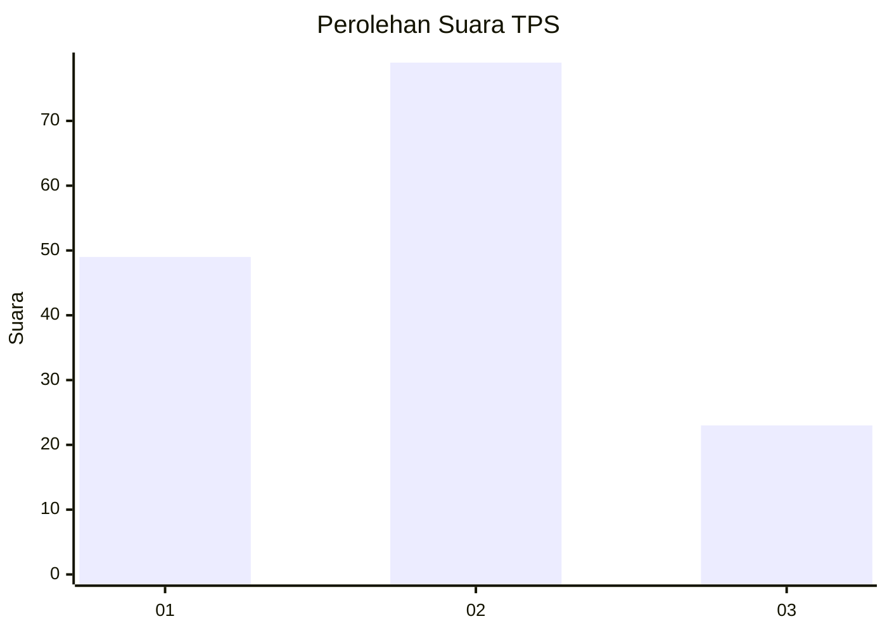
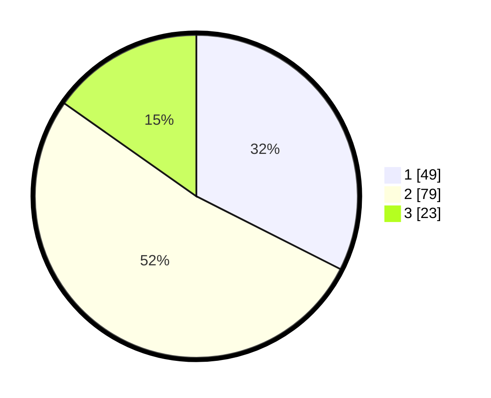

# Hasil

## Grafik

## Tabel

| No. | Nama Paslon    | Suara | Suara (raw) | Persentase |
|:--- |:-------------- | -----:| -----------:| ----------:|
| 1   | ANIES MUHAIMIN | 49    | [49][p-1]   | 32,45      |
| 2   | PRABOWO GIBRAN | 79    | [79][p-2]   | 52,32      |
| 3   | GANJAR MAHFUD  | 23    | [23][p-3]   | 15,23      |

[p-1]: https://github.com/gigit-pemilu/pemilu-2024-34-di-yogyakarta/blob/main/pilpres/hitung-suara/sub/34-di-yogyakarta/sub/02-bantul/sub/02-sanden/sub/2001-gadingsari/sub/013-tps/sub/paslon-1.txt
[p-2]: https://github.com/gigit-pemilu/pemilu-2024-34-di-yogyakarta/blob/main/pilpres/hitung-suara/sub/34-di-yogyakarta/sub/02-bantul/sub/02-sanden/sub/2001-gadingsari/sub/013-tps/sub/paslon-2.txt
[p-3]: https://github.com/gigit-pemilu/pemilu-2024-34-di-yogyakarta/blob/main/pilpres/hitung-suara/sub/34-di-yogyakarta/sub/02-bantul/sub/02-sanden/sub/2001-gadingsari/sub/013-tps/sub/paslon-3.txt

## Foto C Plano

https://sirekap-obj-formc.kpu.go.id/2d0a/pemilu/ppwp/34/02/02/20/01/3402022001013-20240214-200553--b425b75c-14ec-4080-b834-c14536993653.jpg

https://sirekap-obj-formc.kpu.go.id/2d0a/pemilu/ppwp/34/02/02/20/01/3402022001013-20240214-200732--bc0ae42a-fd9b-44c1-8aaa-7aa8ac0c3129.jpg

https://sirekap-obj-formc.kpu.go.id/2d0a/pemilu/ppwp/34/02/02/20/01/3402022001013-20240214-211942--4ed7836b-09a3-421d-b010-f27940d0ad6d.jpg

## Metadata

| Key        | Value               |
| ---------- | ------------------- |
| Time Stamp | 2024-02-14 21:46:01 |

