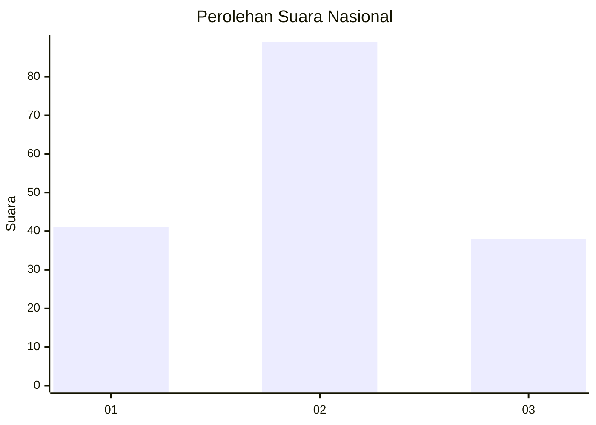
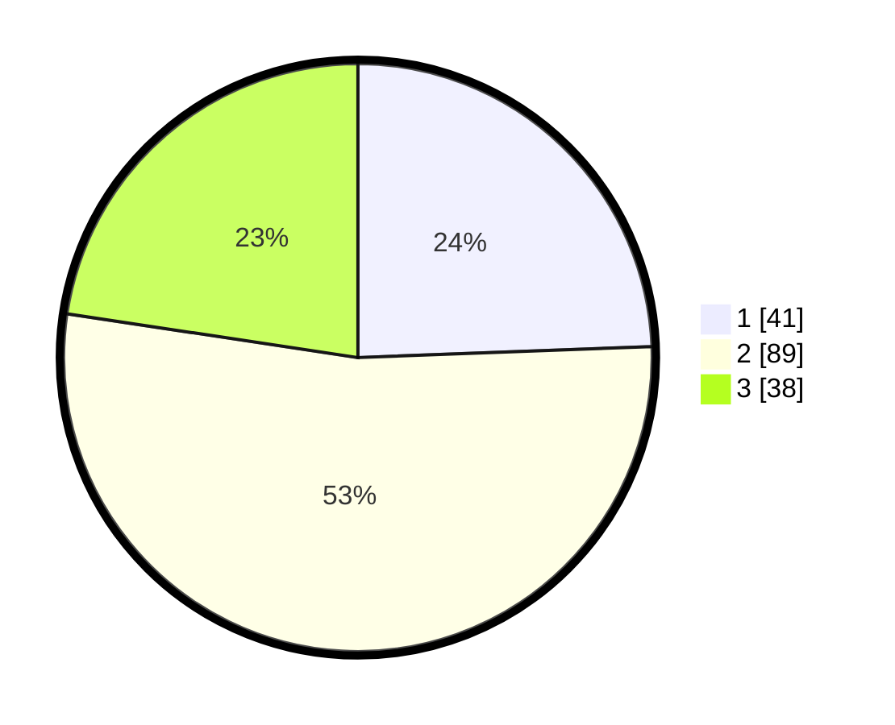

# Hasil

## Grafik

## Tabel

| No. | Nama Paslon    | Suara | Suara (raw) | Persentase |
|:--- |:-------------- | -----:| -----------:| ----------:|
| 1   | ANIES MUHAIMIN | 41    | [41][p-1]   | 24,40      |
| 2   | PRABOWO GIBRAN | 89    | [89][p-2]   | 52,98      |
| 3   | GANJAR MAHFUD  | 38    | [38][p-3]   | 22,62      |

[p-1]: https://github.com/gigit-pemilu/pemilu-2024/blob/main/pilpres/hitung-suara/sub/34-di-yogyakarta/sub/02-bantul/sub/02-sanden/sub/2001-gadingsari/sub/018-tps/sub/paslon-1.txt
[p-2]: https://github.com/gigit-pemilu/pemilu-2024/blob/main/pilpres/hitung-suara/sub/34-di-yogyakarta/sub/02-bantul/sub/02-sanden/sub/2001-gadingsari/sub/018-tps/sub/paslon-2.txt
[p-3]: https://github.com/gigit-pemilu/pemilu-2024/blob/main/pilpres/hitung-suara/sub/34-di-yogyakarta/sub/02-bantul/sub/02-sanden/sub/2001-gadingsari/sub/018-tps/sub/paslon-3.txt

## Foto C Plano

https://sirekap-obj-formc.kpu.go.id/be8f/pemilu/ppwp/34/02/02/20/01/3402022001018-20240214-141316--7076cac0-307f-4fa8-9166-c7b1e5b0eec8.jpg

https://sirekap-obj-formc.kpu.go.id/be8f/pemilu/ppwp/34/02/02/20/01/3402022001018-20240214-141153--0496da12-b7c7-4745-bfc9-918b0bc89d01.jpg

https://sirekap-obj-formc.kpu.go.id/be8f/pemilu/ppwp/34/02/02/20/01/3402022001018-20240214-141816--ee91c083-b264-4c33-835c-29d6b1aade4c.jpg

## Metadata

| Key        | Value               |
| ---------- | ------------------- |
| Time Stamp | 2024-02-15 01:47:43 |

