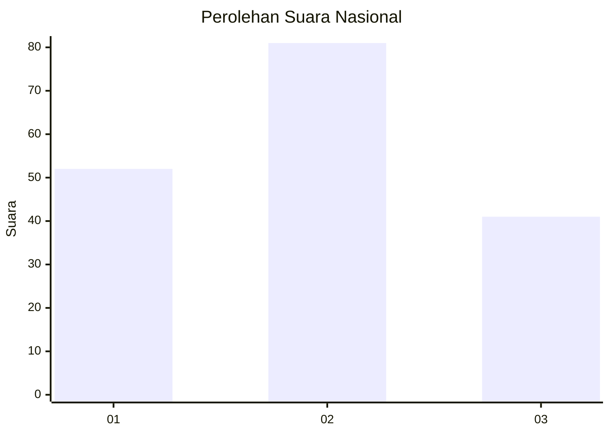
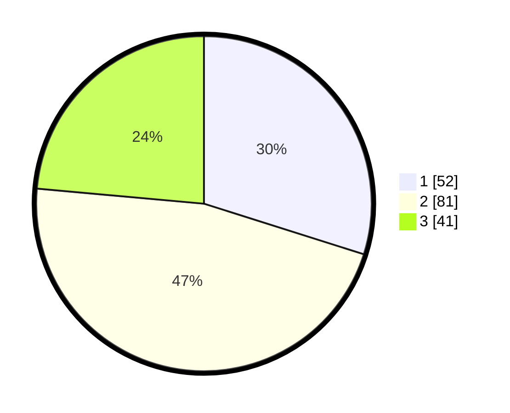

# Hasil

## Grafik

## Tabel

| No. | Nama Paslon    | Suara | Suara (raw) | Persentase |
|:--- |:-------------- | -----:| -----------:| ----------:|
| 1   | ANIES MUHAIMIN | 52    | [52][p-1]   | 29,89      |
| 2   | PRABOWO GIBRAN | 81    | [81][p-2]   | 46,55      |
| 3   | GANJAR MAHFUD  | 41    | [41][p-3]   | 23,56      |

[p-1]: https://github.com/gigit-pemilu/pemilu-2024/blob/main/pilpres/hitung-suara/sub/34-di-yogyakarta/sub/02-bantul/sub/02-sanden/sub/2001-gadingsari/sub/019-tps/sub/paslon-1.txt
[p-2]: https://github.com/gigit-pemilu/pemilu-2024/blob/main/pilpres/hitung-suara/sub/34-di-yogyakarta/sub/02-bantul/sub/02-sanden/sub/2001-gadingsari/sub/019-tps/sub/paslon-2.txt
[p-3]: https://github.com/gigit-pemilu/pemilu-2024/blob/main/pilpres/hitung-suara/sub/34-di-yogyakarta/sub/02-bantul/sub/02-sanden/sub/2001-gadingsari/sub/019-tps/sub/paslon-3.txt

## Foto C Plano

https://sirekap-obj-formc.kpu.go.id/6304/pemilu/ppwp/34/02/02/20/01/3402022001019-20240214-225207--211d21c9-ce3d-4ecb-8ea9-d7f97a0a2b07.jpg

https://sirekap-obj-formc.kpu.go.id/6304/pemilu/ppwp/34/02/02/20/01/3402022001019-20240214-224543--85d40392-845e-4801-b7ff-9acbd3fba3cd.jpg

https://sirekap-obj-formc.kpu.go.id/6304/pemilu/ppwp/34/02/02/20/01/3402022001019-20240214-230504--12774516-f6ba-4aaa-819f-9bb670073271.jpg

## Metadata

| Key        | Value               |
| ---------- | ------------------- |
| Time Stamp | 2024-02-15 12:00:28 |

