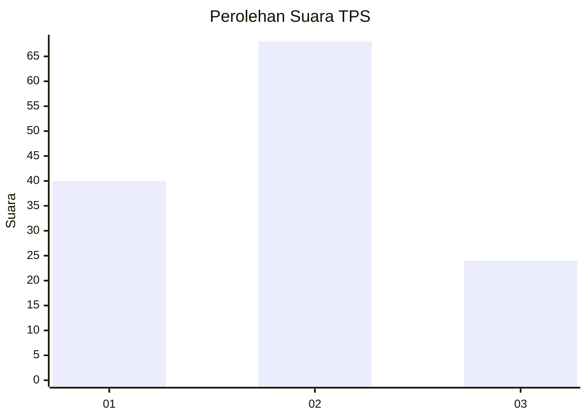
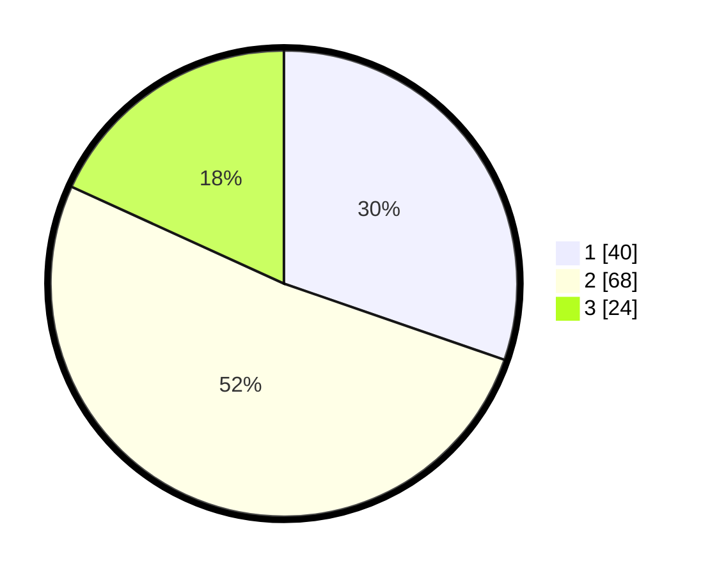

# Hasil

## Grafik

## Tabel

| No. | Nama Paslon    | Suara | Suara (raw) | Persentase |
|:--- |:-------------- | -----:| -----------:| ----------:|
| 1   | ANIES MUHAIMIN | 40    | [40][p-1]   | 30,30      |
| 2   | PRABOWO GIBRAN | 68    | [68][p-2]   | 51,52      |
| 3   | GANJAR MAHFUD  | 24    | [24][p-3]   | 18,18      |

[p-1]: https://github.com/gigit-pemilu/pemilu-2024-34-di-yogyakarta/blob/main/pilpres/hitung-suara/sub/34-di-yogyakarta/sub/02-bantul/sub/02-sanden/sub/2001-gadingsari/sub/020-tps/sub/paslon-1.txt
[p-2]: https://github.com/gigit-pemilu/pemilu-2024-34-di-yogyakarta/blob/main/pilpres/hitung-suara/sub/34-di-yogyakarta/sub/02-bantul/sub/02-sanden/sub/2001-gadingsari/sub/020-tps/sub/paslon-2.txt
[p-3]: https://github.com/gigit-pemilu/pemilu-2024-34-di-yogyakarta/blob/main/pilpres/hitung-suara/sub/34-di-yogyakarta/sub/02-bantul/sub/02-sanden/sub/2001-gadingsari/sub/020-tps/sub/paslon-3.txt

## Foto C Plano

https://sirekap-obj-formc.kpu.go.id/e038/pemilu/ppwp/34/02/02/20/01/3402022001020-20240215-094933--b450e00f-9ed0-43cb-b183-58b832661908.jpg

https://sirekap-obj-formc.kpu.go.id/e038/pemilu/ppwp/34/02/02/20/01/3402022001020-20240214-234235--b50e3e14-4e4e-4e8c-afb9-cf6bb312510e.jpg

https://sirekap-obj-formc.kpu.go.id/e038/pemilu/ppwp/34/02/02/20/01/3402022001020-20240214-234451--8f0c3eb4-53d2-4564-9b0b-3adb8e63fe13.jpg

## Metadata

| Key        | Value               |
| ---------- | ------------------- |
| Time Stamp | 2024-02-25 12:00:00 |

